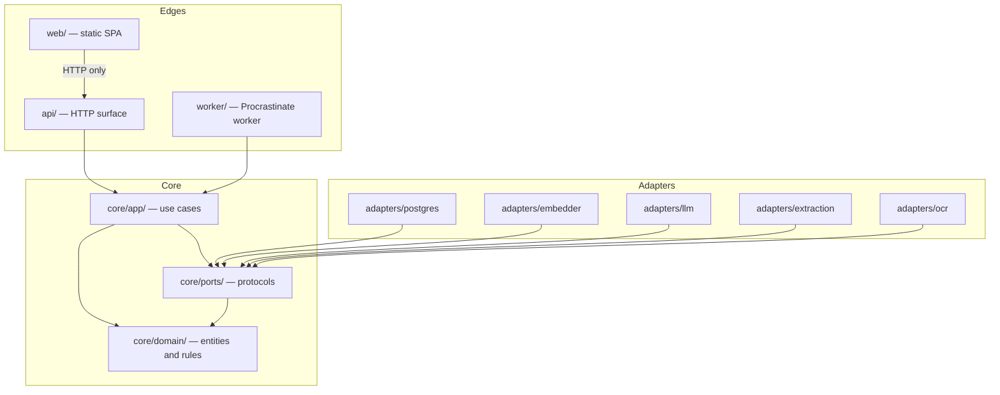
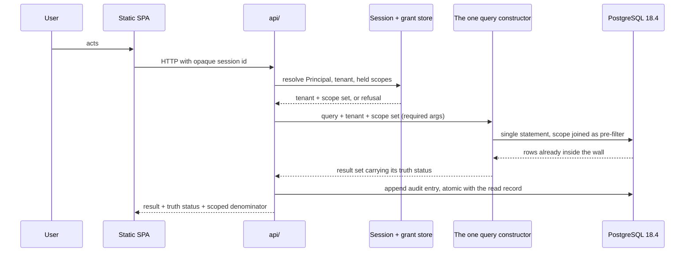
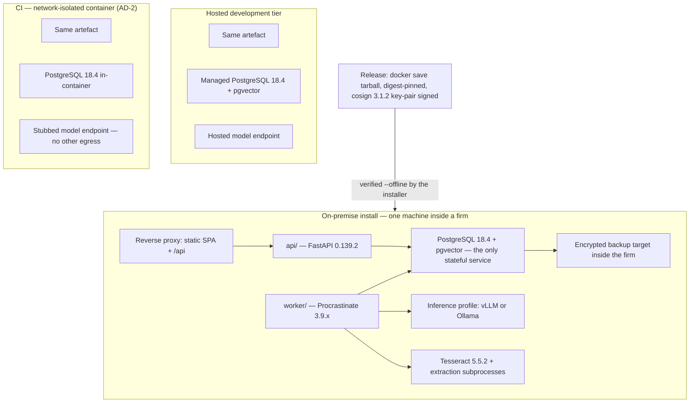
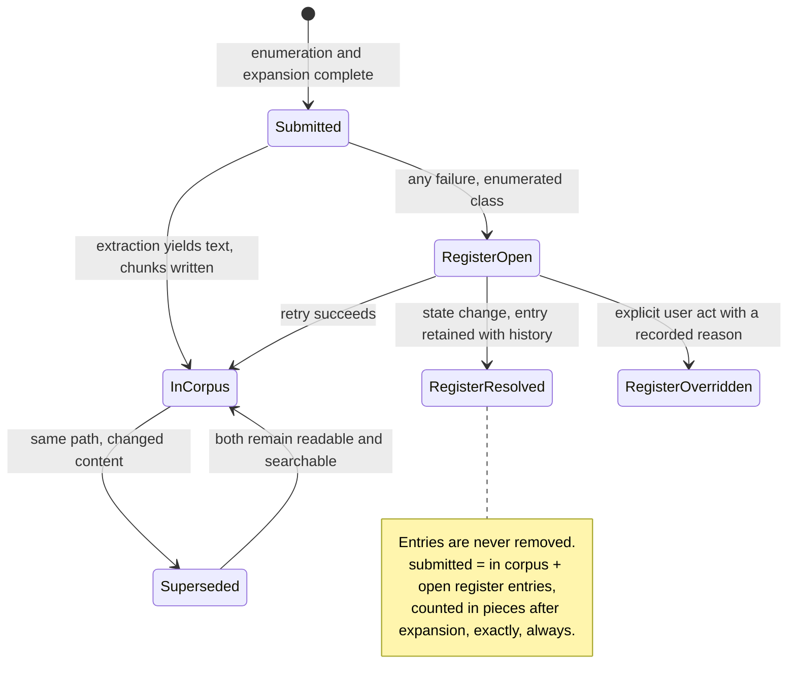
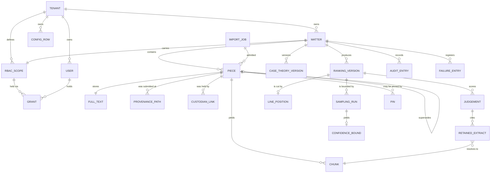

# Architecture Spine — APX MVP, First Increment

**The fitness function is the central invariant: can this run, unmodified, on a single machine
inside a law firm with no internet connection?** It is not a principle here. It is AD-2 — a CI
job that fails the build — and AD-1, AD-3, AD-5, AD-15, AD-26, AD-27, AD-29 and AD-30 exist to
make failing it structurally difficult rather than merely discouraged.

---

## Design Paradigm

**Hexagonal (ports and adapters)**, with a **pipes-and-filters** pipeline as the internal shape of
ingestion and of the relevance cascade. The choice is not stylistic: the fitness function requires
that every component which could be compelled, priced or discontinued by a third party is
replaceable by a configuration row, and a hexagon is the pattern that makes "replaceable" a
compile-time property rather than a promise.

| Layer | Directory | Contains | May depend on |
| --- | --- | --- | --- |
| Domain | `core/domain/` | Entities, the payload record, identity functions, the ranked order, the estimator, truth status | nothing outside itself |
| Ports | `core/ports/` | Protocol definitions: `Embedder`, `LanguageModel`, `Extractor`, `Ocr`, `Store`, `Clock` | Domain |
| Application | `core/app/` | Use cases, the one retrieval query constructor, the one chunk writer, the cascade orchestration | Domain, Ports |
| Adapters | `adapters/` | pgvector store, Procrastinate queue, extract-msg subprocess, Tesseract, vLLM/Ollama client, BGE-M3 runner | Ports |
| Edges | `api/`, `worker/`, `web/` | HTTP surface, worker entrypoint, static SPA | Application |

The domain never imports an adapter, and no adapter imports another adapter. That direction is
AD-4 and it is checked, not documented.

---

## Invariants & Rules

Every decision below is enforceable. `[ADOPTED]` marks a call the user made, or one that existing
reality already settled. Rationale lives in `.memlog.md`; it is not repeated here.



### AD-1 — The core is deployment-agnostic; every third-party edge is a port `[ADOPTED]`

- **Binds:** all units; the directory layout; the CI import-graph check.
- **Prevents:** a unit reaching for a hosted-provider primitive because it was convenient in the
  dev tier, producing an artefact that cannot be installed inside a firm.
- **Rule:** anything that could be compelled, priced or discontinued by a third party is reached
  only through a port in `core/ports/`. Supabase, Vercel and Railway are acceptable as a
  *development and hosted-tier packaging* of adapters, never as a dependency of the core.
  Supabase Auth and PostgreSQL row-level security are **forbidden outright** — each makes the
  on-premise install impossible, and RLS additionally would place the Chinese wall in a layer the
  air-gapped install cannot carry.

### AD-2 — The offline fitness function is a build gate `[ADOPTED]`

- **Binds:** CI; every unit; the release process.
- **Prevents:** portability decaying between the intent and the first installation, discovered in
  front of a client with SM-10 on the line.
- **Rule:** a CI job boots the whole application in a network-isolated container with no
  outbound network except a stubbed model endpoint, and asserts it starts, ingests, indexes,
  retrieves over both engines, ranks, places **the line**, writes an *audit record* and exports.
  It runs from week one of the build, before any feature is complete. A failure fails the build.
  The set of capabilities that do not survive the model provider's absence is **enumerated by
  this job**, never described in prose. The *confidence bound* sentence is inside the surviving
  set: it is templated and rendered locally from the *audit record* with no model call.

### AD-3 — One artefact, three environments; deployment is packaging `[ADOPTED]`

- **Binds:** build, release, configuration, the dev tier.
- **Prevents:** a per-environment or per-client fork, and a feature that exists only where a
  managed service is available.
- **Rule:** exactly one artefact is built and every installation runs it. The three environments —
  hosted development, the network-isolated CI container, the on-premise install — differ by
  configuration rows and by which adapter implementations are wired, never by which code was
  built. A capability available on the managed dev tier but not on-premise may not be depended on
  by the core; this is what excludes pgvectorscale and ParadeDB (see AD-5, AD-21).

### AD-4 — Dependency direction is one-way and checked

- **Binds:** every module.
- **Prevents:** the classic drift where an adapter grows domain rules, or the domain grows an
  import of the store — after which "swap the LLM provider" becomes a rewrite rather than a
  configuration line.
- **Rule:** the arrows in the diagram above are the whole permitted set. `core/domain/` imports
  nothing outside itself. `core/app/` imports Domain and Ports only. No adapter imports another
  adapter. Enforced as a *structural property* (FR-56) by an import-graph rule in CI.

### AD-5 — One stateful service: PostgreSQL 18.4 `[ADOPTED]`

- **Binds:** storage, retrieval, ingestion, the queue, deployment, backup, restore.
- **Prevents:** units independently introducing a second stateful service — Redis for the queue,
  Qdrant or LanceDB for vectors — producing a deployment a non-specialist cannot operate, back up
  or restore, and a backup that is not one consistent snapshot.
- **Rule:** PostgreSQL 18.4 holds relational data, vectors (pgvector ≥ 0.8.5, HNSW, 1024-dim
  `halfvec`), the deterministic text index and the job queue (Procrastinate 3.9.x). No component
  may introduce a stateful service beyond it. Anything that appears to require one is an adapter
  boundary, not a new deployment unit. Consequence taken deliberately: crash-resume mid-ingestion
  is a transaction property rather than a configuration, and "chunk row + its vector + its
  *RBAC scope*" is one transactional object — an embedding cannot outlive the *pièce* it came
  from. PostgreSQL 19 is at Beta 2 and must not ship into a firm.

### AD-6 — Work happens in the queue; the HTTP request never does work

- **Binds:** ingestion, extraction, embedding, ranking, re-ranking, export generation, backup.
- **Prevents:** v1's defect exactly — one synchronous function inside the request doing parse,
  score, chunk, embed and upsert, accumulating every point in memory before a single write. That
  shape cannot ingest 1 700 *pièces*, let alone 100 000, and it makes FR-2's resumability
  unreachable.
- **Rule:** any operation whose cost scales with the size of a *matter* is a queued job. The HTTP
  layer validates, authorises, enqueues and returns. State advances only by a worker committing a
  unit of work. A user-visible progress figure is read from committed state, never held in a
  process.

### AD-7 — Nothing is hard-deleted; sets are views; evidence ledgers are append-only `[ADOPTED]`

- **Binds:** triage, the *failure register*, the *audit record*, the *change log*, the index,
  every administrative operation.
- **Prevents:** reversibility becoming a promise somebody has to keep, rather than a shape in
  which irreversibility is unrepresentable. It also designs out v1's silent index wipe.
- **Rule:** the *retained set* and the *discarded set* are **views** over one ranked order plus
  *pins* — never stored memberships. *Failure register* entries are resolved by state change and
  never removed. The *audit record*, the *change log* and the register are append-only. Bulk
  deletion, truncation or recreation of a *tenant*'s indexed material is reachable from exactly
  **one** named administrative entry point, requires a human act and a reason, and is never a
  response to an error, a dimension mismatch or a version difference. Enforced as a *structural
  property*: no other call site exists.

### AD-8 — A *pièce*'s identity is (content hash, matter) `[ADOPTED]`

- **Binds:** ingestion, deduplication, retrieval filtering, audit, the *bordereau*.
- **Prevents:** two units disagreeing on whether a *pièce* is one object seen from several
  *matters* or several independent objects — which yields incompatible identity keys,
  incompatible dedup semantics and an ambiguous Chinese wall.
- **Rule:** identity is a deterministic function of content and *matter*. **Provenance path is not
  part of identity**; it is a recorded attribute, and one *pièce* may carry several. The same file
  ingested into two *matters* yields two *pièces* with separate identities, rankings, audit
  records and lifecycles. No entity is visible from more than one *matter*. Cross-*matter*
  deduplication and "seen before" intelligence are explicitly forfeited — they are the capability
  a Chinese wall exists to forbid. Consequence: the scope predicate is an **equality**, the filter
  shape hardest to get wrong. Identifiers are never allocated from a counter *(v1 restarted ingest
  ids from 1, so a second upload overwrote the first)*.

### AD-9 — One chunk write boundary; the payload schema is frozen and versioned `[ADOPTED]`

- **Binds:** every write to the *corpus*; every migration; the *failure register*.
- **Prevents:** the only irreversible mistake in the increment — a mandatory field arriving late,
  which means re-indexing everything at every installed site, blind, against a live 100 000-*pièce*
  index. And a *chunk* acquiring a scope from a global default rather than from its *matter*.
- **Rule:** exactly one function writes a *chunk*. It takes *tenant*, *matter*, *RBAC scope* and
  *custodian* as **required arguments with no default value anywhere in the source**. A write
  missing any mandatory field is rejected at the boundary, fails its unit of work loudly and
  enters the *failure register*; it is never written with a default. The schema carries an explicit
  version; a migration that cannot preserve every mandatory field of every existing *chunk* is
  rejected rather than run. An *import job* completes under the schema and chunking versions it
  started with. Two extension points are reserved now and written by nothing in this increment:
  an **external-authority reference** on a *chunk* (Judilibre/Légifrance, next increment) and a
  **`supersedes`** relation between *pièces*.

### AD-10 — The full extracted text of a *pièce* is a first-class stored artefact, separate from its chunks

- **Binds:** extraction, storage, the deterministic engine, the exact-containment check.
- **Prevents:** the deterministic engine being built over *chunks*, which would miss every phrase
  and proximity match spanning a chunk boundary **by construction** — an absence claim that is
  false and cannot be detected by any test that does not plant matches across boundaries.
- **Rule:** extraction produces two artefacts with separate identities and versions: the addressable
  full text of the *pièce*, and the *chunks* derived from it. The deterministic engine (AD-21) runs
  over full text and over names; the semantic engine runs over *chunks*. Exact-containment
  verification resolves against the full text at the moment an extract is shown, and a resolution
  that fails marks the containing export degraded rather than displaying the extract as ordinary.

### AD-11 — 1024 dimensions is the interface; the embedder is swappable `[ADOPTED]`

- **Binds:** the chunk schema, retrieval, any re-embed, the hardware conversation.
- **Prevents:** a model choice becoming a schema migration.
- **Rule:** the vector column is 1024-dim `halfvec`. Every chunk row carries `model_id` and
  `model_version`. Changing embedder is a background migration, never a rebuild, and a
  mixed-provenance *corpus* is detectable rather than suspected. BGE-M3 (568M, 1024-dim, MIT) is
  the default and yields **dense and sparse** vectors from one pass — sparse matters for French
  legal names, references and article numbers, where dense-only retrieval classically fails.
  `multilingual-e5-large-instruct` is a drop-in fallback; `Qwen3-Embedding-0.6B` is the
  same-family upgrade. **There is no fallback embedder at runtime**, in any configuration
  including test and development: the port has exactly one non-test implementation, no exception
  handler in the embedding path constructs an embedder, and no configuration key selects one
  outside the enumerated list. *(v1 fell back to a 256-dim hash on any exception, unlogged, and
  the index then deleted itself on the dimension mismatch.)* Carried risk: BGE-M3 is a
  2024-generation model measurably behind the 2026 frontier (51.8 vs 56.4 BEIR); if retrieval
  quality proves to be the binding constraint on triage recall, the upgrade path costs hardware.

### AD-12 — *Tenant* first, then *RBAC scope*; both fail closed `[ADOPTED]`

- **Binds:** every read, every count, every export, every diagnostic surface.
- **Prevents:** an ambiguity resolving toward more access. A cross-*matter* leak is silent, has no
  error message, and voids the product's premise.
- **Rule:** every stored record carries its *tenant*, enforced at the write boundary; a record
  without one cannot be written. Every read is constrained by *tenant* before *RBAC scope* is
  applied. A user with no scope receives an **empty** *corpus*, not the whole one — and this
  applies identically to administrative and system identities. There is no implicit superuser and
  no identity that bypasses the predicate. The *failure register* is **inside** this guarantee: a
  *pièce* that never entered the *corpus* never had a *chunk* written, so the register cannot
  inherit a stamped scope, and its filenames are frequently the privileged fact.

### AD-13 — *RBAC scope* is resolved at query time from a single authoritative source, never denormalised onto indexed rows `[ADOPTED]`

- **Binds:** every retrieval path, the payload record, every administrative operation on scopes,
  every long-running job.
- **Prevents:** a stale wall — scope stamped at index time, scopes editable as configuration,
  nothing re-stamps, and an ordinary administrative act silently enforces obsolete permissions
  against the wrong wall, permanently and correctly.
- **Rule:** authorisation state lives in exactly one place and is **joined into every retrieval
  query as a pre-filter**. A scope change takes effect on the next query, with no re-indexing, no
  migration and no window of indeterminate state. **No re-stamping operation exists in the
  system**, so the long-running rewrite that fails halfway on an unreachable machine is designed
  out rather than made recoverable. A long-running job re-resolves the caller's scope at every
  unit of work, which is what makes FR-14's "revocation reaches open sessions within a bounded
  interval" true for in-flight exports and running *sampling runs* as well as for queries.
  Cost accepted: a join per query.

### AD-14 — Exactly one code path constructs a retrieval query `[ADOPTED]`

- **Binds:** both engines, every count, the *scoped denominator*, the cascade's stage 2, every
  export that names *pièces*.
- **Prevents:** the join of AD-13 being bypassed by a second query path written in good faith —
  and post-filtering, which leaks silently because the wrong rows were already fetched, counted or
  logged.
- **Rule:** retrieval has one entry point. It requires a scope argument. No result-set
  post-processing function accepts a scope, and none exists. Its uniqueness is a *structural
  property* asserted in CI (FR-56), not a convention: the join must be **impossible** to bypass.
  Every retrieval is recorded in the *audit record* with the scope it executed under, reviewable
  by a holder of the *tenant* administrative grant — a log nobody can read is not an
  insider-threat control.



### AD-15 — Authentication is owned, not delegated `[ADOPTED]`

- **Binds:** every authenticated request; the packaging; the security review.
- **Prevents:** a unit reaching for a managed identity provider — forbidden, it breaks the
  air-gapped install — or for a library that is dead or CVE-ridden. It also prevents the rejected
  options being revisited by whoever next reads a FastAPI tutorial.
- **Rule:** opaque server-side sessions in PostgreSQL with Argon2id via `pwdlib[argon2]` 0.3.0.
  PyJWT 2.13.0 is for **internal service tokens only, never for user sessions**. `pyotp` 2.10.0
  provides TOTP as the second factor; `py_webauthn` 3.0.0 is an additive credential type gated on
  a per-site FQDN and certificate. No reversible credential storage exists, enforced as a
  *structural property*. `Principal` resolution sits behind one interface and no route imports the
  session table directly — which is also the cheap insurance against Open Risk 2.
  **Rejected with reasons, recorded so they are not revisited:** FastAPI-Users (maintenance mode
  since 15.0.1), python-jose (CVE-2024-33663 authentication bypass; three releases in five years),
  passlib (unmaintained since 2020), Authlib (twelve advisories including CVE-2026-27962, CVSS 9.1
  signature-verification bypass patched only in 1.6.9 on 2026-03-15) unless OIDC is contractually
  forced.

### AD-16 — There is exactly one ingestion path `[ADOPTED]`

- **Binds:** intake, the evaluation corpora, every screen that displays data, the test tree.
- **Prevents:** v1's most damaging shape — a demo layer that overrode a healthy backend, two
  screens that never called it at all, and "golden fixtures" no model ever generated.
- **Rule:** every *pièce* enters through one path, whether it comes from a lawyer's USB key or
  from the TREC gold set. Corpora are **configured data sources**, never fixtures, never
  fallbacks, never a demo branch. Enforced as *structural properties*: no runtime module imports
  from the test tree; no runtime module reads a fixture directory; no conditional on an
  environment variable selects a data source outside the enumerated configured-source list; no
  screen renders from an embedded literal dataset. The v1 fixture layer is **deleted**, not
  disabled.

### AD-17 — The unit of work is one *pièce*: idempotent, resumable, quarantinable, memory-bounded

- **Binds:** the queue, extraction, embedding, the *failure register*, the inventory guarantee.
- **Prevents:** three failures that each end a 100 000-*pièce* run: a resume that resumes onto the
  unit that killed the worker and never completes; a *pièce* large enough to exhaust memory taking
  the worker with it; and a re-run that duplicates or overwrites already-indexed material.
- **Rule:** each *pièce* is one committed unit of work against an application-owned ledger keyed
  by its identity (AD-8). Re-processing an already-committed unit is a no-op that reports itself.
  **No single *pièce*, however large, may be required to fit in memory whole.** A unit exceeding
  its configured resource bound enters the register as `resource-exhausted`; a unit that kills the
  worker is quarantined after a configured number of attempts as its own register entry and the
  job proceeds. The submitted set is frozen at the completion of enumeration-and-expansion, and
  the enumeration itself is recorded. Capacity bounds — *pièce* size, container depth, expansion
  ratio, attachments per message, *matters* per *tenant*, rows per export — are configuration with
  defined defaults, and each surfaces as a *failure register* class rather than as an outage.

### AD-18 — The cascade is a required three-stage gate, and its stage-3 share is a measured output `[ADOPTED]`

- **Binds:** the *relevance judgement*, inference cost, egress volume, wall-clock, the hardware ask.
- **Prevents:** per-*pièce* LLM judgement at 100 000 *pièces* — simultaneously the largest
  inference cost in the system and its largest single export of a client's *matter*. Cutting the
  model's workload tenfold is far cheaper than ten times the GPU, and it is the difference between
  the €2 000 machine and the €20 000 one.
- **Rule:** the order is fixed: **(1)** deterministic filters and near-duplicate grouping —
  content-hash dedup, document type, participant roles, dates against the *case theory* period,
  obvious noise; **(2)** cheap semantic scoring plus deterministic retrieval over the embeddings
  and text already produced; **(3)** LLM judgement **only** on the uncertain band that stages 1
  and 2 could not separate, plus a mandatory calibration sample of the confident bands. Stage
  boundaries are configuration-as-data. **The share of *pièces* reaching stage 3 is recorded per
  run** — it is the number that decides cost, latency and egress, and the number a regression
  would otherwise hide. Near-duplicate families are judged as a family with one representative;
  members keep their own identity, provenance and *custodian*.

### AD-19 — Loud failure everywhere; nothing is imputed `[ADOPTED]`

- **Binds:** every component, every adapter, every derived value.
- **Prevents:** the v1 pattern in which retrieval did not stop working — it silently became noise,
  which is worse. And the sharper version: a *pièce* no model ever read, scored zero, sorted to
  the bottom, sitting inside the population a *confidence bound* reports on.
- **Rule:** every failure produces exactly one of a *failure register* entry, a halt, or a
  *worklist* line — never a plausible-looking wrong answer, never a *chunk*, never an imputed
  score, never a completed action whose record was not written. **Unscored is not zero:** a
  *pièce* the model could not judge is excluded from the ranked order and shown as unscored, not
  ranked last. Where a guarantee cannot be met the product **refuses**: a query that cannot
  guarantee completeness errors rather than returning a labelled partial set. Confidence is
  derived from observable quantities and **never** from a figure a model states about itself —
  enforced as a *structural property*: no field parsed from a model response is named or used as
  a confidence, and the derivation function has one implementation.

### AD-20 — Two engines, two truth statuses, one constant construction site each `[ADOPTED]`

- **Binds:** both engines, the interface, every export, the *audit record*.
- **Prevents:** a similarity threshold wearing the costume of a proof. *(v1's off-corpus gate was
  a similarity threshold shipped disabled by default — a guess that looked like a proof, which is
  worse than nothing.)*
- **Rule:** *truth status* is a property of the **result set**, carried in data, present in the
  interface, in every export and in the *audit record*. Two values only: **suggestive** (semantic,
  ranked, top-k — can support a finding, can never prove an absence) and **exhaustive**
  (deterministic, complete match set over the whole indexed *corpus* within one scope). It is set
  at exactly one construction site per engine and is a **constant** there; no threshold in any
  configuration can produce an **exhaustive** label. No interface element merges results from both
  engines into one undifferentiated list. An **exhaustive** result set carries, in the interface
  and in every export, the qualifications that make an absence claim honest: the *scoped
  denominator*, open register entries, open `container-unopenable` entries of **unknown**
  cardinality, and the OCR-derived share of the searched set with the share below the quality
  signal.

### AD-21 — The deterministic engine is PostgreSQL-native, over full text and names, with declared normalisation

- **Binds:** exhaustive search, the cascade's stage 2, the *failure register* search.
- **Prevents:** a second search service arriving through the back door (ParadeDB, an external
  BM25 server) and breaking AD-3 and AD-5 — and an unspecified normalisation, which is not a
  detail: opposing counsel needs the one document where the word appears with an accent the OCR
  dropped.
- **Rule:** deterministic search runs inside PostgreSQL 18.4 over the stored full extracted text
  (AD-10) and over the filename-as-submitted and extractable title. ParadeDB and pgvectorscale are
  excluded by AD-3 — they are unavailable on the managed dev tier and would become an
  on-prem-only code path, which is the exact divergence AD-3 exists to prevent. Normalisation
  semantics are **decided, declared on the result set, and configuration-as-data**: diacritics,
  case, elision, ligatures, hyphenation across a scanned line break, whitespace, and which of
  boolean/proximity/wildcard the expression supports. A *pièce* in the *failure register* is not
  in the searched set; the register is searched separately within scope and a name match there
  returns as a register hit, visibly distinct and never counted inside the **exhaustive** set.

### AD-22 — An audit entry is atomic with the action it records, sequenced from one authority and chained `[ADOPTED]`

- **Binds:** moving **the line**, *overrides*, *pins*, *validation acts*, completing a *sampling
  run*, granting or revoking a scope, changing configuration, producing an export.
- **Prevents:** an action that succeeded while its record did not — afterwards indistinguishable
  from an action that never happened, and the gap is an absence, which the record's reader cannot
  see.
- **Rule:** **an action whose audit entry cannot be written fails.** Both happen or neither does.
  Entries carry a monotonic sequence number from a single authority and a chain value over the
  previous entry, so a gap, a reordering or a truncation is detectable by a reader holding **only
  the export**. The continuity check runs on export and its result appears on the export's face,
  and it is verified again on restore; a failed verification is surfaced, never silently repaired.
  Where the audit store cannot be written at all, the application refuses the affected actions
  rather than degrading to an unaudited mode; read-only functions may continue. AD-5 keeps this in
  the same transactional store as the action, which is what makes atomicity buildable at all.

### AD-23 — Every derived artefact names the version identity that produced it; staleness is explicit and never self-resolving

- **Binds:** the ranked order, **the line**, the review-effort estimate, the *confidence bound*,
  every **exhaustive** result set, every export.
- **Prevents:** the north-star artefact being false while displayed as fresh — 300 *pièces*
  arrive, the sentence still reads "1 400 in the discarded set", nothing is marked stale and it
  remains exportable as current.
- **Rule:** a *ranking version* is the complete immutable identity of what produced one order:
  *case theory* version, model identity, prompt version, temperature and every sampling parameter,
  cascade configuration, embedder identity, chunking configuration, schema version. Re-running a
  fixed *ranking version* over a fixed *corpus* reproduces the same order, *pièce* for *pièce*;
  where the model is non-deterministic at the configured temperature the version records the
  scores themselves. **The tie-break is deterministic and recorded in the version** — never the
  order a store happened to return, because ties are the normal case for near-duplicates and a tie
  spanning **the line** would otherwise reshuffle set membership with no recorded event.
  Staleness triggers are a complete enumerated list — new *ranking version*, line move, pin added
  or removed, *case theory* revision, a configuration change affecting retrieval/ranking/the
  estimator, a scope change affecting the population, **and any ingestion into the *matter***.
  Staleness is never resolved by time, by background recomputation or by being viewed: only by an
  explicit user-initiated recomputation that produces a **new** artefact.

### AD-24 — Customisation is data, never code `[ADOPTED]`

- **Binds:** the taxonomy, scopes, the model provider and endpoint, configured sources, chunking,
  cascade and refusal thresholds, interface language, the labels on **the line**.
- **Prevents:** the consultancy failure mode — a consultancy says yes to bespoke requests, and
  every yes becomes a code fork unless configuration absorbs it. Forking is survivable at three
  clients and fatal at eight.
- **Rule:** per-*tenant* behaviour is data rows. No *tenant*-specific identifier or name appears
  anywhere in source, enforced as a *structural property*. *Tenant*-specific **behaviour** is not
  a greppable property and is not claimed as one — it is covered by AD-3's single-artefact rule.
  Every configuration key has a defined default, and **no default disables the guarantee its key
  governs** *(v1's off-corpus gate shipped disabled)*. Every key named in documentation exists and
  is asserted to exist by a test *(v1 named keys that appeared in zero source files)*.

### AD-25 — Configuration changes through exactly one audited surface

- **Binds:** provisioning, the settings surface, the first administrative grant, support.
- **Prevents:** direct store editing at a firm's site — which produces no *audit record* entry,
  no validation and no rollback, and is a per-site divergence: the fork AD-24 exists to prevent,
  arriving as data instead of as code, which is not better.
- **Rule:** one per-*tenant* surface reads and changes every configuration-as-data value and
  provisions the *tenant*, its first administrative user, its scopes and its taxonomy on first run
  — without it, a correctly fail-closed installation is one where nobody can see anything and
  nobody can grant access, at a site APX reaches only by telephone. Every change is validated
  against the declared schema, is reversible, produces an audit entry with actor, key, before,
  after and timestamp, and marks derived artefacts stale (AD-23). It is inside the *tenant*
  boundary and never cross-*tenant*; it is not an operator console. A configuration value whose
  provenance is not an audited change through this surface is detectable as such.

### AD-26 — One content-free projection registry; exactly three egress paths `[ADOPTED]`

- **Binds:** the diagnostic export, all outbound network, the next increment's style extractor.
- **Prevents:** telemetry arriving by accident, a second ad-hoc "just counts" path whose
  content-freedom nobody tested, and a closed enumeration that forces the next increment to fork
  the primitive.
- **Rule:** all emission of information *about* a *tenant*'s data goes through **one registry of
  named projectors**, each declaring the shape of what it emits. The registry is **open by
  construction** — it must serve the next increment's on-premises style extractor, whose output is
  a distribution over sentence lengths and a phrasebook of the firm's own formulae, and is none of
  the value kinds the diagnostic export needs. Content-freedom is structural, in three parts:
  (i) the seeded-token test runs against **every registered projector**, not against the export;
  (ii) an emission path outside the registry fails the build; (iii) a projector deriving a value
  from *pièce* or *chunk* text may emit only values **attested across a configured minimum number
  of *pièces* and *matters***, never a value traceable to one. Filenames, paths, *matter* names,
  user names, content and query text never appear in any output; where a name is needed for
  correlation, an opaque identifier is used. **Outbound network originates from an enumerated set
  of adapters only** — the configured language model provider, the configured embedder, the
  configured OCR service where one is used — asserted by a static check. The three egress paths
  are: the model provider (the largest, automatic, and the product's normal operation — it carries
  the substance of every *pièce* reaching stage 3 under a **contract clause, not a technical
  property**); the user-initiated content-free projection; and the user-initiated *audit record*
  and retained-set exports. **Any fourth path is a defect**, and its absence is a structural
  property, not a runtime test.

### AD-27 — Two inference profiles behind one OpenAI-compatible interface, selected by configuration `[ADOPTED]`

- **Binds:** every inference call site; the hardware conversation; the commercial tiering.
- **Prevents:** application code branching on which engine is behind it, and a per-profile fork.
- **Rule:** APX ships both a **GPU profile** — vLLM 0.25.1 pinned by digest, Mistral Small 3.2 24B
  (Apache-2.0) at INT8/Q4 on 24 GB VRAM, 100 000 *pièces* overnight — and a **CPU/low-end
  profile** — Ollama 0.32.1, the same job in two to three weeks — priced differently. Application
  code never knows which serves it. The profile is configuration-as-data, and the expected
  wall-clock for the chosen profile is **stated honestly to the firm before the job starts**. The
  same interface must admit a locally hosted model and a sovereign hosted facility as
  configurations without a code change, because a *bâtonnier* applying the CNB criteria may make
  a fully local model necessary rather than premium. Commercially, the GPU ask cites the CCBE's
  March 2026 guide, which publicly prices law-firm hardware at €2 000–20 000.

### AD-28 — Extraction adapters run out-of-process and licence-isolated

- **Binds:** `.msg`, PDF, OCR, Office extraction; the worker's failure modes; the licence position.
- **Prevents:** two things at once — a GPL or AGPL dependency contaminating a proprietary core by
  a single `import`, and a malformed compound file taking the worker down with it. It also
  removes the incentive to reach for a hosted OCR API, which §15 forbids because OCR must run
  inside the *tenant* boundary.
- **Rule:** each extraction engine sits behind the `Extractor` / `Ocr` ports and runs in a
  subprocess with its own resource bound; a crash is a *failure register* entry, never a worker
  death (AD-17). `extract-msg` 0.56.0 is invoked **out-of-process and GPL-isolated**. PyMuPDF is
  excluded — AGPL-3.0 makes it unusable here without a commercial licence. The permitted set for
  this increment: `pypdf` 6.14.2 and `pdfplumber` 0.11.7 for born-digital PDF, Docling 2.114.0
  with Tesseract 5.5.2 for scanned PDF and layout-heavy documents, `python-docx` 1.2.0 and
  `openpyxl` 3.1.5 for Office. Every extracted *pièce* records the extraction method **and the
  extractor version**, so a transcription is distinguishable from a text layer and a re-extraction
  under a new engine is detectable rather than suspected.

### AD-29 — The frontend is a static SPA `[ADOPTED]`

- **Binds:** every data access path, the deployed artefact, the authorisation surface.
- **Prevents:** a second place where *matter* scope can be wrong. A server-rendering layer that
  fetches data is a second query path, in a second language, and it contradicts AD-14 directly.
- **Rule:** the client is static assets — Vite 8.1.5 and React Router 8.2.0, built in CI, served
  by the same reverse proxy that fronts the API. All data access is HTTP to the one API. **No
  rendering layer holds credentials or performs authorisation.** Next.js is dropped: this removes
  a Node runtime and its patch debt from an artefact that cannot be patched remotely, and removes
  Next 16's caching architecture, which is a liability under a per-*matter* wall. Recorded so it is
  not relitigated: Next.js does work offline, so this is not a functionality argument. v1's React
  components port; the Next scaffolding is what is discarded, not the interface work. One token
  set — no colour, spacing or type value outside it, enforced as a *structural property*
  *(v1 shipped three unreconciled colour systems)*.

### AD-30 — Offline packaging, signed; upgrade fails closed; rollback is a dump restore `[ADOPTED]`

- **Binds:** release, install, upgrade, rollback, support.
- **Prevents:** an unattended migration on an unreachable machine leaving a half-migrated database
  with no way back.
- **Rule:** delivery is a Docker Compose bundle (Engine 29.6.2, Compose v5.3.1) as a `docker save`
  tarball, everything pinned by digest, signed with a **cosign 3.1.2 key pair** and verified
  `--offline` by the installer — keyless verification needs Fulcio and Rekor and is unusable
  air-gapped. `upgrade.sh` takes a **verified `pg_dump` before every Alembic 1.18.5 migration and
  fails closed**. Rollback is dump restore plus re-tagging recorded image digests — **never**
  `alembic downgrade`. Ruled out and recorded: a single binary (the stack shape — PostgreSQL plus
  native extensions — forbids it) and a Tauri wrapper (additive only, though it would dissolve the
  WebAuthn secure-context problem). The application version, the payload schema version and the
  *ranking version* are readable in the interface and present in the *audit record* and the
  content-free projection, because a user on the telephone must be able to read them out.

### AD-31 — Encryption is a property of the application's storage adapters; no key, no start

- **Binds:** every store, every staged export, backups, the deployment.
- **Prevents:** encryption becoming a property of somebody's volume service — true in the hosted
  tier and false on the firm's own machine, which is the deployment where the criminal obligation
  applies. And a permissive default, which is how every encryption requirement is actually lost.
- **Rule:** a deployment started with encryption disabled or without a key **fails to start**;
  there is no warning-and-continue. Secrets and keys are held outside the application's own data
  stores, are never written to a log, a diagnostic, an export or an audit entry, are never
  redisplayed after entry, and are rotatable without redeployment and without re-indexing. No
  secret appears in source, in committed configuration or in any example configuration — a
  *structural property*. The seeded-token test of AD-26 is run against the raw stores and against
  seeded secret values, not only against projector output. **Unresolved and recorded, not
  smoothed:** application-level encryption of the vector column and of the deterministic text
  index is incompatible with indexing them — you cannot build an HNSW or a text index over
  ciphertext. Which layer carries at-rest encryption for the two searchable surfaces is an open
  question below, and it is the one place where FR-47's wording and AD-5 are in tension.

### AD-32 — Backup and restore are product features, exercised in CI

- **Binds:** the store, the operational envelope, the pre-flight capacity check, the *worklist*.
- **Prevents:** the single most likely way an installation ends a client relationship — one
  machine, no ops staff, no telemetry, an append-only record of asserted legal weight, and a
  backup whose failure nobody knew about.
- **Rule:** the product produces a complete restorable backup of a *tenant* — originals, extracted
  text, index, *audit record*, *failure register*, configuration — on a schedule and on demand,
  encrypted, inside the *tenant* boundary. AD-5 is what makes this one consistent snapshot rather
  than a reconciliation problem. **Restore is exercised, not assumed:** a restore into an empty
  installation reproduces a *tenant* whose *denominator*, ranked orders, audit sequence and
  *confidence bounds* are identical — asserted in CI at reduced scale and by a documented
  procedure at the *design target*, with the AD-22 chain re-verified on restore. Backup success or
  failure is a *worklist* line in the lawyer's language. The product **computes and states** a
  *tenant*'s storage footprint at the *design target*, and a pre-flight capacity check refuses an
  *import job* that cannot fit rather than discovering it at 70%.

### AD-33 — Structural properties are static checks over source; the registry is itself checked `[ADOPTED]`

- **Binds:** CI; every AD above that says "no code path".
- **Prevents:** a universal negative being asserted by a runtime test, which cannot decide one —
  and an inflated claim about what the suite proves, which with tests standing in for the
  engineers this team does not have is the most dangerous inaccuracy available.
- **Rule:** where this spine says no code path does something, a **static check** decides it —
  grep, lint, import-graph or architecture rule — and a violation fails the build. Each property
  names the check that enforces it and the file or pattern it inspects; **a property with no check
  is not a property**. Three verbs are used and never conflated: *asserted by test* (a CI test
  decides), *enforced as a structural property* (a static check decides), *asserted by review* (a
  human decides against a checklist, and it is never counted as a passing test). The registry of
  user-reachable actions is itself a structural property: an action not in the registry fails the
  build.

### AD-34 — The gold set is a merge gate on ranking code `[ADOPTED]`

- **Binds:** the cascade, the ranked order, **the line**, the estimator.
- **Prevents:** the exact v1 defect — a gold set that exists and never runs — and its 2026
  costume, a ranking that looks extraordinary in a screenshot and is unfalsifiable without a
  matter-specific gold standard.
- **Rule:** no ranking or triage code merges before recall against the *gold set* executes in CI
  and its figure is recorded. The floor is set from the **first measured baseline** and may only
  rise — without a floor, whatever the first figure happens to be becomes permanently acceptable
  and permanently defended by a green build. The ratchet is **significance-tested** against the
  measured run-to-run variance, because a strict rule on a noisy measure produces flaky builds,
  flaky builds get disabled, and that is how a gold set stops running for the second time.
  Confidence is calibrated against the gold set; a systematically overconfident derivation fails
  the build. The estimator is validated by simulation against populations of known composition
  before it ships.

---

## Consistency Conventions

| Concern | Convention |
| --- | --- |
| Naming — entities | Glossary terms are the only names in code and in data. *Pièce*, *matter*, *chunk*, *tenant*, *custodian*, *corpus*, *ranking version*, *the line*, *pin*, *retained set*, *discarded set*, *truth status*. `document`, `item` and `file` are banned as substitutes for *pièce*; `file` means a filesystem entry as submitted and nothing else. |
| Naming — modules | Ports are role nouns (`Embedder`, `Extractor`, `LanguageModel`); adapters are `<port>_<technology>` (`store_postgres`, `llm_openai_compatible`). One implementation per port outside the test tree unless an AD says otherwise. |
| Identity | `pièce_id` = deterministic hash of (content, matter). `chunk_id` = deterministic function of (pièce_id, position, chunking configuration). Never a sequence, never a counter, stable across runs, processes and installations. |
| Dates | Two distinct fields, never substituted: the date the *pièce* bears (with an explicit `undetermined` value) and the ingestion timestamp. Stored UTC, ISO-8601. Locale-aware rendering only at the display edge. |
| Absent values | No nulls on mandatory payload fields and no defaults. Absence is an **explicit enumerated value**: `custodian-undeclared`, `unlabelled`, `date-undetermined`, cardinality `unknown`. |
| Error shape | Every failure carries a **stable enumerated class** from the *failure register* vocabulary, plus a redacted diagnostic. Classes are translated (AD-24) so a support call names a class the user can read on screen. An unclassified failure is class `unknown` with its diagnostic — never dropped. |
| Result envelopes | Every result set carries *truth status*, the *scoped denominator* where completeness is claimed, and the applied normalisation. Counts shown to a user are always the **scoped** figure, and the surface says which quantity it is showing. |
| Mutation | Through a use case in `core/app/`, never from an adapter or a route. Anything scaling with *matter* size is a queued job (AD-6). Anything of evidential weight is append-only (AD-7) and atomic with its audit entry (AD-22). |
| Configuration | Data rows read through the AD-25 surface. Every key has a default; no default disables its own guarantee. Environment variables configure **wiring** (which adapter, which endpoint), never behaviour. |
| Logging | No *pièce* content, no *chunk* content, no filename, no *matter* name, no query text, no secret — the AD-26 rules apply to logs as to exports. Log the class and the opaque identifier. |
| Translation keys | Namespaced keys, never a natural-language string as a key, no silent fallback to the source language. *(v1 keyed English strings by their French source text, which broke on the first copy edit.)* |
| Versions | Every artefact carries the version identity that produced it (AD-23). Superseded decisions are marked as superseded, never quietly overwritten *(v1's recorded default model and hosting provider both silently ceased to be true)*. |
| Language | Documents, code, comments and commits in English. Agents converse in French. Terms of art stay French: *pièce*, *bordereau*, *ordonnance 145 CPC*, *secret professionnel*, *conclusions*, *veille*, *bâtonnier*. *Matter* stays English per the Glossary. |

---

## Stack

*Seed — verified 2026-07-21 against `docs/context/05-stack-research-2026-07.md`. The code owns this
once it exists; the reasoning does not live here.*

| Name | Version | Role |
| --- | --- | --- |
| Python | 3.13.14 | Core and worker language |
| FastAPI | 0.139.2 | HTTP surface; Starlette moved only in lockstep |
| Uvicorn | 0.51.0 | ASGI server |
| Pydantic | 2.13.4 | Boundary validation (2.14.0a1 is alpha — do not ship) |
| SQLAlchemy | 2.0.51 | Persistence (2.1.0b3 is beta — do not ship) |
| Alembic | 1.18.5 | Migrations, behind the AD-30 fail-closed wrapper |
| PostgreSQL | 18.4 | The one stateful service (PG19 is at Beta 2 — must not ship into a firm) |
| pgvector | ≥ 0.8.5 | Vectors: HNSW, 1024-dim `halfvec` |
| Procrastinate | 3.9.x | Job queue, in the same PostgreSQL |
| BGE-M3 | 568M, 1024-dim, MIT | Default embedder, dense + sparse from one pass |
| multilingual-e5-large-instruct | 560M, 1024-dim, MIT | Drop-in embedder fallback |
| Qwen3-Embedding-0.6B | 0.6B, 1024-dim, Apache-2.0 | Same-family embedder upgrade path |
| vLLM | 0.25.1, pinned by digest | GPU inference profile |
| Mistral Small 3.2 24B | Apache-2.0 | Default judgement model, INT8/Q4 on 24 GB VRAM |
| Ollama | 0.32.1 | CPU / low-end inference profile |
| extract-msg | 0.56.0 | `.msg`, out-of-process and GPL-isolated |
| pypdf | 6.14.2 | Born-digital PDF |
| pdfplumber | 0.11.7 | Table-heavy PDF |
| Docling | 2.114.0, MIT | Layout-aware extraction |
| Tesseract | 5.5.2, Apache-2.0 | OCR, inside the *tenant* boundary |
| python-docx | 1.2.0 | `.docx` |
| openpyxl | 3.1.5 | `.xlsx` |
| pwdlib[argon2] | 0.3.0 | Argon2id password hashing |
| argon2-cffi | 25.1.0 | Argon2 binding under pwdlib |
| PyJWT | 2.13.0 | Internal service tokens only — never user sessions |
| pyotp | 2.10.0 | TOTP second factor |
| py_webauthn | 3.0.0 | Additive credential, gated on per-site FQDN + certificate |
| Vite | 8.1.5 | SPA build |
| React Router | 8.2.0 | SPA routing, declarative/data mode |
| Node.js | 24.18.0 LTS | Build-time only; no Node runtime ships |
| Docker Engine | 29.6.2 | Runtime of the delivered bundle |
| Docker Compose | v5.3.1 | Bundle composition |
| cosign | 3.1.2 | Key-pair signing, verified `--offline` |

**Excluded, with the reason, so they are not reconsidered by accident:** PyMuPDF (AGPL-3.0);
pgvectorscale and ParadeDB (unavailable on the managed dev tier — AD-3); Qdrant, LanceDB, Milvus,
Weaviate, Chroma, Redis (AD-5); SQLite + sqlite-vec (abandons PostgreSQL entirely); Next.js
(AD-29); FastAPI-Users, python-jose, passlib, Authlib (AD-15).

---

## Structural Seed

### Deployment and environments



The only line that ever leaves a firm's walls is the configured model provider (AD-27), and only
for *pièces* that survive stages 1 and 2 of the cascade (AD-18). Diagnostic and audit exports are
user-initiated pushes (AD-26). There is no inbound channel by which APX can trigger anything.

### The ingestion and judgement pipeline

```mermaid
flowchart LR
    A["Folder or removable drive<br/>+ matter + RBAC scope + custodian"] --> B["Enumerate and expand containers<br/>submitted count frozen here"]
    B --> C{"Per pièce — one unit of work"}
    C -->|"extract"| D["Extraction subprocess<br/>text + extractor version"]
    D -->|"scanned"| E["OCR + quality signal"]
    D --> F["Full extracted text — stored addressably"]
    E --> F
    F --> G["Chunk with provenance to source position"]
    G --> H["Embed — 1024-dim halfvec, fails loudly"]
    H --> I["Chunk written through the one write boundary"]
    C -->|"any failure"| R["Failure register entry<br/>enumerated class, cardinality, retry action"]
    I --> J["Stage 1 — deterministic filters + near-duplicate families"]
    J --> K["Stage 2 — semantic + deterministic scoring"]
    K --> L["Stage 3 — LLM judgement, uncertain band + calibration sample"]
    L --> M["Derived confidence — never model-reported"]
    M --> N["One ranked order + ranking version"]
    N --> O["The line — an ordinal cut over a named ranking version"]
    O --> P["Retained set / discarded set — views, not containers"]
```



### The inventory guarantee as a state machine



### Core entities



Attributes are deliberately absent — where one is itself an invariant it is an AD, not a diagram.
The *retained set* and *discarded set* have no entity because they are views (AD-7).

### Source tree

```text
apx/
  core/
    domain/        # entities, payload record, identity fn, ranked order, estimator, truth status
    ports/         # Embedder, LanguageModel, Extractor, Ocr, Store, Clock — protocols only
    app/           # use cases; the ONE chunk writer; the ONE query constructor; cascade
  adapters/
    store_postgres/    # pgvector, Procrastinate, full-text, the append-only ledgers
    embedder_bgem3/    # exactly one non-test Embedder implementation
    llm_openai_compat/ # vLLM and Ollama profiles behind one client
    extraction/        # extract-msg, pypdf, pdfplumber, Docling — each out-of-process
    ocr_tesseract/
  api/             # FastAPI routes: validate, authorise, enqueue, return
  worker/          # Procrastinate worker entrypoint
  web/             # Vite + React Router SPA, built to static files
  checks/          # AD-33 structural checks; each names its pattern and its AD
  eval/            # gold set mapping, degradation pipeline, estimator simulation
tests/             # unreachable from any runtime module — enforced by a check
deploy/            # compose bundle, upgrade.sh, cosign verification, backup scripts
```

---

## Capability → Architecture Map

| PRD area | Lives in | Governed by |
| --- | --- | --- |
| §4.1 Corpus intake (FR-1…FR-7) | `core/app` intake use cases, `worker/`, `adapters/extraction` | AD-6, AD-8, AD-16, AD-17, AD-19, AD-28 |
| §4.2 Index and payload schema (FR-8…FR-11) | `core/domain`, the one chunk writer in `core/app` | AD-9, AD-10, AD-11, AD-19, AD-7 |
| §4.3 Retrieval (FR-12…FR-15) | the one query constructor in `core/app`, `adapters/store_postgres` | AD-12, AD-13, AD-14, AD-20, AD-21 |
| §4.4 Triage (FR-16…FR-21) | `core/domain` ranked order and views, `web/` | AD-7, AD-23, AD-29 |
| §4.5 Audit and sampling (FR-22…FR-26) | `core/domain` estimator, `adapters/store_postgres` append-only tables | AD-22, AD-23, AD-34 |
| §4.6 Home screen (FR-27, FR-28, FR-60) | `web/` | AD-12, AD-29 |
| §4.7 Tenancy and configuration (FR-29…FR-33) | `core/app` config surface, the projector registry | AD-12, AD-24, AD-25, AD-26, AD-16 |
| §4.8 Internationalisation (FR-34…FR-36) | `web/` key sets, `core/app` model-language plumbing | AD-24, AD-29, AD-33 |
| §4.9 Relevance (FR-37…FR-43) | `core/app` cascade, `adapters/llm_openai_compat` | AD-18, AD-19, AD-23, AD-27, AD-34 |
| §4.10 Reading and handback (FR-44…FR-46) | `web/`, `core/app` export use cases | AD-10, AD-22, AD-26, AD-29 |
| §4.11 Security and continuity (FR-47…FR-53) | `core/app` identity, `adapters/store_postgres`, `deploy/` | AD-15, AD-22, AD-31, AD-32 |
| §4.12 Corpus and fitness (FR-54…FR-56) | `eval/`, `checks/`, CI | AD-2, AD-16, AD-33, AD-34 |
| §4.13 Inventory and freshness (FR-57, FR-58) | `core/domain` denominator arithmetic, staleness rules | AD-17, AD-23 |
| §4.14 Usability gate (FR-59) | `web/` tokens, the review register | AD-29, AD-33 |
| §16 Deployment and update | `deploy/` | AD-3, AD-30, AD-32 |

---

## Deferred

Named here so that not deciding is a decision rather than an omission.

| Deferred | Why it can wait | Who owns it |
| --- | --- | --- |
| Chunk size, overlap and the chunking strategy's parameters | Configuration-as-data (AD-24) and recorded on every chunk (AD-9). The values follow the chunk-yield measurement of Open Risk 1; fixing them now would be inventing numbers. | The embedder-and-index unit, after measurement |
| The five estimator design decisions of OQ-4 — unit of draw, census crossover, pooling of repeated runs, the population-freezing contract, calibration admissibility | The estimand is settled (a hypergeometric prevalence bound stating its confidence level). What remains is design, validated by simulation against populations of known truth — a testable property, not architecture. | The estimator unit |
| The near-duplicate threshold, and the product-facing near-duplicate policy (OQ-21) | One number serves both the cascade and the draw; picking it before a real *matter* is guesswork. The *shape* — families judged together, members keeping identity — is fixed by AD-18. | The cascade unit, then a practitioner |
| SSO / SAML / OIDC (OQ-22) | AD-15 keeps `Principal` behind one interface, so this is an added adapter rather than a rewrite. It is gated on Open Risk 2, not on a schedule. | Deferred until a customer requires it |
| On-premise update delivery past the first installation (OQ-13) | Genuinely unsolved. Deferring is correct for one installation and compounds badly from the second — version drift across blind installations is unrecoverable once it starts. AD-30 covers the first install and no further. | Must be answered before the second installation |
| Retention limits and lawful erasure against "never hard-delete" (OQ-8) | A statutory question a practitioner answers, not an architecture one. AD-7 makes deletion structurally absent, which is the conservative position while it is open. | A practitioner |
| Legal hold — sealing a *matter* (OQ-23) | Append-only helps; it is not a seal. Nothing today freezes a *matter* against a new *ranking version* underneath a bound already quoted to a court. | Next increment or the first litigation-live install |
| Scale past the *design target* (OQ-14) | Every scale-sensitive consequence is asserted at 100 000 *pièces*. The recorded Italian prospect holding ~15 years of a practice is plausibly an order of magnitude above it, and that is a sizing exercise on measured numbers, not a spine decision. | After Open Risk 1 and Open Risk 3 have numbers |
| The concrete default values of every capacity bound | Their **existence** is AD-17; their values are configuration and follow measurement. | The ingestion unit |
| The OCR quality signal and its threshold | Configuration-as-data. It gates the honesty of every absence claim, so it must exist — but no threshold value is fixed anywhere upstream and inventing one would be an unaudited number. | The extraction unit, against the degraded French corpus |
| An availability or uptime commitment (OQ-10) | Not an architecture decision. The stated ambition and the current capacity are in open contradiction, and that belongs to the APX partners before SM-10, not after. | The APX partners |
| The admin cockpit, live connectors, drafting, the citation checker, *veille*, mobile | Out of scope for the increment. AD-9's reserved external-authority reference and AD-26's open registry are the two places where the next increment was made cheap **now**, and they are the only two. | Next increment |
| The file tree beyond the seed above | Owned by the code once it exists. | Whoever writes it |

---

## Open Risks

The three carried from the memlog, with their falsification tests intact. A risk you cannot test
is just anxiety.

### Open Risk 1 — pgvector as the sole vector store (AD-5, AD-11)

The whole memory argument rests on an **assumed** chunk yield of 3–8 M for a 100 000-*pièce*
*matter*, on a corpus nobody has seen. The escape hatch (pgvectorscale StreamingDiskANN) is
unavailable on the managed dev tier, so being wrong means an on-prem-only code path — the exact
divergence AD-3 exists to prevent.

> **Falsified by:** measuring actual chunk yield on a real 100 000-document `.msg` + PDF corpus.
> If it exceeds ~8 M chunks, or if HNSW p95 query latency under a *matter*-scoped filter exceeds
> ~2 s, or if the index build cannot complete within `maintenance_work_mem` on a 64 GB machine,
> the single-store decision is wrong.
> **This measurement must happen before any retrieval code is written** — it is the cheapest and
> highest-value test in the plan. Keep the vector column type behind a migration you can change.
> The same run should record full-text index size and per-*pièce* maxima, because AD-21's
> deterministic index is unbenchmarked at the *design target*.

### Open Risk 2 — that the firm has no identity provider (AD-15)

Self-built sessions are correct **if** identity stops at the application boundary. Firms large
enough to buy this run Microsoft 365 or an on-premise Active Directory, and enterprise security
questionnaires ask for SSO as a matter of routine. Being wrong does not merely add work: it puts
Authlib — CVSS 9.1 signature-verification bypass patched only in March 2026, plus eleven other
advisories — onto the critical path of an unpatchable machine.

> **Falsified by:** the first real customer's security questionnaire or IT review requiring
> SAML/OIDC federation. Watch for it during the first procurement conversation, not at contract
> signature.
> **Cheap insurance, already an AD:** keep `Principal` resolution behind one interface, and never
> let a route import the session table directly.

### Open Risk 3 — nobody summed the machine (AD-18, AD-27, AD-28, and every wall-clock claim)

**The sharpest of the three.** Sections 3, 4 and 5 of the stack research each sized the same
€2 000 box independently, as if OCR, embedding and LLM inference each had it to themselves.
During an ingestion all three run concurrently. Tesseract at ~25 pages/min, BGE-M3 at 4 800
passages/s and a 24B model doing 150 M prefill tokens are three jobs contending for the same
24 GB of VRAM and the same CPU — and those are engineering estimates, not measurements. There is
also no headroom for a firm wanting to work on *matter* B while *matter* A ingests.

> **Falsified by:** an end-to-end **timed run of 5 000 real documents** on the target hardware
> with OCR, embedding and LLM judgement **all active concurrently**. If wall-clock ingest
> extrapolates past one weekend for 100 000 *pièces*, or if the scanned-PDF proportion pushes
> Tesseract past the LLM as the bottleneck, the hardware recommendation and the €2 000 sales
> story are both wrong — and UJ-1, which requires the *retained set* to be readable over a
> weekend, is invalid rather than merely missed.
> **Until that number exists, every wall-clock promise in the PRD is speculation.** It is the
> first thing to measure, before any feature code. The AD-18 cascade is the mitigation, which is
> why it is built early rather than late.

---

## Open Questions

Real gaps. None is filled with an invented answer.

1. ~~**Encryption of the two searchable surfaces (AD-31 vs AD-5, AD-11, AD-21).**~~ **RESOLVED 21 July 2026** — see the encryption-layer-split AD. The vector column and the deterministic text index are named exceptions, protected at the volume or cluster layer on a firm-owned machine; everything else is encrypted by the application's storage adapters; startup fails closed on both layers. FR-47 was amended the same day so the PRD and this spine agree. Retained below for the reasoning.

   *Original question:* FR-47 requires
   encryption at rest to be a property of the application's storage adapters rather than of a
   hosting provider's volume service, and requires it to hold identically on a firm's own machine.
   Application-level encryption of the `halfvec` column and of the deterministic text index makes
   both unindexable — you cannot build HNSW or a text index over ciphertext. Either those two
   surfaces are encrypted at a layer FR-47's wording appears to exclude (cluster-level or
   filesystem-level, which on a single firm-owned machine is not a third party's volume service
   and may satisfy the intent), or they are the documented exception. **This must be decided
   before the store is built**, and FR-47's wording amended to match whichever answer is taken.

2. **FR-49's re-stamp consequence is superseded by AD-13 and the PRD has not been corrected.**
   FR-49 requires that changing a *matter*'s scope "propagates to every *chunk* of that *matter*",
   and FR-14 refers to "FR-49 for the re-stamp mechanism". AD-13 removes re-stamping from the
   system entirely: scope is joined at query time, so a re-scope takes effect on the next query
   with nothing to propagate. The **behavioural guarantee** FR-49 asks for is strictly stronger
   under AD-13 — immediate rather than eventual, with no half-migrated window — but the FR text
   and the spine now disagree, and FR-14's mutating adversarial suite must assert the new
   mechanism rather than the old one. The PRD needs a dated correction.

3. **Where the *audit record*'s sequence authority lives in a multi-worker install.** AD-22
   requires a monotonic sequence from a **single** authority while AD-6 runs many workers
   concurrently. PostgreSQL makes this buildable, but whether the authority is per-*tenant* or
   per-*matter* — and what a concurrent-append contention rate looks like at the *design target*
   during a 100 000-*pièce* ingestion that writes register entries continuously — is unmeasured.
   Fold it into the Open Risk 3 timed run.

4. **The deterministic engine has no benchmark at the *design target*.** The stack research
   benchmarked vector search, extraction, embedding and inference. It did not benchmark
   PostgreSQL-native full-text over the stored full text of 100 000 *pièces*, and ParadeDB's BM25
   was assessed for *hybrid search* and then excluded on availability grounds (AD-3), not on
   measured performance. AD-21 is therefore the least-evidenced decision in this spine. FR-13
   requires only that a latency figure exists and then may not regress, which is the honest
   position — but the figure does not exist yet.
