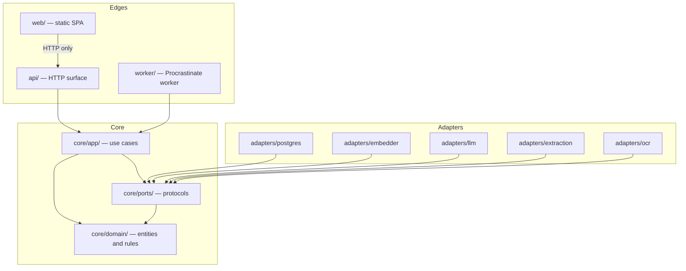
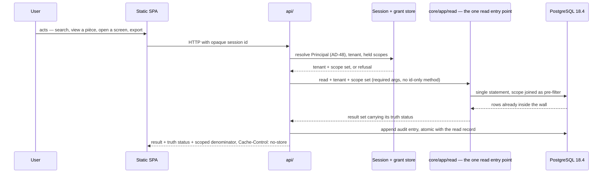
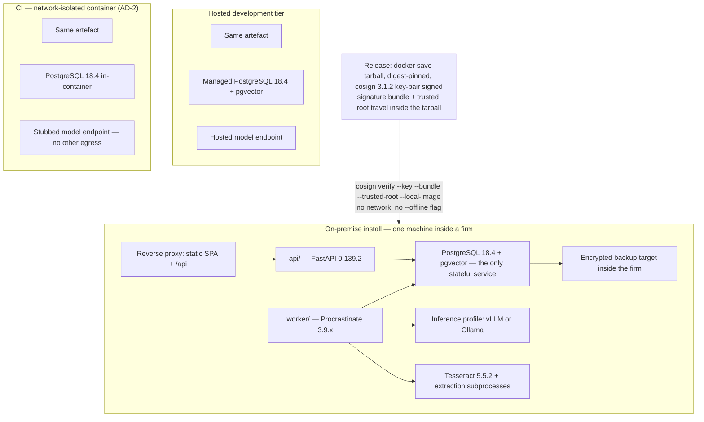
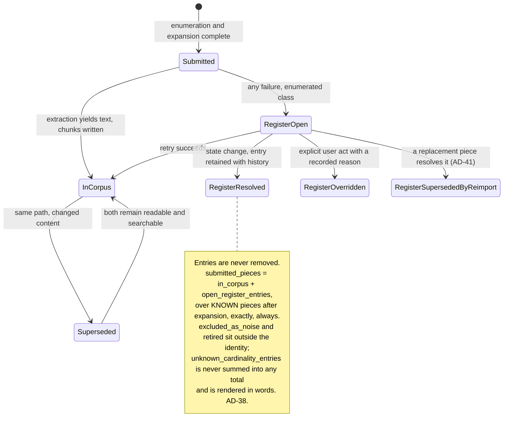
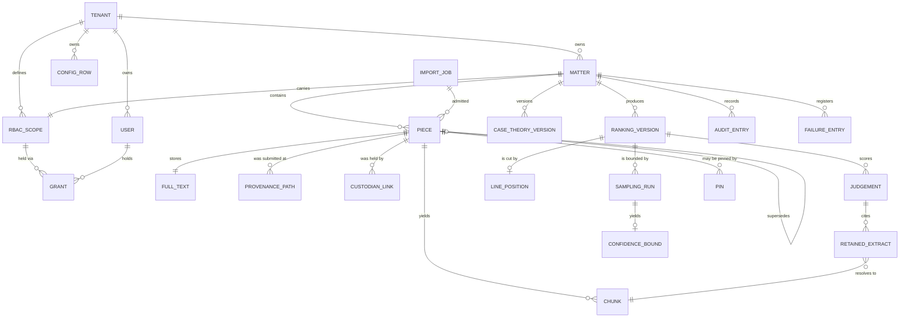

# Architecture Spine — APX MVP, First Increment

**The fitness function is the central invariant: can this run, unmodified, on a single machine
inside a law firm with no internet connection?** It is not a principle here. It is AD-2 — a CI
job that fails the build — and AD-1, AD-3, AD-5, AD-15, AD-26, AD-27, AD-29, AD-30, AD-45 and
AD-46 exist to make failing it structurally difficult rather than merely discouraged.

**Forty-nine ADs.** Revised 21 July 2026 against two reviews — `review-adversarial-spine.md` and
`review-versions.md`; the Revision log at the end records every change and which review it answers.
**AD identifiers are stable:** an amended decision keeps its ID, a decision split out of an
over-loaded AD takes the next free ID, and no ID is ever reused or renumbered.

**This system is built by one non-hands-on lead plus AI coding agents. An AD that relies on a
human noticing is not an AD.** Every rule below is decidable by a test or by a static check, or it
carries an explicit **`[NOT ENFORCEABLE]`** label naming why and what stands in its place (AD-33).

---

## Design Paradigm

**Hexagonal (ports and adapters)**, with a **pipes-and-filters** pipeline as the internal shape of
ingestion and of the relevance cascade. The choice is not stylistic: the fitness function requires
that every component which could be compelled, priced or discontinued by a third party is
replaceable by a configuration row, and a hexagon is the pattern that makes "replaceable" a
compile-time property rather than a promise.

| Layer | Directory | Contains | May depend on |
| --- | --- | --- | --- |
| Domain | `core/domain/` | Entities, the payload record, identity functions, the ranked order, the estimator, truth status | nothing outside itself |
| Ports | `core/ports/` | Protocol definitions: `Embedder`, `LanguageModel`, `Extractor`, `Ocr`, `Store`, `Clock` | Domain |
| Application | `core/app/` | Use cases, **the one read entry point (`core/app/read/`)**, the one chunk writer, the cascade orchestration, the AD-37 transition owners | Domain, Ports |
| Adapters | `adapters/` | pgvector store, Procrastinate queue, extract-msg subprocess, Tesseract, vLLM/Ollama client, BGE-M3 runner | Ports |
| Edges | `api/`, `worker/`, `web/` | HTTP surface, worker entrypoint, static SPA | Application |

The domain never imports an adapter, and no adapter imports another adapter. That direction is
AD-4 and it is checked, not documented.

---

## Invariants & Rules

Every decision below is enforceable. `[ADOPTED]` marks a call the user made, or one that existing
reality already settled. Rationale lives in `.memlog.md`; it is not repeated here.



### AD-1 — The core is deployment-agnostic; every third-party edge is a port `[ADOPTED]`

- **Binds:** all units; the directory layout; the CI import-graph check.
- **Prevents:** a unit reaching for a hosted-provider primitive because it was convenient in the
  dev tier, producing an artefact that cannot be installed inside a firm.
- **Rule:** anything that could be compelled, priced or discontinued by a third party is reached
  only through a port in `core/ports/`. Supabase, Vercel and Railway are acceptable as a
  *development and hosted-tier packaging* of adapters, never as a dependency of the core.
  Supabase Auth and PostgreSQL row-level security are **forbidden outright** — each makes the
  on-premise install impossible, and RLS additionally would place the Chinese wall in a layer the
  air-gapped install cannot carry.

### AD-2 — The offline fitness function is a build gate `[ADOPTED]`

- **Binds:** CI; every unit; the release process.
- **Prevents:** portability decaying between the intent and the first installation, discovered in
  front of a client with SM-10 on the line.
- **Rule:** a CI job boots the whole application in a network-isolated container with no
  outbound network except a stubbed model endpoint, and asserts it starts, ingests, indexes,
  retrieves over both engines, ranks, places **the line**, writes an *audit record* and exports.
  It runs from week one of the build, before any feature is complete. A failure fails the build.
  The set of capabilities that do not survive the model provider's absence is **enumerated by
  this job**, never described in prose. The *confidence bound* sentence is inside the surviving
  set: it is templated and rendered locally from the *audit record* with no model call.
  **Exactly one edge is stubbed: the language-model endpoint.** The embedder is the real one,
  running from weights **carried inside the artefact** (AD-11) — which is also what makes the
  on-premise install free of any model-download step. The job **fails if any model weight,
  tokeniser or layout artefact is fetched at start-up or at first use**, and it starts from a
  **cold cache** in an image built with `HF_HUB_OFFLINE=1`, `TRANSFORMERS_OFFLINE=1`,
  `DO_NOT_TRACK=1` and `SCARF_NO_ANALYTICS=1`; a warm `$HOME/.cache/docling` otherwise passes CI
  and fails at the firm. If the cost of real embedding in CI proves prohibitive once U2 has
  measured it, the answer is a **second job tier** — a fast job that skips indexing and a full job
  that does not — **never a stub inside the artefact**. Recorded per run, because a regression
  would otherwise hide them: the artefact's size, the job's wall-clock and the AD-18 stage-3 share.
  The job also asserts **against the live schema** what a source-level grep cannot see: no
  `ON DELETE CASCADE`, `SET NULL` or `SET DEFAULT` anywhere (AD-7); the pinned collation and locale
  (AD-5); exactly one reachable PostgreSQL endpoint, not in recovery (AD-5); and no cache directive
  in the shipped reverse-proxy configuration applying to `/api` (AD-29).

### AD-3 — One artefact, three environments; deployment is packaging `[ADOPTED]`

- **Binds:** build, release, configuration, the dev tier.
- **Prevents:** a per-environment or per-client fork, and a feature that exists only where a
  managed service is available.
- **Rule:** exactly one artefact is built and every installation runs it. The three environments —
  hosted development, the network-isolated CI container, the on-premise install — differ by
  configuration rows and by which adapter implementations are wired, never by which code was
  built. A capability available on the managed dev tier but not on-premise may not be depended on
  by the core; this is what excludes pgvectorscale and ParadeDB (see AD-5, AD-21).
  **"Depended on" is not decidable by any check, and is not claimed as a property.** What is
  enforced in its place, and is the whole of the enforcement: a **package and extension deny-list
  in `checks/`**, extended by name and failing the build on import or on `CREATE EXTENSION` —
  today `pgvectorscale`, `pg_search`/ParadeDB, and any driver or SDK a managed tier alone supplies
  — plus AD-5's start-up refusals, which catch at run time the divergences a deny-list cannot name
  in advance.

### AD-4 — Dependency direction is one-way and checked

- **Binds:** every module.
- **Prevents:** the classic drift where an adapter grows domain rules, or the domain grows an
  import of the store — after which "swap the LLM provider" becomes a rewrite rather than a
  configuration line.
- **Rule:** the arrows in the diagram above are the whole permitted set. `core/domain/` imports
  nothing outside itself. `core/app/` imports Domain and Ports only. No adapter imports another
  adapter. Enforced as a *structural property* (FR-56) by an import-graph rule in CI.

### AD-5 — One stateful service: PostgreSQL 18.4 `[ADOPTED]`

- **Binds:** storage, retrieval, ingestion, the queue, deployment, backup, restore.
- **Prevents:** units independently introducing a second stateful service — Redis for the queue,
  Qdrant or LanceDB for vectors — producing a deployment a non-specialist cannot operate, back up
  or restore, and a backup that is not one consistent snapshot.
- **Rule:** one PostgreSQL instance holds relational data, vectors (**pgvector ≥ 0.8 with `halfvec`
  and HNSW** — the invariant is the extension contract, not the server's patch number), the
  deterministic text index and the job queue (Procrastinate 3.9.x). **The major version is "the
  newest the environment offers"**: the on-premise artefact and Railway ship PostgreSQL 18.4
  (`pgvector/pgvector:pg18`); the Supabase dev tier runs PostgreSQL 17 with pgvector 0.8.0, which
  satisfies `halfvec` + HNSW identically. A PG17↔PG18 parity check runs in CI (verified 2026-07-22,
  `docs/context/06-postgres-managed-tier-check-2026-07.md`). No component may introduce a stateful
  service beyond it. Anything that appears to require one is an adapter
  boundary, not a new deployment unit. Consequence taken deliberately: crash-resume mid-ingestion
  is a transaction property rather than a configuration, and "*chunk* row + its vector + its
  *matter*" is one transactional object — an embedding cannot outlive the *pièce* it came from.
  *(Amended: the parenthetical previously read "+ its RBAC scope", which contradicted AD-13. Scope
  is never on the row — AD-9.)* PostgreSQL 19 is at Beta 2 and must not ship into a firm.
  pgvector is pinned exactly, not by a floor: 0.8.3 and 0.8.4 were HNSW vacuum-corruption fixes,
  on an index nobody can inspect remotely, in a bundle AD-30 pins by digest.
- **Rule — exactly one endpoint.** One PostgreSQL **endpoint**, in every environment. No read
  replica, no hot standby, and no pooler that may route a statement anywhere but the primary. The
  application refuses to start against a connection where `pg_is_in_recovery()` is true, and
  asserts at start-up that the queue, the vector store and the ledgers resolve to the same
  endpoint. An asynchronously stale replica would resolve AD-13's scope join against a revocation
  it has not seen, split an **exhaustive** set from its qualifications across two LSNs, and fork
  the audit chain — and the dev tier makes one available in a single configuration row, which is
  why this is a start-up refusal and not a convention.
- **Rule — the collation is part of the artefact.** `LC_COLLATE`, `LC_CTYPE`, the collation
  provider and the ICU version are declared, are asserted at start-up against the running cluster,
  and a mismatch **fails to start** rather than warning. The AD-46 restore procedure asserts them
  before restoring, and the AD-2 job asserts them against the live schema. Unpinned collation
  silently changes AD-23's tie-break and AD-21's declared normalisation semantics — the first
  moves set membership across **the line** with no recorded event, the second is the honesty of
  every absence claim.

### AD-6 — Work happens in the queue; the HTTP request never does work

- **Binds:** ingestion, extraction, embedding, ranking, re-ranking, export generation, backup.
- **Prevents:** v1's defect exactly — one synchronous function inside the request doing parse,
  score, chunk, embed and upsert, accumulating every point in memory before a single write. That
  shape cannot ingest 1 700 *pièces*, let alone 100 000, and it makes FR-2's resumability
  unreachable.
- **Rule:** any operation whose cost scales with the size of a *matter* is a queued job. The HTTP
  layer validates, authorises, enqueues and returns. State advances only by a worker committing a
  unit of work. A user-visible progress figure is read from committed state, never held in a
  process.
- **Rule — every state-changing request is idempotent.** Every state-changing HTTP request carries
  a **client-generated idempotency key**; the API stores it with the resulting action in the same
  transaction and returns the original result for any repeat. An action listed in the AD-33
  registry as state-changing and reachable without an idempotency key **fails the build**. The
  idempotency key of a unit of work **covers its audit entry**: a re-executed unit that is a no-op
  under AD-17 writes **no new entry** and reports itself against the existing one. Without this, a
  double-click, a retried fetch on a slow link or an SPA remount turns one bulk *validation act*
  over 1 400 *pièces* into 2 800 permanent entries in two batches, and AD-7 forbids removing
  either — the record then says the gesture happened twice. FR-7's one-open-*import job* rule
  closes this for imports only; this closes it for line moves, *pins*, exports, *sampling run*
  starts, bulk retries and bulk *validation acts*.

### AD-7 — Nothing is hard-deleted; evidence ledgers are append-only; no cascade exists `[ADOPTED]`

*Split 21 July 2026: the "*retained set* and *discarded set* are views" clause bound one unit and
is now AD-39. This AD binds everyone.*

- **Binds:** the *failure register*, the *audit record*, the *change log*, the head journal, the
  index, every migration, every administrative operation.
- **Prevents:** reversibility becoming a promise somebody has to keep, rather than a shape in
  which irreversibility is unrepresentable. It also designs out v1's silent index wipe — and the
  sharper case: the one blessed administrative deletion eating the audit entry that records it,
  while the grep for "no other call site" stays green.
- **Rule:** *Failure register* entries are resolved by state change and never removed. The *audit
  record*, the *change log*, the head journal and the register are append-only. Bulk deletion,
  truncation or recreation of a *tenant*'s indexed material is reachable from exactly **one**
  named administrative entry point, requires a human act and a reason, and is never a response to
  an error, a dimension mismatch or a version difference. Enforced as a *structural property*: no
  other call site exists.
- **Rule — deletion at the schema layer.** `ON DELETE CASCADE` is not a call site; it is a schema
  property that PostgreSQL executes, it is what an agent writes by default for the ER diagram's
  relations, and it passes every source-level check. Therefore: **no foreign key in any migration
  declares `ON DELETE CASCADE`, `ON DELETE SET NULL` or `ON DELETE SET DEFAULT`**; every reference
  to an evidential ledger — the *audit record*, the *change log*, the *failure register*, the head
  journal — is `ON DELETE RESTRICT`. The named administrative entry point performs a **state
  transition to `retired`**, never a `DELETE`: retired material is excluded from every read through
  the AD-14 entry point, is excluded from every total in the *denominator* with its retirement
  stated as its own named count (AD-38), and remains restorable by the inverse transition. The
  tokens `DELETE FROM`, `TRUNCATE` and `DROP TABLE` appear in **no** runtime module, and in
  migrations only under a reviewed, dated allow-list naming the migration and its reason. Enforced
  as a *structural property* over the migration files **and re-asserted against the live schema by
  the AD-2 job** — a cascade that reached a firm's database through a hand-run migration is
  invisible to a source grep. One named exception exists and is written here so it is not
  invented elsewhere: the single-use transient-credential row of AD-47 is **purged**, and the
  purge writes an audit entry naming the *failure register* entry and never the value.

### AD-8 — A *pièce*'s identity is (content hash, matter) `[ADOPTED]`

- **Binds:** ingestion, deduplication, retrieval filtering, audit, the *bordereau*.
- **Prevents:** two units disagreeing on whether a *pièce* is one object seen from several
  *matters* or several independent objects — which yields incompatible identity keys,
  incompatible dedup semantics and an ambiguous Chinese wall.
- **Rule:** identity is a deterministic function of content and *matter*. **Provenance path is not
  part of identity**; it is a recorded attribute, and one *pièce* may carry several. The same file
  ingested into two *matters* yields two *pièces* with separate identities, rankings, audit
  records and lifecycles. No entity is visible from more than one *matter*. Cross-*matter*
  deduplication and "seen before" intelligence are explicitly forfeited — they are the capability
  a Chinese wall exists to forbid. Consequence: the scope predicate is an **equality**, the filter
  shape hardest to get wrong. Identifiers are never allocated from a counter *(v1 restarted ingest
  ids from 1, so a second upload overwrote the first)*.
- **Rule — supersession, and it is written in this increment.** A `supersedes` relation points
  **from the newer *pièce* to the older**, is acyclic (database constraint), forms a chain and not
  a tree, and is written by the ingestion use case only (AD-37). Both *pièces* remain in the
  *corpus*, readable and searchable (AD-7). A superseded *pièce* **remains in the *denominator***
  (AD-38), is **excluded from the ranked order and from every *sampling run*'s population** — its
  current version stands for it, which is FR-4's "not counted as two independent draws" — and is
  **marked as superseded on the face of every export**, naming its current version.
  **Supersession is never derived from a provenance path**, because path is not identity: FR-4's
  "same content at the same path" would leave `folderA/contrat.pdf` and `folderB/contrat.pdf`
  with one byte changed as two unrelated *pièces*, which is the ordinary case. A relation is
  created only by (i) an explicit user act with a recorded reason, or (ii) a declared, configured,
  audited rule whose output is a ***worklist* line offering the relation** — never a silent write
  during ingestion. Where no relation is created, two versions of one document are two *pièces*
  and every surface counting them says so.

### AD-9 — One *chunk* write boundary; the permitted `chunk` columns are enumerated `[ADOPTED]`

*Split 21 July 2026: schema freezing, versioning and migration rejection are now AD-40. This AD is
the write boundary and the column enumeration.*

- **Binds:** every write to the *corpus*; the *failure register*; every migration touching `chunk`.
- **Prevents:** a *chunk* acquiring a scope from a global default rather than from its *matter* —
  and the sharper failure the enumeration exists for: a wall with **two representations**, a column
  written at index time that nothing may ever re-stamp and a join resolved at query time. The
  moment any third path — an export enumerator, a bulk retry, the stage-2 filter, a capacity
  report, a projector — reads a scope column because it is right there and it is `NOT NULL`, it
  enforces the **stale** wall permanently and correctly against the wrong material, which is
  AD-13's stated failure mode reached without disobeying AD-13.
- **Rule:** exactly one function writes a *chunk*. It takes *tenant*, *matter*, *RBAC scope* and
  *custodian* as **required arguments with no default value anywhere in the source**. A write
  missing any mandatory field is rejected at the boundary, fails its unit of work loudly and
  enters the *failure register*; it is never written with a default.
- **Rule — arguments are not columns.** *Tenant* and *matter* are **persisted on the row** and are
  immutable for the life of the *chunk*. *RBAC scope* is a **write-time authorisation check against
  the *matter*'s current scope and is never persisted**. *Custodian* is likewise a **write-time
  required input and never a column**: custodianship is a set on the *pièce* (`CUSTODIAN_LINK`),
  unioned — never replaced or collapsed — by every *import job* admitting the same content, and
  resolved by join at read time. *(Two units otherwise disagree on the question the spine itself
  calls "frequently the fact in issue": AD-17 makes the second import a no-op, so a stamped
  custodian never reaches the row, and AD-13 removed every re-stamp path that could fix it.)*
- **Rule — the enumeration.** The columns a `chunk` may carry are exactly: `chunk_id`,
  `piece_id`, `tenant`, `matter`, `position`, `full_text_version`, chunking-configuration identity,
  schema version, `model_id`, `model_version`, the vector, and the reserved external-authority
  reference. **Any other column fails the build**, and no column named or aliased as a scope or a
  custodian exists on `chunk`, `piece` or `full_text`. Enforced as a *structural property*: a
  schema check over the migration files decides the column set, and the import-graph check asserts
  that the grant store is imported only by the AD-14 read entry point. This enumeration is the one
  place an agent will look before adding a field to the frozen schema, which is why it is a list
  and not a principle.

### AD-10 — The full extracted text of a *pièce* is a first-class stored artefact, separate from its chunks

- **Binds:** extraction, storage, the deterministic engine, the exact-containment check.
- **Prevents:** the deterministic engine being built over *chunks*, which would miss every phrase
  and proximity match spanning a chunk boundary **by construction** — an absence claim that is
  false and cannot be detected by any test that does not plant matches across boundaries.
- **Rule:** extraction produces two artefacts with separate identities and versions: the addressable
  full text of the *pièce*, and the *chunks* derived from it. The deterministic engine (AD-21) runs
  over full text and over names; the semantic engine runs over *chunks*. Exact-containment
  verification resolves against the full text at the moment an extract is shown, and a resolution
  that fails marks the containing export degraded rather than displaying the extract as ordinary.

### AD-11 — 1024 dimensions is the interface; the embedder is swappable `[ADOPTED]`

- **Binds:** the chunk schema, retrieval, any re-embed, the hardware conversation.
- **Prevents:** a model choice becoming a schema migration.
- **Rule:** the vector column is 1024-dim `halfvec`. Every chunk row carries `model_id` and
  `model_version`. Changing embedder is a background migration, never a rebuild, and a
  mixed-provenance *corpus* is detectable rather than suspected. BGE-M3 (568M, 1024-dim, MIT) is
  the default and yields **dense and sparse** vectors from one pass — sparse matters for French
  legal names, references and article numbers, where dense-only retrieval classically fails.
  `multilingual-e5-large-instruct` is a drop-in fallback; `Qwen3-Embedding-0.6B` is the
  same-family upgrade. **There is no fallback embedder at runtime**, in any configuration
  including test and development: the port has exactly one non-test implementation, no exception
  handler in the embedding path constructs an embedder, and no configuration key selects one
  outside the enumerated list. *(v1 fell back to a 256-dim hash on any exception, unlogged, and
  the index then deleted itself on the dimension mismatch.)*
  **And there is no stub embedder anywhere.** The `Embedder` port has exactly one implementation
  **in the artefact**, in every environment including CI and the hosted dev tier; no
  configuration-as-data key and no wiring variable selects one; the test tree's fakes are
  unreachable from any runtime module (AD-16). Where a test must avoid the cost of real embedding
  it substitutes **at the port boundary inside the test process**, never inside a running
  artefact. Enforced as a *structural property*: exactly one class implements `Embedder` under
  `adapters/`. The consequence is deliberate and is stated because two units would otherwise
  resolve it opposite ways in week one: **the 1.4 GB of weights sit inside the CI image and inside
  the shipped `docker save` tarball**, the artefact's size grows accordingly, the AD-2 job's
  wall-clock is bounded by real embedding throughput from week one — and the on-premise install has
  no model-download step, which is the property that pays for it. Carried risk: BGE-M3 is a
  2024-generation model measurably behind the 2026 frontier (51.8 vs 56.4 BEIR); if retrieval
  quality proves to be the binding constraint on triage recall, the upgrade path costs hardware.

### AD-12 — *Tenant* first, then *RBAC scope*; both fail closed `[ADOPTED]`

- **Binds:** every read, every count, every export, every diagnostic surface.
- **Prevents:** an ambiguity resolving toward more access. A cross-*matter* leak is silent, has no
  error message, and voids the product's premise.
- **Rule:** every stored record carries its *tenant*, enforced at the write boundary; a record
  without one cannot be written. Every read is constrained by *tenant* before *RBAC scope* is
  applied. A user with no scope receives an **empty** *corpus*, not the whole one — and this
  applies identically to administrative and system identities. There is no implicit superuser and
  no identity that bypasses the predicate; the only three principal kinds that exist, and the one
  of them that may read a whole *tenant* partition without producing a result set, are AD-48.

*Split 21 July 2026: the third clause — the *failure register* is inside this guarantee — was a
separate, load-bearing rule buried in a long AD and is now AD-41.*

### AD-13 — *RBAC scope* is resolved at query time from a single authoritative source, never denormalised onto indexed rows `[ADOPTED]`

- **Binds:** every retrieval path, the payload record, every administrative operation on scopes,
  every long-running job.
- **Prevents:** a stale wall — scope stamped at index time, scopes editable as configuration,
  nothing re-stamps, and an ordinary administrative act silently enforces obsolete permissions
  against the wrong wall, permanently and correctly.
- **Rule:** authorisation state lives in exactly one place and is **joined into every retrieval
  query as a pre-filter**. A scope change takes effect on the next query, with no re-indexing, no
  migration and no window of indeterminate state. **No re-stamping operation exists in the
  system**, so the long-running rewrite that fails halfway on an unreachable machine is designed
  out rather than made recoverable. A long-running job re-resolves the caller's scope at every
  unit of work, which is what makes FR-14's "revocation reaches open sessions within a bounded
  interval" true for in-flight exports and running *sampling runs* as well as for queries.
  Cost accepted: a join per query.
- **Rule — the general form.** The rule is not about scope alone: **no mutable attribute of a
  *pièce* or a *matter* is denormalised onto an indexed row.** Scope and *custodian* are the two
  instances that would otherwise be written today; the enumerated `chunk` column list in AD-9 is
  what decides the general case, and any column outside it fails the build.

### AD-14 — Exactly one code path reads *tenant* data — not only retrieval `[ADOPTED]`

- **Binds:** both engines, every count, the *scoped denominator*, the cascade's stage 2, the
  *pièce* viewer, every non-search screen, every aggregate, every export that names *pièces*.
- **Prevents:** the join of AD-13 being bypassed by a second query path written in good faith —
  and post-filtering, which leaks silently because the wrong rows were already fetched, counted or
  logged. **Amended 21 July 2026 because the noun was too narrow:** *retrieval* means the search of
  a *corpus* returning a ranked or complete match set, and most reads of *tenant* data are not
  that. AD-12 makes a hand-written scope check in a viewer route **obligatory**; it does not make
  it **centralised**, so the wall ends up enforced in N places, correctly per AD-12, with no single
  path and no check over any of them. The four legitimate second paths are the *pièce* viewer
  (FR-44), per-*pièce* hydration inside the export (FR-46), corpus-wide aggregates (AD-18's
  stage-3 share, FR-3's OCR figure) and every non-search screen (FR-27, FR-28, FR-60, FR-7, FR-52).
- **Rule:** **every read of *tenant*-owned data has one entry point**, not only ranked or
  exhaustive search. It covers: reads by identifier; streams of original bytes, OCR images and
  stored full text; render and thumbnail requests; counts, aggregates and derived statistics; the
  *failure register*; the *worklist*, the *denominator*, the *matters* zone and the completion
  summary; and every enumeration performed while producing an export. The read port exposes **no
  method that accepts an identifier without a *tenant* and a scope argument**. No result-set
  post-processing function accepts a scope, and none exists.
- **Rule — the check that decides it.** No SQL text and no ORM query naming a *tenant*-owned table
  appears outside `core/app/read/`, asserted by a grep over `adapters/`, `api/`, `worker/`,
  `eval/` and `web/`; and the AD-33 registry of user-reachable actions carries, per action, **the
  read entry point it uses — an action with none fails the build**. This is what converts the work
  breakdown's "the adversarial suite must be extended every time any surface is added, forever"
  from an intention that relies on a human noticing into a check.
- **Rule — aggregates.** Aggregate and derived-statistic computation is a first-class use case
  executed through the same entry point under an explicit **tenant-bound maintenance principal**
  (AD-48), recorded in the *audit record* as a system-actor read. Any figure displayed to a user is
  either recomputed within that user's scope, or is labelled on its face as a *matter*-level
  quantity the user is authorised to see — FR-6's two-names rule, extended from the *denominator*
  to every derived figure. Every retrieval and every read is recorded in the *audit record* with
  the scope it executed under, reviewable by a holder of the *tenant* administrative grant — a log
  nobody can read is not an insider-threat control. High-volume read records are appended under
  AD-44, not chained one by one.



### AD-15 — Authentication is owned, not delegated `[ADOPTED]`

- **Binds:** every authenticated request; the packaging; the security review.
- **Prevents:** a unit reaching for a managed identity provider — forbidden, it breaks the
  air-gapped install — or for a library that is dead or CVE-ridden. It also prevents the rejected
  options being revisited by whoever next reads a FastAPI tutorial.
- **Rule:** opaque server-side sessions in PostgreSQL with Argon2id via `pwdlib[argon2]` 0.3.0.
  PyJWT 2.13.0 is for **internal service tokens only, never for user sessions**. `pyotp` 2.10.0
  provides TOTP as the second factor; `py_webauthn` 3.0.0 is an additive credential type gated on
  a per-site FQDN and certificate. No reversible credential storage exists, enforced as a
  *structural property*. `Principal` resolution sits behind one interface and no route imports the
  session table directly — which is also the cheap insurance against Open Risk 2.
- **Rule — the accepted algorithm list is explicit at every decode, and that is a static check.**
  Every `jwt.decode` call passes `algorithms=["HS256"]` **explicitly**; the algorithm is never
  inferred from the token header, and no JWK or JWKS client is used. Enforced as a *structural
  property*: a `jwt.decode` call site without a literal `algorithms=` list fails the build, and
  the tokens `PyJWK`, `PyJWKClient` and `jwks` appear in no runtime module. This is the control,
  not the version number: **PyJWT 2.13.0 is itself the fix release for five advisories** — among
  them CVE-2026-48526 (HIGH: a public-key JWK accepted as an HMAC secret, enabling forged HS256
  tokens where mixed families are allowed) and CVE-2026-48523 (algorithm allow-list bypass when
  decoding through `PyJWK`/`PyJWKClient`) — i.e. **the same bug class** that disqualified the
  rejected libraries below. Adopting the patched release is correct; adopting it without the
  explicit algorithm list would not be.
- **The rejected alternatives are a record, not an invariant, and they have moved.** *Split
  21 July 2026:* the rejected-library list is a memo no check can enforce, and a unit citing
  "AD-15" was citing two different things. It now lives under **Stack › Rejected authentication
  libraries**, labelled `[NOT ENFORCEABLE — record]`. What this AD enforces is the adopted set
  above, the no-reversible-storage property, the one `Principal` interface and the algorithm-list
  check. One sentence survives here because it is the reasoning a unit needs: **the rejections are
  about maintenance posture and response record, never about a library having had a CVE** — every
  library in this space has had one, including the adopted one.

### AD-16 — There is exactly one ingestion path `[ADOPTED]`

- **Binds:** intake, the evaluation corpora, every screen that displays data, the test tree.
- **Prevents:** v1's most damaging shape — a demo layer that overrode a healthy backend, two
  screens that never called it at all, and "golden fixtures" no model ever generated.
- **Rule:** every *pièce* enters through one path, whether it comes from a lawyer's USB key or
  from the TREC gold set. Corpora are **configured data sources**, never fixtures, never
  fallbacks, never a demo branch. Enforced as *structural properties*: no runtime module imports
  from the test tree; no runtime module reads a fixture directory; no conditional on an
  environment variable selects a data source outside the enumerated configured-source list; no
  screen renders from an embedded literal dataset. The v1 fixture layer is **deleted**, not
  disabled.

### AD-17 — The unit of work is one *pièce*: idempotent, resumable, quarantinable, memory-bounded

- **Binds:** the queue, extraction, embedding, the *failure register*, the inventory guarantee.
- **Prevents:** three failures that each end a 100 000-*pièce* run: a resume that resumes onto the
  unit that killed the worker and never completes; a *pièce* large enough to exhaust memory taking
  the worker with it; and a re-run that duplicates or overwrites already-indexed material.
- **Rule — the ledger is the only authority.** The **application-owned ledger** is the single
  authority for a unit's state and for every user-visible progress figure. The queue holds no state
  any read path consults, and no module outside `adapters/store_postgres/queue` may query a queue
  table (*structural property*). Procrastinate's job table is committed state in the same
  PostgreSQL and is cheaper to query, which is exactly why two units would otherwise count two
  different numbers for FR-2's "processed against submitted" — they disagree during retries and
  after quarantine. The attempt counter lives in the ledger and is incremented in a **separate
  transaction committed before the unit's work begins**, so that an OS-level kill still advances
  it; the quarantine transition and its *failure register* entry are committed in a transaction
  **independent of the failing unit's**, because an exception handler writing inside the failing
  transaction rolls back with it and the poison unit is retried forever — the very failure this AD
  names. A unit whose attempt counter exceeds its configured bound is never dispatched again.
  Asserted by test with an induced `SIGKILL` mid-unit, not only an induced exception.
- **Rule:** each *pièce* is one committed unit of work against that ledger, keyed by its identity
  (AD-8). Re-processing an already-committed unit is a no-op that reports itself.
  **No single *pièce*, however large, may be required to fit in memory whole.** A unit exceeding
  its configured resource bound enters the register as `resource-exhausted`; a unit that kills the
  worker is quarantined after a configured number of attempts as its own register entry and the
  job proceeds. The submitted set is frozen at the completion of enumeration-and-expansion, and
  the enumeration itself is recorded. Capacity bounds — *pièce* size, container depth, expansion
  ratio, attachments per message, *matters* per *tenant*, rows per export — are configuration with
  defined defaults, and each surfaces as a *failure register* class rather than as an outage.

### AD-18 — The cascade is a required three-stage gate, and its stage-3 share is a measured output `[ADOPTED]`

- **Binds:** the *relevance judgement*, inference cost, egress volume, wall-clock, the hardware ask.
- **Prevents:** per-*pièce* LLM judgement at 100 000 *pièces* — simultaneously the largest
  inference cost in the system and its largest single export of a client's *matter*. Cutting the
  model's workload tenfold is far cheaper than ten times the GPU, and it is the difference between
  the €2 000 machine and the €20 000 one.
- **Rule:** the order is fixed: **(1)** deterministic filters and near-duplicate grouping —
  content-hash dedup, document type, participant roles, dates against the *case theory* period,
  obvious noise; **(2)** cheap semantic scoring plus deterministic retrieval over the embeddings
  and text already produced; **(3)** LLM judgement **only** on the uncertain band that stages 1
  and 2 could not separate, plus a mandatory calibration sample of the confident bands. Stage
  boundaries are configuration-as-data. **The share of *pièces* reaching stage 3 is recorded per
  run** — it is the number that decides cost, latency and egress, and the number a regression
  would otherwise hide. Near-duplicate families are judged as a family with one representative;
  members keep their own identity, provenance and *custodian* — and the family identifier travels
  into the ranked order (AD-23), because the estimator cannot recover it later.
- **Rule — "only the uncertain band" needs a floor to mean anything.** "Uncertain" is
  configuration-as-data, so a *tenant* configuration widening the band to everything satisfies the
  letter of the stage-3 rule; AD-24's "no default disables its own guarantee" protects the default
  and not an edit. Therefore a configuration that would send **more than a configured share of a
  *matter* to stage 3** requires an explicit *override* with a reason through the AD-25 surface,
  and the measured share — already required above — **generates a *worklist* line when it exceeds
  the floor**. Asserted by test.
- **Rule — what the cascade may not do.** Stages 1 and 2 decide only which *pièces* reach
  judgement; they never remove a *pièce* from the population a *confidence bound* reports on. That
  is AD-36, and it is the difference between an honest sentence and a sentence about a set that
  silently excludes the material most likely to be wrongly excluded.

### AD-19 — Loud failure everywhere; nothing is imputed `[ADOPTED]`

- **Binds:** every component, every adapter, every derived value.
- **Prevents:** the v1 pattern in which retrieval did not stop working — it silently became noise,
  which is worse. And the sharper version: a *pièce* no model ever read, scored zero, sorted to
  the bottom, sitting inside the population a *confidence bound* reports on.
- **Rule:** every failure produces exactly one of a *failure register* entry, a halt, or a
  *worklist* line — never a *chunk*, never an imputed score, never a completed action whose record
  was not written. **Unscored is not zero:** a *pièce* the model could not judge is shown as
  unscored in its own named set, never ranked last and never dropped from the population (AD-36).
  Where a guarantee cannot be met the product **refuses**: a query that cannot guarantee
  completeness errors rather than returning a labelled partial set. Confidence is derived from
  observable quantities and **never** from a figure a model states about itself — enforced as a
  *structural property*: no field parsed from a model response is named or used as a confidence,
  and the derivation function has one implementation.
- **`[NOT ENFORCEABLE]` — "never a plausible-looking wrong answer".** Undecidable as stated; no
  test or static check decides plausibility. It stays as the *rationale* for the rule above, and it
  is not counted as a property. Its two checkable parts are in the Rule: the model-reported
  confidence check and the single derivation implementation. The remainder is *asserted by review*
  against U20's checklist.

### AD-20 — Two engines, two truth statuses, one constant construction site each `[ADOPTED]`

*Split 21 July 2026: the qualifications an **exhaustive** set must carry bind the surfaces and the
export rather than the engine, and are now AD-42 — the droppable half was the honesty of the
absence claim.*

- **Binds:** both engines, the interface, every export, the *audit record*.
- **Prevents:** a similarity threshold wearing the costume of a proof. *(v1's off-corpus gate was
  a similarity threshold shipped disabled by default — a guess that looked like a proof, which is
  worse than nothing.)* And its 2026 costume: a `LIMIT` clause. At the *design target* a common
  French word matches 40 000 *pièces*, no API returns 40 000 rows and no browser renders them, so
  the configured transport bound AD-17 **requires to exist** turns a complete match set into a
  top-k set still carrying the constant `exhaustive`.
- **Rule:** *truth status* is a property of the **result set**, carried in data, present in the
  interface, in every export and in the *audit record*. Two values only: **suggestive** (semantic,
  ranked, top-k — can support a finding, can never prove an absence) and **exhaustive**
  (deterministic, complete match set over the whole indexed *corpus* within one scope). It is set
  at exactly one construction site per engine and is a **constant** there; no threshold in any
  configuration can produce an **exhaustive** label. No interface element merges results from both
  engines into one undifferentiated list.
- **Rule — an exhaustive set is never truncated.** Where the match set exceeds the configured
  transport bound, the product returns the **count and the AD-42 qualifications** with status
  **exhaustive**, and the rows as an explicitly paginated cursor over **one stable snapshot**. A
  `LIMIT`, a `top_k` or a page size applied to a set constructed as exhaustive **downgrades its
  status to *suggestive* at the same construction site**, and no configuration can prevent the
  downgrade. Enforced as a *structural property*: the deterministic engine's constructor accepts
  no limit parameter.
- **Rule — one snapshot, and never over a moving population.** An **exhaustive** set and its
  qualifications are computed **in one repeatable-read transaction**, and over a *matter* with **no
  open *import job***. Where an *import job* is open, the deterministic engine **refuses** and says
  so in the lawyer's language, naming the job and offering the *worklist* line; it never downgrades
  silently to **suggestive** and never returns a labelled partial set (AD-19). Otherwise the four
  qualifications are read at four instants and the absence claim is made over a population that
  grew while it was being made — and an ingestion at the *design target* runs for a weekend.

### AD-21 — The deterministic engine is PostgreSQL-native, over full text and names, with declared normalisation

- **Binds:** exhaustive search, the cascade's stage 2, the *failure register* search.
- **Prevents:** a second search service arriving through the back door (ParadeDB, an external
  BM25 server) and breaking AD-3 and AD-5 — and an unspecified normalisation, which is not a
  detail: opposing counsel needs the one document where the word appears with an accent the OCR
  dropped.
- **Rule:** deterministic search runs inside PostgreSQL 18.4 over the stored full extracted text
  (AD-10) and over the filename-as-submitted and extractable title. ParadeDB and pgvectorscale are
  excluded by AD-3 — they are unavailable on the managed dev tier and would become an
  on-prem-only code path, which is the exact divergence AD-3 exists to prevent. Normalisation
  semantics are **decided, declared on the result set, and configuration-as-data**: diacritics,
  case, elision, ligatures, hyphenation across a scanned line break, whitespace, and which of
  boolean/proximity/wildcard the expression supports. They depend on the database collation, which
  is why AD-5 pins it and refuses to start on a mismatch. A *pièce* in the *failure register* is not
  in the searched set; the register is searched separately within scope and a name match there
  returns as a register hit, visibly distinct and never counted inside the **exhaustive** set.

### AD-22 — An audit entry is atomic with the action it records `[ADOPTED]`

*Split 21 July 2026: this AD carried four decisions and three unstated concurrency consequences.
Atomicity and the refusal-when-unwritable rule stay here; the sequence and chain contract is
**AD-43**; the high-volume partition-and-seal contract is **AD-44**; the head journal that makes
truncation detectable at all is **AD-35**.*

- **Binds:** moving **the line**, *overrides*, *pins*, *validation acts*, completing a *sampling
  run*, granting or revoking a scope, changing configuration, producing an export, every read
  (AD-14).
- **Prevents:** an action that succeeded while its record did not — afterwards indistinguishable
  from an action that never happened, and the gap is an absence, which the record's reader cannot
  see.
- **Rule:** **an action whose audit entry cannot be written fails.** Both happen or neither does.
  The continuity check (AD-43) runs on export and its result appears on the export's face, and it
  is verified again on restore against the head journal (AD-35); a failed verification is
  surfaced, never silently repaired. Where the audit store cannot be written at all, the
  application refuses the affected actions rather than degrading to an unaudited mode; read-only
  functions may continue. **A lock timeout or write contention is not "cannot be written at all"**
  and does not open that escape — which is why the high-volume events that would otherwise
  contend on the chain head are partitioned by AD-44 rather than serialised. AD-5 keeps the entry
  in the same transactional store as the action, which is what makes atomicity buildable at all.

### AD-23 — Every derived artefact names the version identity that produced it; staleness is explicit and never self-resolving

- **Binds:** the ranked order, **the line**, the review-effort estimate, the *confidence bound*,
  every **exhaustive** result set, every export.
- **Prevents:** the north-star artefact being false while displayed as fresh — 300 *pièces*
  arrive, the sentence still reads "1 400 in the discarded set", nothing is marked stale and it
  remains exportable as current.
- **Rule:** a *ranking version* is the complete immutable identity of what produced one order:
  *case theory* version, model identity, prompt version, temperature and every sampling parameter,
  cascade configuration, embedder identity, chunking configuration, schema version, **and the
  near-duplicate grouping** — a change to the grouping threshold produces a new version.
  Re-running a fixed *ranking version* over a fixed *corpus* reproduces the same order, *pièce* for
  *pièce*; where the model is non-deterministic at the configured temperature the version records
  the scores themselves. **The tie-break is deterministic and recorded in the version** — never the
  order a store happened to return, because ties are the normal case for near-duplicates and a tie
  spanning **the line** would otherwise reshuffle set membership with no recorded event — **and it
  is computed over a byte-ordered, collation-independent key, the *pièce* identity hash, never over
  collated text.** Asserted by test: the same *ranking version* over the same *corpus* reproduces
  the same order under two different `LC_COLLATE` settings, which is what makes AD-32's restore
  assertion survive a rebuilt machine.
  Staleness triggers are a complete enumerated list — new *ranking version*, line move, pin added
  or removed, *case theory* revision, a configuration change affecting retrieval/ranking/the
  estimator, a scope change affecting the population, any ingestion into the *matter*, **and a
  re-extraction of any *pièce* in the *matter*** (AD-40). Staleness is never resolved by time, by
  background recomputation or by being viewed: only by an explicit user-initiated recomputation
  that produces a **new** artefact.
- **Rule — the ranked order's recorded output.** Per *pièce* it carries: rank; score **or** the
  enumerated rejection class that kept it out of judgement (AD-36); its **near-duplicate family
  identifier and whether it was the family's judged representative**; and its `supersedes` state.
  The family identifier is not cheaply recoverable at the *design target*, and without it the
  estimator draws 40 members of one family as 40 independent draws — the hypergeometric bound then
  assumes an independence it does not have and is **wrong in the unsafe direction**. The
  threshold's *value* stays deferred (OQ-21); its presence in the version identity does not.
- **Rule — a version identity is a conditional commit.** An action producing an artefact that
  carries a version identity **commits only if every input recorded in that identity is unchanged
  at commit time**, verified in the same transaction as the write. A changed input fails the
  commit into the artefact's `invalidated` state with a *worklist* line naming which input changed
  — never into a produced artefact. This binds a *ranking version*, a position of **the line**, a
  *sampling run*'s completion, a *confidence bound*, an **exhaustive** result set and every export.
  *(Otherwise: user A completes a *sampling run* while user B moves **the line**, and the
  *confidence bound* — the north star, copyable as text, quoted to a court — is committed over a
  population whose defining cut moved, with both units perfectly obedient.)*

### AD-24 — Customisation is data, never code `[ADOPTED]`

- **Binds:** the taxonomy, scopes, the model provider and endpoint, configured sources, chunking,
  cascade and refusal thresholds, interface language, the labels on **the line**.
- **Prevents:** the consultancy failure mode — a consultancy says yes to bespoke requests, and
  every yes becomes a code fork unless configuration absorbs it. Forking is survivable at three
  clients and fatal at eight.
- **Rule:** per-*tenant* behaviour is data rows. No *tenant*-specific identifier or name appears
  anywhere in source, enforced as a *structural property*. Every configuration key has a defined
  default, and **no default disables the guarantee its key governs** *(v1's off-corpus gate shipped
  disabled)*. Every key named in documentation exists and is asserted to exist by a test *(v1 named
  keys that appeared in zero source files)*.
- **Rule — and the check for *behaviour*, which used to terminate in nothing.** The previous text
  said *tenant*-specific behaviour was not greppable and deferred to AD-3, whose own rule is not
  decidable either — so the chain ended in no check at all. The real check, which is greppable and
  is most of what was wanted: **no conditional anywhere under `core/` reads a *tenant*
  identifier.** A *tenant* identifier is a filter argument and a row key; it is never a branch.
  Enforced as a *structural property*.

### AD-25 — Configuration changes through exactly one audited surface

- **Binds:** provisioning, the settings surface, the first administrative grant, support.
- **Prevents:** direct store editing at a firm's site — which produces no *audit record* entry,
  no validation and no rollback, and is a per-site divergence: the fork AD-24 exists to prevent,
  arriving as data instead of as code, which is not better.
- **Rule:** one per-*tenant* surface reads and changes every configuration-as-data value and
  provisions the *tenant*, its first administrative user, its scopes and its taxonomy on first run
  — without it, a correctly fail-closed installation is one where nobody can see anything and
  nobody can grant access, at a site APX reaches only by telephone. Every change is validated
  against the declared schema, is reversible, produces an audit entry with actor, key, before,
  after and timestamp, and marks derived artefacts stale (AD-23). It is inside the *tenant*
  boundary and never cross-*tenant*; it is not an operator console. A configuration value whose
  provenance is not an audited change through this surface is detectable as such.

### AD-26 — One content-free projection registry `[ADOPTED]`

*Split 21 July 2026: the egress enumeration and the outbound-adapter check bind everyone and are
now **AD-45**. The work breakdown predicts the projection unit is dropped; dropping it must not
drop the check that no fourth egress path exists.*

- **Binds:** the diagnostic export, the next increment's style extractor.
- **Prevents:** telemetry arriving by accident, a second ad-hoc "just counts" path whose
  content-freedom nobody tested, and a closed enumeration that forces the next increment to fork
  the primitive.
- **Rule:** all emission of information *about* a *tenant*'s data goes through **one registry of
  named projectors**, each declaring the shape of what it emits. The registry is **open by
  construction** — it must serve the next increment's on-premises style extractor, whose output is
  a distribution over sentence lengths and a phrasebook of the firm's own formulae, and is none of
  the value kinds the diagnostic export needs. Content-freedom is structural, in three parts:
  (i) the seeded-token test runs against **every registered projector**, and against **the union of
  all registered projectors' output for one *tenant*** — the attestation floor is not composable,
  and two projectors each above it can jointly identify; (ii) an emission path outside the registry
  fails the build; (iii) a projector deriving a value from *pièce* or *chunk* text may emit only
  values **attested across a configured minimum number of *pièces* and *matters***, never a value
  traceable to one, **and it declares its attestation counts machine-readably in the registry** —
  a projector that does not declare them fails the build, because the floor is otherwise
  undecidable. Filenames, paths, *matter* names, user names, content and query text never appear
  in any output; where a name is needed for correlation, an opaque identifier is used.

### AD-27 — Two inference profiles behind one OpenAI-compatible interface, selected by configuration `[ADOPTED]`

- **Binds:** every inference call site; the hardware conversation; the commercial tiering.
- **Prevents:** application code branching on which engine is behind it, and a per-profile fork.
- **Rule:** APX ships both a **GPU profile** — vLLM 0.25.1, Mistral Small 3.2 24B (Apache-2.0) at
  **Q4 on 24 GB VRAM**, 100 000 *pièces* overnight — and a **CPU/low-end profile** — Ollama
  0.32.1, the same job in two to three weeks — priced differently. **Both engines are pinned by
  image digest**, not one: both ship weekly, both are pre-1.0, and every release has changed
  scheduling, KV-cache handling or backend kernels. Application code never knows which serves it.
  The profile is configuration-as-data. The same interface must admit a locally hosted model and a
  sovereign hosted facility as configurations without a code change, because a *bâtonnier* applying
  the CNB criteria may make a fully local model necessary rather than premium. Commercially, the
  GPU ask cites the CCBE's March 2026 guide, which publicly prices law-firm hardware at
  €2 000–20 000.
  *Corrected 21 July 2026: the rule previously read "INT8/Q4 on 24 GB VRAM". INT8 for a 24B model
  is ≈24 GB of weights alone — half the FP16 footprint of ≈48 GB — before KV cache, activations and
  the CUDA context. **Only the Q4 path fits the €2 000 machine**; INT8 belongs to the larger card
  tier, and the claim as written could not be honoured on the hardware it was sold with.*
- **Rule — "stated honestly before the job starts" is a screen, not a sales act.** A sentence
  about what somebody says to a firm is not a system property and nothing in the product could
  enforce it. What is enforced: the AD-32 pre-flight check, which already computes capacity,
  **also states the expected wall-clock for the configured profile before an *import job* is
  accepted, and records the statement in the *audit record* with the job**. Asserted by test —
  an *import job* accepted with no recorded pre-flight statement fails.
- **Recorded, not decided:** "Mistral Small" now denotes a 119B model upstream, and Mistral's
  current line for this hardware class is Ministral 3 (14B/8B/3B, Apache-2.0). The comparison
  against Mistral Small 3.2 24B was set up by the stack research and never run — see Open
  Question 6. The default is configuration-as-data (AD-24), so being wrong here is cheap.

### AD-28 — Extraction adapters run out-of-process and licence-isolated

- **Binds:** `.msg`, PDF, OCR, Office extraction; the worker's failure modes; the licence position.
- **Prevents:** two things at once — a GPL or AGPL dependency contaminating a proprietary core by
  a single `import`, and a malformed compound file taking the worker down with it. It also
  removes the incentive to reach for a hosted OCR API, which §15 forbids because OCR must run
  inside the *tenant* boundary.
- **Rule:** each extraction engine sits behind the `Extractor` / `Ocr` ports and runs in a
  subprocess with its own resource bound; a crash is a *failure register* entry, never a worker
  death (AD-17). `extract-msg` 0.56.0 is invoked **out-of-process and GPL-isolated**. PyMuPDF is
  excluded — AGPL-3.0 makes it unusable here without a commercial licence. The permitted set for
  this increment: `pypdf` 6.14.2 and `pdfplumber` 0.11.10 for born-digital PDF, Docling 2.114.0
  with Tesseract 5.5.2 for scanned PDF and layout-heavy documents, `python-docx` 1.2.0 and
  `openpyxl` 3.1.5 for Office. Every extracted *pièce* records the extraction method **and the
  extractor version**, and that version is part of the full text's identity and therefore of every
  `chunk_id` derived from it (AD-40) — so a transcription is distinguishable from a text layer, and
  a re-extraction under a new engine produces new *chunks* rather than mutating the evidence under
  an existing citation.
- **Rule — the licence position, stated completely.** The copyleft dependencies are enumerated
  here and nowhere else, because an incomplete licence position is what a diligence process finds:
  `extract-msg` (**GPL-3.0**) — out-of-process, no import into the core; PyMuPDF (**AGPL-3.0**) —
  excluded outright; **`psycopg` 3.3.4 (LGPL-3.0-only)** — a hard, unconditional dependency of
  Procrastinate, imported **in-process into the core**, and the one copyleft library that cannot be
  isolated because it is the database driver. **The position taken:** dynamic use of an unmodified
  LGPL library by a proprietary application is the case LGPL §4 contemplates, and the bundle ships
  it as a separate, replaceable, unmodified package — but it goes to counsel **in the same email**
  as `extract-msg`'s GPL question, and the answer is recorded here. *(Added 21 July 2026: the
  research said to put psycopg on that list and the distillation dropped it, leaving AD-28 stating
  a complete licence position that was not complete.)*
- **Rule — subprocess I/O discipline.** A subprocess's `stdout` and `stderr` are **never**
  propagated verbatim into a *failure register* entry, a log, a diagnostic or an export.
  `pdfplumber`, `pypdf`, Docling and `extract-msg` all emit warnings containing document fragments,
  object streams and filenames on malformed input — and malformed input is the normal case at the
  *design target*, while the *failure register* is exportable and is a projector's potential input.
  The adapter maps the streams to an **enumerated error class** and discards the text; where a
  free-text diagnostic is genuinely needed it is truncated and passed through the same redaction
  function the register uses, and that function's output is inside AD-26's seeded-token test —
  which is extended to seed tokens **inside malformed documents fed to each extractor**, not only
  inside the *corpus*. Enforced as a *structural property*: no `subprocess` call outside
  `adapters/extraction`, and no `stderr=None` within it.

### AD-29 — The frontend is a static SPA `[ADOPTED]`

- **Binds:** every data access path, the deployed artefact, the authorisation surface.
- **Prevents:** a second place where *matter* scope can be wrong. A server-rendering layer that
  fetches data is a second query path, in a second language, and it contradicts AD-14 directly.
- **Rule:** the client is static assets — Vite 8.1.5 and React Router 8.2.0, built in CI, served
  by the same reverse proxy that fronts the API. All data access is HTTP to the one API. **No
  rendering layer holds credentials or performs authorisation.** Next.js is dropped: this removes
  a Node runtime and its patch debt from an artefact that cannot be patched remotely, and removes
  Next 16's caching architecture, which is a liability under a per-*matter* wall. Recorded so it is
  not relitigated: Next.js does work offline, so this is not a functionality argument. v1's React
  components port; the Next scaffolding is what is discarded, not the interface work. One token
  set — no colour, spacing or type value outside it, enforced as a *structural property*
  *(v1 shipped three unreconciled colour systems)*.
- **Rule — nothing carrying *tenant* data is cacheable.** Removing Next's caching architecture and
  then putting an unconfigured reverse proxy in front of the API would reintroduce it by the back
  door: a `GET /api/search?q=…` held for sixty seconds replays an **exhaustive** absence claim,
  status and qualifications intact, over a *corpus* that has moved — and AD-23 forbids staleness
  being *resolved* by time, not *created* by a cache. A shared proxy cache keyed without the
  session is additionally a cross-scope leak: two users, two scopes, one key. Therefore every
  response carrying *tenant* data sets `Cache-Control: no-store` and carries **no `ETag`**,
  asserted **by test over every registered route** (AD-33's action registry supplies the
  enumeration). **The reverse-proxy configuration is part of the signed artefact**, and the AD-2
  job asserts that no cache directive in it applies to `/api`. Client-side result caching in the
  SPA is permitted only for the duration of one rendered view, and is discarded on any mutation,
  any *matter* change and any session change.

### AD-30 — Offline packaging, signed, and verified without a network `[ADOPTED]`

*Split 21 July 2026: the upgrade and rollback contract is now **AD-46**. Packaging and signature
verification stay here.*

- **Binds:** release, install, the installer's verification step, support.
- **Prevents:** an install gate that rests on a flag which no longer means what the spine says —
  and a bundle whose provenance cannot be checked at all on a machine with no route to the
  internet.
- **Rule:** delivery is a Docker Compose bundle (Engine 29.6.2, Compose v5.3.1) as a `docker save`
  tarball, everything pinned by digest, signed with a **cosign 3.1.2 key pair** — keyless
  verification needs Fulcio and Rekor and is unusable air-gapped.
- **Rule — the verification that actually holds offline.** The installer verifies with
  **`cosign verify --key cosign.pub --bundle <sig.bundle> --trusted-root <trusted_root.json>
  --local-image ./bundle`**. The signature material and the service keys and certificates travel
  **inside the delivered tarball**; nothing is fetched. **`--offline` is not used.** *(Corrected
  21 July 2026: at cosign 3.1.2 `--offline` is marked deprecated in the source, is absent from the
  generated `cosign_verify` documentation, and its own help text now reads "May still include
  network requests to retrieve service keys from a TUF repository" — where at 2.6.4 it read "only
  allow offline verification". The spine's air-gap guarantee rested on a flag that had changed
  meaning under it. `--bundle` + `--trusted-root` is upstream's own stated replacement, named in
  the deprecation message. `cosign save`, `cosign load`, `--local-image` and `--key` are
  unaffected at 3.1.2 and are retained.)* The installer's verification is asserted by the AD-2
  job, executed with **no route to any network**: a run that succeeds only because a name resolved
  is a failing run. Should the `--bundle` flow prove unworkable at a firm, the alternative is
  pinning cosign **2.6.4** — still maintained, released the same day as 3.1.2 — and keeping
  `--offline`; it is **not** to reintroduce a flag that emits a deprecation warning inside an
  installer nobody can reach.
- **Ruled out and recorded:** a single binary (the stack shape — PostgreSQL plus native extensions
  — forbids it) and a Tauri wrapper (additive only, though it would dissolve the WebAuthn
  secure-context problem). The application version, the payload schema version and the *ranking
  version* are readable in the interface and present in the *audit record* and the content-free
  projection, because a user on the telephone must be able to read them out.

### AD-31 — Encryption is split across two layers by name, and start-up fails closed on both `[ADOPTED]`

*User decision, 21 July 2026 — this is the resolution of the spine's Open Question 1, which was
previously marked resolved while pointing at an AD that did not exist, leaving AD-31 reading
"unresolved" and one work-breakdown unit blocked on a decision that had in fact been taken.
Secret and key handling is a separate decision and is now **AD-47**.*

- **Binds:** every storage adapter, the schema, the start-up gate, backups, the security
  questionnaire answer.
- **Prevents:** two failures at once — a unit building an unsatisfiable application-layer
  encryption of columns that must be indexed, and a unit silently leaving the searchable surfaces
  unencrypted with nobody having decided it. And, standing behind both, encryption becoming a
  property of somebody's volume service: true in the hosted tier and false on the firm's own
  machine, which is the deployment where the criminal obligation applies.
- **Rule:** **everything is encrypted by the application's storage adapters, except two named
  surfaces.** The exceptions are the **`halfvec` vector column** and the **deterministic text
  index** — neither can be indexed as ciphertext, because you cannot build HNSW or a text index
  over it. They are protected by **volume- or cluster-level encryption on a machine the firm
  itself owns** — never a third party's volume service — so that a stolen disk or a restored backup
  yields nothing while both indexes stay buildable. Everything else is inside the application
  layer: original *pièces*, extracted full text, OCR images, the *audit record*, the *change log*,
  the *failure register*, configuration, staged exports, the head journal (AD-35) and every backup
  artefact.
- **Rule — the gate is on both layers.** Start-up **fails closed on either**: a missing or
  unreadable application key, **or** a data volume the application cannot verify as encrypted.
  There is no warning-and-continue and no single-layer configuration. The AD-26 seeded-token test
  runs against the raw stores **excluding the two named surfaces**, whose protection is asserted
  by the start-up gate instead — stated explicitly so that nobody reads the exclusion as an
  oversight and nobody weakens the test to accommodate it.
- **Recorded so it is not re-litigated:** FR-47 was amended in the PRD on 21 July 2026, with a
  dated note, to match this split — the spine and its source do not diverge.

### AD-32 — Backup and restore are product features, exercised in CI

- **Binds:** the store, the operational envelope, the pre-flight capacity check, the *worklist*.
- **Prevents:** the single most likely way an installation ends a client relationship — one
  machine, no ops staff, no telemetry, an append-only record of asserted legal weight, and a
  backup whose failure nobody knew about.
- **Rule:** the product produces a complete restorable backup of a *tenant* — originals, extracted
  text, index, *audit record*, *failure register*, configuration — on a schedule and on demand,
  encrypted, inside the *tenant* boundary. AD-5 is what makes this one consistent snapshot rather
  than a reconciliation problem. **Restore is exercised, not assumed:** a restore into an empty
  installation reproduces a *tenant* whose *denominator*, ranked orders, audit sequence and
  *confidence bounds* are identical — asserted in CI at reduced scale and by a documented
  procedure at the *design target*, with the AD-43 chain re-verified on restore, **the collation
  asserted before restoring (AD-5), and the restored head reconciled against the head journal
  (AD-35)**. A restore that moves the head backwards is a truncation and is named as one; a
  restore is never "successful" merely because every link verifies. Backup success or
  failure is a *worklist* line in the lawyer's language. The product **computes and states** a
  *tenant*'s storage footprint at the *design target*, and a pre-flight capacity check refuses an
  *import job* that cannot fit rather than discovering it at 70%.

### AD-33 — Structural properties are static checks over source; the registry is itself checked `[ADOPTED]`

- **Binds:** CI; every AD above that says "no code path".
- **Prevents:** a universal negative being asserted by a runtime test, which cannot decide one —
  and an inflated claim about what the suite proves, which with tests standing in for the
  engineers this team does not have is the most dangerous inaccuracy available.
- **Rule:** where this spine says no code path does something, a **static check** decides it —
  grep, lint, import-graph or architecture rule — and a violation fails the build. Each property
  names the check that enforces it and the file or pattern it inspects; **a property with no check
  is not a property**. Three verbs are used and never conflated: *asserted by test* (a CI test
  decides), *enforced as a structural property* (a static check decides), *asserted by review* (a
  human decides against a checklist, and it is never counted as a passing test).
- **Rule — the fourth label, added because the alternative is citable cover.** A clause no check
  can decide is marked **`[NOT ENFORCEABLE]`**, states why, and names what stands in its place.
  Without the label, a unit can decline any sentence with no named check and invoke this AD for it;
  with it, the spine says which of its own sentences are intentions rather than invariants. The
  labelled clauses are AD-3 (the deny-list stands in), AD-19 ("plausible-looking"), AD-15's
  rejection record, and AD-27's commercial statement (the pre-flight screen stands in). Any new
  clause with no check and no label fails the AD-33 self-check, which reads this document.
- **Rule — the registries.** The registry of user-reachable actions is itself a structural
  property: an action not in the registry fails the build. Each registered action additionally
  names **the read entry point it uses** (AD-14), **whether it is state-changing** and therefore
  requires an idempotency key (AD-6), and **the state transitions it owns** (AD-37). An action
  missing any of the three fails the build.

### AD-34 — The gold set is a merge gate on ranking code `[ADOPTED]`

- **Binds:** the cascade, the ranked order, **the line**, the estimator.
- **Prevents:** the exact v1 defect — a gold set that exists and never runs — and its 2026
  costume, a ranking that looks extraordinary in a screenshot and is unfalsifiable without a
  matter-specific gold standard.
- **Rule:** no ranking or triage code merges before recall against the *gold set* executes in CI
  and its figure is recorded. The floor is set from the **first measured baseline** and may only
  rise — without a floor, whatever the first figure happens to be becomes permanently acceptable
  and permanently defended by a green build. The ratchet is **significance-tested** against the
  measured run-to-run variance, because a strict rule on a noisy measure produces flaky builds,
  flaky builds get disabled, and that is how a gold set stops running for the second time.
  Confidence is calibrated against the gold set; a systematically overconfident derivation fails
  the build. The estimator is validated by simulation against populations of known composition
  before it ships.

### AD-35 — The chain head is recorded outside the restorable store `[ADOPTED]`

- **Binds:** the *audit record*, backup, restore, `upgrade.sh`, start-up, the support procedure.
- **Prevents:** the one destructive operation the spine blesses — a dump restore (AD-46) —
  silently destroying the record the spine exists to protect. A restore replaces the live database
  with an earlier dump and every entry written since is gone: a hard delete of the evidential
  record, executed by the documented, single, blessed operation, with no unit disobeying anything.
  **It is undetectable by design:** a truncation to an earlier *consistent* point produces a chain
  whose every link verifies. AD-43's check finds a hole in the middle; it cannot see that the
  record now ends earlier than it did, because nothing outside the restorable database records
  where the head was. The chain proves internal consistency, not currency — and this is the
  operation most likely to be run on a bad day, by a support call, at a firm.
- **Rule:** on every chain seal (AD-44) and on every append to a *tenant* chain, the head — chain
  scope, sequence number, chain value, wall-clock and monotonic timestamps (AD-49), application and
  schema versions — is appended to a **head journal held outside the restorable database**: at
  minimum an append-only file on a volume the dump does not cover, plus a copy on every backup
  target. `upgrade.sh` records the head at which its pre-migration `pg_dump` was taken. On start-up
  and on restore, the live head is compared with the journal's latest: **a live head behind the
  journal is a truncation.** It is surfaced in the interface and as a *worklist* line in the
  lawyer's language, is named on the face of every subsequent export, and clears only by a
  recorded *override* with a reason (AD-25, AD-22). It is never repaired. A missing or unwritable
  head journal **fails start-up**, on the same gate as AD-31's key. Asserted by test: restore a
  dump taken before three known entries and assert the truncation is detected, named, and carried
  onto an export.

### AD-36 — The cascade removes *pièces* from judgement, never from the population

- **Binds:** the cascade, the ranked order, **the line**, the estimator, every *sampling run*,
  every *confidence bound*, the *denominator*.
- **Prevents:** the population a bound reports on being narrowed by a deterministic filter that
  nobody reads as a filter — producing an honest-looking sentence about a set that excludes exactly
  the material most likely to be wrongly excluded. AD-18 never said what stage 1 does with what it
  removes, and AD-19's "unscored is not zero" actively pushes toward dropping stage-1 rejects from
  the ranked order: a stage-1 reject was never judged by any model. The concrete instance is a
  `date-undetermined` *pièce* failing a "date within the *case theory* period" filter — the normal
  case for scanned material — which then sits **outside** the population while the sentence quoted
  to a court claims a bound over "the discarded".
- **Rule:** stages 1 and 2 decide **only** which *pièces* reach LLM judgement. Every *pièce* in the
  *corpus* is at all times in exactly one of two sets — **the ranked order** or the explicit
  **unscored** set — and there is no third. A stage-1 or stage-2 rejection places the *pièce* **in
  the ranked order carrying its rejection reason as an enumerated class**, never outside it. The
  **unscored** set holds only *pièces* whose judgement failed (AD-19), and is displayed as its own
  named count wherever the sets are counted. A *sampling run*'s population is the *discarded set*
  **plus** the unscored set — or the run's record states the exclusion and the AD-23 sentence
  carries it in words. Asserted by test: a *pièce* with `date-undetermined` outside the *case
  theory* period is drawable by a *sampling run*.

### AD-37 — One owning use case per state transition; every transition is a conditional commit

- **Binds:** the *failure register*, **the line**, *pins*, *validation acts*, *sampling runs*,
  *import jobs*, grants, configuration rows, *ranking versions*, the *change log*, *pièce* and
  *chunk* retirement.
- **Prevents:** two obedient writers racing on one row; a bulk retry mutating what a lawyer just
  overrode; a stale read used to compute a write. **None of these is visible to a code review, and
  none is decidable by a static check over a single file** — which is why this is the largest
  silence in the original spine and the one an agent team will not fill correctly by default. The
  damaging concrete ordering: a lawyer *overrides* a register entry while a bulk retry of 2 800
  entries is running; the retry succeeds second and wins unconditionally; the *pièce* is in the
  *corpus* while the *audit record* permanently holds a named lawyer's recorded reason for
  deliberately excluding a document she could in fact have opened — the shape FR-5 explicitly calls
  a defect, made unerasable by AD-7.
- **Rule:** every stateful entity has **one owning use case per transition**, named in the table
  below; a transition performed anywhere else fails the build (*structural property*: the entity's
  state column is written by exactly one module). Every transition is a **conditional commit** —
  the write names the state it observed, and a transition whose precondition no longer holds
  **fails loudly** into the *failure register* or the *worklist* with an enumerated class. It never
  overwrites and never silently no-ops. Every use case that computes a value from a read and then
  writes it performs the read and the write **in one transaction at repeatable-read or stronger**,
  and the isolation level is a declared property of the use case, not of the adapter.
- **The ownership table is part of this spine**, and every unit adds its entities to it **before**
  its first write.

| Entity | Transition | Owning use case | Conditional on |
| --- | --- | --- | --- |
| *failure register* entry | `open → resolved` | ingestion retry | observed `open` |
| *failure register* entry | `open → overridden` | the *override* use case | observed `open` |
| *failure register* entry | `open → superseded-by-reimport` | ingestion | observed `open` |
| *failure register* entry | `* → quarantined` | the unit-of-work supervisor, in an **independent** transaction | attempt counter ≥ bound |
| *import job* | `open → completed / failed` | ingestion completion | observed `open`, one per *matter* |
| *pièce* | `in-corpus → superseded` | ingestion, on an offered relation (AD-8) | observed current |
| *pièce* / *chunk* | `* → retired` | the one named administrative entry point (AD-7) | human act + reason |
| **the line** (`LINE_POSITION`) | any move | the line use case | observed position **and** *ranking version* |
| *pin* | added / removed | the pin use case | observed presence |
| *sampling run* | `open → completed / invalidated-in-flight` | the estimator use case | every recorded population input unchanged (AD-23) |
| *ranking version* | created | the ranking use case | never mutated after creation |
| grant | granted / revoked | scope administration | observed grant set |
| configuration row | changed | the AD-25 surface only | observed value |
| session | created / revoked | the identity use case | observed session state |
| transient credential (AD-47) | created / consumed / purged | the credential-supply use case, then the consuming worker | single use, TTL |

A retry that succeeds against an `overridden` entry does **not** silently resolve it: it produces a
*worklist* line offering to reverse the *override*, which is a new audit entry (AD-7), never an
erasure.

### AD-38 — The *denominator* is a record of disjoint counts; `unknown` never enters a total

- **Binds:** ingestion, the *failure register*, the home screen, every **exhaustive** claim, every
  export, the estimator, the pre-flight capacity check.
- **Prevents:** three legitimate implementations of one number appearing on four surfaces. FR-6
  asserts an exact identity over a quantity that by FR-57 **is not a number** — a
  `container-unopenable` entry stands for an unknown number of *pièces* and carries cardinality
  `unknown` — then adds a fourth named count (filesystem noise) while forbidding a third bucket,
  while FR-3 puts `extracted-empty` in the register and explicitly not in the *corpus*. Known
  *pièces* only, known plus one per unopened container, or known plus a configured expected
  cardinality: all three satisfy every word written, and they produce different numbers on the home
  screen, in the completion summary, on the export's face and inside the *confidence bound*.
- **Rule:** the *denominator* is **one record** with exactly these fields, all disjoint, all
  displayed with their own names wherever any of them is displayed: `submitted_pieces`
  (post-expansion, frozen at the completion of enumeration), `in_corpus`, `open_register_entries`,
  `excluded_as_noise`, `retired`, and **`unknown_cardinality_entries`** — the count of open entries
  standing for an unknown number of *pièces*. The invariant is
  `submitted_pieces = in_corpus + open_register_entries`, over **known** *pièces* only;
  `excluded_as_noise` and `retired` sit outside it and are stated separately;
  **`unknown_cardinality_entries` is never summed into any total** and is rendered in words —
  *"1 archive unopened, contents unknown"* — on every surface carrying a total. A *confidence
  bound* whose population record has `unknown_cardinality_entries > 0` states that fact in the
  sentence. Asserted by test at the *design target*, **and by a type: the *denominator* has no
  `int` representation anywhere in the source.**

### AD-39 — The *retained set* and the *discarded set* are views, never memberships `[ADOPTED]`

*Split from AD-7 on 21 July 2026: it bound one unit while the rest of AD-7 binds everyone.*

- **Binds:** triage, the ranked order, **the line**, *pins*, the estimator's population, every
  export naming a set.
- **Prevents:** a stored membership drifting from the order and the cut that define it — after
  which "reversible labelling" is a promise somebody has to keep rather than a shape in which
  irreversibility is unrepresentable.
- **Rule:** the *retained set* and the *discarded set* are **views** computed over one ranked order
  plus *pins*, in that sequence, at read time through the AD-14 entry point — never stored
  memberships, never a column, never a materialised table. A *pièce* moves between them only
  because the order changed, **the line** moved or a *pin* was added or removed, and each of those
  is an audited transition with an owner (AD-37). Enforced as a *structural property*: no table and
  no column names a retained or discarded set.

### AD-40 — The payload schema is frozen and versioned; a migration that cannot preserve it is rejected `[ADOPTED]`

*Split from AD-9 on 21 July 2026. AD-9 is the write boundary and the column enumeration; this is
the schema contract, and it corrects a statement AD-9 made about its own scope.*

- **Binds:** every migration; the *import job*; re-extraction and re-chunking; the *failure
  register*; the next increment.
- **Prevents:** the only irreversible mistake in the increment — a mandatory field arriving late,
  which means re-indexing everything at every installed site, blind, against a live
  100 000-*pièce* index. And evidence mutating under a citation.
- **Rule:** the schema carries an explicit version. A migration that cannot preserve every
  mandatory field of every existing *chunk* is **rejected rather than run**. An *import job*
  completes under the schema and chunking versions it started with.
- **Rule — one reserved extension point, and one that is not reserved.** Reserved and written by
  nothing in this increment: the **external-authority reference** on a *chunk* (Judilibre,
  Légifrance — next increment). **`supersedes` is not reserved: it is written in this increment**,
  by the ingestion use case only, and its semantics are fixed in AD-8. *(Corrected 21 July 2026:
  AD-9 previously declared `supersedes` inert while FR-4 requires ingestion to write it and three
  units depend on it — so its direction, its acyclicity and, load-bearingly, whether a superseded
  *pièce* stays in the ranked order, in a *sampling run*'s population and in the *denominator*
  would each have been decided unilaterally by whichever unit reached it first.)*
- **Rule — the extractor is inside the identity of what it produced.** `chunk_id` is a
  deterministic function of (`piece_id`, **`full_text_version`**, `position`, chunking
  configuration), where `full_text_version` is AD-10's version identity of the stored full text and
  therefore includes the extraction method and the extractor version (AD-28). A re-extraction
  produces **new *chunks* with new identities**; the previous ones are retired by state, never
  deleted (AD-7); and every *retained extract*, *judgement* and export citing a retired *chunk* is
  marked stale (AD-23). *(Otherwise a re-extraction writes different text at the same position
  under the same `chunk_id`, and a re-extraction that yields **better** text resolves the
  exact-containment check successfully and silently — so the justification recorded in the *audit
  record* rests on evidence that changed after the fact. AD-11 puts `model_id` and `model_version`
  on every *chunk* for exactly this reason on the embedding side.)* Asserted by test: re-extract a
  *pièce* under a changed extractor version, assert no `chunk_id` collides and every citing
  artefact is stale.
- **Rule — chunking configuration is immutable for a *matter* with a *corpus*.** AD-11 makes
  changing the *embedder* a background migration; the *chunker* has no equivalent and its
  configuration is inside `chunk_id`. A chunking-configuration change applies only to *matters*
  with no *corpus*, or through an explicit audited re-chunk that writes new *chunks*, retires the
  old by state and marks every citing artefact stale — the same shape as re-extraction.

### AD-41 — The *failure register* is inside the tenancy and scope guarantee `[ADOPTED]`

*Split from AD-12 on 21 July 2026, where it was a third clause of a long AD and therefore the
clause a citing unit drops.*

- **Binds:** the register's writes and reads, its search, its export, the *worklist*, the home
  screen.
- **Prevents:** the register being treated as metadata rather than as client data. A *pièce* that
  never entered the *corpus* never had a *chunk* written, so the register **cannot inherit a
  stamped scope** — and its filenames are frequently the privileged fact.
- **Rule:** every register entry carries its *tenant* at the write boundary and is read only
  through the AD-14 entry point under the same *tenant*-then-scope predicate as the *corpus*. It is
  searched **separately** from the **exhaustive** set, within scope; a name match there returns as
  a register hit, visibly distinct, and is **never counted inside an exhaustive result set**
  (AD-21). Entries that belong to no *matter* are reachable only by a holder of the *tenant*
  administrative grant. A register entry is keyed by (submitted path, submitted content hash,
  *import job*), which is what makes the **`superseded-by-reimport`** transition of AD-37
  expressible: fixing a corrupt source file produces different content and therefore a **different
  *pièce*** under AD-8, so without that transition the original entry can never be resolved by
  successful ingestion and its only exit is the *override* FR-5 itself calls a defect —
  accumulating permanently in the "not indexed" count the home screen displays forever.

### AD-42 — An **exhaustive** result set carries the qualifications that make an absence claim honest `[ADOPTED]`

*Split from AD-20 on 21 July 2026: it binds the surfaces and the export rather than the engine, and
it is the half a unit citing "AD-20" drops.*

- **Binds:** every surface displaying an **exhaustive** set, every export containing one, the
  *audit record*.
- **Prevents:** a complete-looking answer whose completeness is true only of the material that
  happened to be searchable — the absence claim is the product's most dangerous output, and its
  honesty lives in four numbers that are easy to omit.
- **Rule:** an **exhaustive** result set carries, in the interface **and** in every export: the
  *scoped denominator* (AD-38's record, not an integer), the open *failure register* entries, the
  open `container-unopenable` entries of **unknown** cardinality stated in words, and the
  OCR-derived share of the searched set together with the share below the quality signal. All four
  are computed in the same snapshot as the set itself (AD-20). A surface or an export rendering an
  **exhaustive** set without all four **fails the build** — asserted over the AD-33 action registry,
  which names the read entry point each action uses.

### AD-43 — The audit sequence is allocated inside the entry's own transaction; chains are per (*tenant*, *matter*) plus one *tenant* chain `[ADOPTED]`

*Split from AD-22 on 21 July 2026, and it answers Open Question 3.*

- **Binds:** every audit entry; every unit that writes one; export continuity; restore.
- **Prevents:** two things a careful implementer gets wrong in opposite directions. **(a)** A
  PostgreSQL `SEQUENCE` satisfies "monotonic from a single authority" and `nextval` is
  **non-transactional**: a worker that takes number 41 209 and then crashes burns it forever, the
  chain has a permanent gap, the continuity check reports it on every future export, and AD-22
  forbids repair. **An ordinary worker crash would manufacture a permanent, unrepairable tamper
  alarm on a record of asserted legal weight, on a machine APX reaches only by telephone.**
  **(b)** AD-22 binds *tenant*-level acts — granting a scope, changing configuration — while FR-24
  requires every entry to carry a *matter*, and a scope grant belongs to no *matter*: one unit
  invents a sentinel *matter*, another writes a separate chain, a third writes neither. Three
  chains, or one chain with a lie in it.
- **Rule:** the sequence number is allocated **inside the entry's own transaction**, from a
  **chained head row** taken under `SELECT … FOR UPDATE` — never from a sequence generator. A gap
  is therefore impossible **by construction** rather than detectable after the fact. `nextval` and
  any `Sequence`-backed column on an evidential table **fail the build** (*structural property*).
  Each entry carries a chain value over the previous entry, so a gap, a reordering or a truncation
  is detectable by a reader holding **only the export** — with currency supplied by AD-35, which
  the chain alone cannot give.
- **Rule — the chain's scope, decided.** The chain is scoped **per (*tenant*, *matter*)**, and each
  *tenant* additionally carries **one matterless *tenant* chain** for *tenant*-level acts:
  provisioning, scope grants and revocations, configuration changes, backups, restores. FR-24's
  "every entry carries a *matter*" is amended to **"every entry carries a *matter*, or names the
  *tenant* chain explicitly"** — the PRD needs the dated correction.

### AD-44 — High-volume machine-generated events are partitioned per worker and sealed into the chain `[ADOPTED]`

*Split from AD-22 on 21 July 2026. It exists because contention on an audit chain is a correctness
problem here, not a performance one.*

- **Binds:** *failure register* entries, read and retrieval records (AD-14), per-unit ingestion
  commits, and any event class whose rate scales with the *design target*.
- **Prevents:** read-path availability being bounded by write contention on one chain head. AD-14
  requires **every read** to be recorded and AD-22 requires the action to **fail** if its entry
  cannot be written, while an ingestion writes register entries continuously from N concurrent
  workers — so a lock timeout on the head would refuse ordinary reads, and AD-22's
  "read-only functions may continue" escape does not apply to a lock timeout.
- **Rule:** high-volume machine-generated events are appended to a **per-worker partition ledger
  that is not chained per entry**. Each partition is **sealed at a configured interval** and its
  digest is appended to the *matter* or *tenant* chain as **one** entry — so the chain carries
  O(intervals), not O(*pièces*), and tamper-evidence is preserved over the digests. The interval
  and the partition count are configuration-as-data with defined defaults; **the sealing act is
  itself an entry**; and each seal appends to the head journal (AD-35). Asserted by test: seal,
  alter a partition row, and assert the digest check fails on export.

### AD-45 — Exactly three egress paths; outbound network originates from an enumerated adapter set `[ADOPTED]`

*Split from AD-26 on 21 July 2026 precisely because the projection unit is the one the work
breakdown predicts will be cut, and this check must survive that cut. It is owned by the fitness-
gates unit, not by the projection unit.*

- **Binds:** all outbound network, every adapter, the cascade, the export, the deployment.
- **Prevents:** a fourth egress path arriving by accident — telemetry, a crash reporter, a model
  provider's analytics, a font CDN, an update check — in a product whose entire premise is that
  client data never leaves the firm.
- **Rule:** **outbound network originates from an enumerated set of adapters only** — the
  configured language-model provider, the configured embedder, the configured OCR service where one
  is used — asserted by a static check over the import graph and the socket-opening call sites. The
  three egress paths are: **(1)** the model provider — the largest, automatic, the product's normal
  operation, carrying the substance of every *pièce* reaching stage 3 under **a contract clause,
  not a technical property**; **(2)** the user-initiated content-free projection (AD-26); **(3)**
  the user-initiated *audit record* and retained-set exports. **Any fourth path is a defect**, and
  its absence is a *structural property*, not a runtime test. The AD-2 job is the second line: it
  runs with no route to any network and fails on any attempted egress.

### AD-46 — Upgrade fails closed; rollback is a dump restore, never a downgrade `[ADOPTED]`

*Split from AD-30 on 21 July 2026.*

- **Binds:** upgrade, rollback, restore, the support procedure.
- **Prevents:** an unattended migration on an unreachable machine leaving a half-migrated database
  with no way back.
- **Rule:** `upgrade.sh` takes a **verified `pg_dump` before every Alembic 1.18.5 migration and
  fails closed** — an unverifiable dump aborts the upgrade before the migration runs. It records
  the audit head at which the dump was taken (AD-35) and asserts the pinned collation (AD-5).
  Rollback is **dump restore plus re-tagging the recorded image digests** — **never** `alembic
  downgrade`. A restore is not complete until the restored head has been reconciled against the
  head journal and any backward movement named as a truncation (AD-35); a restore that silently
  ends the record earlier than it ended before is the failure this pair of ADs exists to make
  visible.

### AD-47 — Secrets, keys, and the one channel for a transient user-supplied credential

*Split from AD-31 on 21 July 2026.*

- **Binds:** key management, the *failure register*'s credential-supply action, the queue, logs,
  diagnostics, exports, backups.
- **Prevents:** a secret reaching a store that is dumped, logged or exported. And specifically: a
  document password with no lawful channel to a worker. AD-6 forbids the API doing the work, the
  only channel to a worker is the queue, and the queue is a table in the one PostgreSQL — the
  application's own data store. Whichever of the three obvious resolutions ships, a *pièce*
  password ends up in a Procrastinate argument column, in the queue's own diagnostics, and in
  `pg_dump` and every backup thereafter.
- **Rule:** secrets and keys are held **outside the application's own data stores**, are never
  written to a log, a diagnostic, an export or an audit entry, are never redisplayed after entry,
  and are rotatable without redeployment and without re-indexing. No secret appears in source, in
  committed configuration or in any example configuration — a *structural property*. The AD-26
  seeded-token test runs against the raw stores and against seeded secret values, not only against
  projector output.
- **Rule — a third class, named so it is not improvised.** A **transient user-supplied secret** —
  a document or archive password, a credential supplied to resolve a *failure register* entry — is
  written **only** to a dedicated **encrypted, single-use, TTL-bounded credential row keyed by the
  register entry**. The worker consumes it and the row is **purged**: a named, audited exception to
  AD-7, recorded in AD-7's own text, whose purge writes an audit entry naming the entry and never
  the value. It never appears in a job payload, a log, a diagnostic, an export or a backup —
  **backups exclude the credential table by name**. The seeded-token test seeds a document password
  among its tokens, because nobody would otherwise think to.

### AD-48 — Three principal kinds and no fourth

- **Binds:** every read and write, the queue, backup, migration, the capacity check, aggregate
  statistics, the CI job, the *audit record*'s actor field.
- **Prevents:** the gap AD-12 leaves. AD-12 forbids an implicit superuser and defines only users —
  so a worker computing a corpus-wide OCR figure has no principal, has no scope, must therefore
  compute over nothing, and the only implementation that ships is a query path with no scope
  argument at all. Every system-side actor — backup, migration, the queue's own work, the
  pre-flight check, the aggregate statistics, the AD-2 job — is in that gap.
- **Rule:** exactly three principal kinds exist, and **a fourth fails the build**:
  **(1) user** — carries held scopes, may read and act within them.
  **(2) matter-bound job** — created **only** by an audited user action, carries the initiating
  user's identity, and re-resolves that user's scope at every unit of work (AD-13).
  **(3) tenant-bound maintenance** — may read whole *tenant* partitions, and **may not produce a
  result set, may not render content to any surface, and may not emit through the AD-26 registry**.
  Backup, migration, the capacity check and aggregate computation run here.
  Every audit entry names its principal and its kind. Enforced as a *structural property*: the
  principal type is a closed enumeration, and the maintenance kind has no code path to a result-set
  constructor or to a projector.

### AD-49 — Every evidential record carries wall-clock **and** a monotonic counter

- **Binds:** the *audit record*, the head journal, session lifetimes, staleness comparisons, the
  `Clock` port.
- **Prevents:** a reader of the record drawing the obvious conclusion from timestamps that go
  backwards. `Clock` is a port and nothing else was said about time — on an air-gapped machine with
  a user-settable clock, FR-48's absolute and idle session lifetimes, every audit timestamp and
  every staleness comparison read a clock that can move backwards, and **an *audit record* whose
  timestamps go backwards is a tamper signal to its reader.**
- **Rule:** every entry in the *audit record* and the head journal carries **both** the `Clock`
  wall-clock and a **monotonic counter** that never decreases; ordering, session expiry and
  staleness comparisons use the monotonic value, and the wall-clock is for human reading. A
  backward wall-clock movement between consecutive entries **appends its own `clock-adjusted`
  entry** naming both values, rather than leaving a reader to interpret it. Asserted by test with
  the clock moved backwards mid-run.

---

## Consistency Conventions

| Concern | Convention |
| --- | --- |
| Naming — entities | Glossary terms are the only names in code and in data. *Pièce*, *matter*, *chunk*, *tenant*, *custodian*, *corpus*, *ranking version*, *the line*, *pin*, *retained set*, *discarded set*, *truth status*. `document`, `item` and `file` are banned as substitutes for *pièce*; `file` means a filesystem entry as submitted and nothing else. |
| Naming — modules | Ports are role nouns (`Embedder`, `Extractor`, `LanguageModel`); adapters are `<port>_<technology>` (`store_postgres`, `llm_openai_compatible`). One implementation per port outside the test tree unless an AD says otherwise. |
| Identity | `pièce_id` = deterministic hash of (content, matter). `chunk_id` = deterministic function of (`piece_id`, **`full_text_version`**, position, chunking configuration) — the extractor version is inside it (AD-40), so a re-extraction yields new *chunks* rather than new text under an old identity. Never a sequence, never a counter, stable across runs, processes and installations. |
| Dates | Two distinct fields, never substituted: the date the *pièce* bears (with an explicit `undetermined` value) and the ingestion timestamp. Stored UTC, ISO-8601. Locale-aware rendering only at the display edge. |
| Absent values | No nulls on mandatory payload fields and no defaults. Absence is an **explicit enumerated value**: `custodian-undeclared`, `unlabelled`, `date-undetermined`, cardinality `unknown`. |
| Error shape | Every failure carries a **stable enumerated class** from the *failure register* vocabulary, plus a redacted diagnostic. Classes are translated (AD-24) so a support call names a class the user can read on screen. An unclassified failure is class `unknown` with its diagnostic — never dropped. |
| Result envelopes | Every result set carries *truth status*, the *scoped denominator* where completeness is claimed, and the applied normalisation. Counts shown to a user are always the **scoped** figure, and the surface says which quantity it is showing. |
| Mutation | Through a use case in `core/app/`, never from an adapter or a route. Anything scaling with *matter* size is a queued job (AD-6). Anything of evidential weight is append-only (AD-7) and atomic with its audit entry (AD-22). Every state transition has one owning use case and is a **conditional commit** naming the state it observed (AD-37); every state-changing request carries an **idempotency key** (AD-6). |
| Reads | Every read of *tenant* data goes through `core/app/read/` (AD-14) — including reads by identifier, byte streams, counts and aggregates. No SQL and no ORM query naming a *tenant*-owned table exists anywhere else. Responses carrying *tenant* data are `Cache-Control: no-store` with no `ETag` (AD-29). |
| Concurrency | Isolation is a declared property of the use case, never of the adapter: any use case that reads then writes runs at repeatable-read or stronger, in one transaction (AD-37). Sequence-like values on evidential tables are allocated in-transaction from a chained head, never from `nextval` (AD-43). |
| Units of measure | Every quantity crossing a module boundary carries its unit **in its type and its name** — `extent_pages`, `size_bytes`, `duration_seconds`, `burden_minutes`. A bare `int` or `float` for a physical quantity fails review. **Extent** is defined once, in `core/domain`, as **estimated pages** (extracted characters ÷ a configured characters-per-page constant, or the true page count where the format supplies one); FR-22's *reading burden* and FR-39's *review-effort estimate* are **the same quantity** and call the same function. Wall-clock and burden estimates are rendered with an explicit stated basis, never as a bare number. |
| Configuration | Data rows read through the AD-25 surface. Every key has a default; no default disables its own guarantee. Environment variables configure **wiring** (which adapter, which endpoint), never behaviour. |
| Logging | No *pièce* content, no *chunk* content, no filename, no *matter* name, no query text, no secret — the AD-26 rules apply to logs as to exports. Log the class and the opaque identifier. |
| Translation keys | Namespaced keys, never a natural-language string as a key, no silent fallback to the source language. *(v1 keyed English strings by their French source text, which broke on the first copy edit.)* |
| Versions | Every artefact carries the version identity that produced it (AD-23). Superseded decisions are marked as superseded, never quietly overwritten *(v1's recorded default model and hosting provider both silently ceased to be true)*. |
| Language | Documents, code, comments and commits in English. Agents converse in French. Terms of art stay French: *pièce*, *bordereau*, *ordonnance 145 CPC*, *secret professionnel*, *conclusions*, *veille*, *bâtonnier*. *Matter* stays English per the Glossary. |

---

## Stack

*Seed — verified 2026-07-21 against `docs/context/05-stack-research-2026-07.md`. The code owns this
once it exists; the reasoning does not live here.*

| Name | Version | Role |
| --- | --- | --- |
| Python | 3.13.14 | Core and worker language |
| FastAPI | 0.139.2 | HTTP surface |
| Starlette | 1.3.1 | **Pinned here, not inherited.** FastAPI 0.139.2 declares `starlette>=0.46.0` — an open lower bound spanning the 0.46 → 1.x major boundary, and `pydantic>=2.9.0` likewise. There is no lockstep; the lockfile is the discipline, and it is load-bearing because AD-3 builds one artefact and AD-30 pins by digest. *(Corrected 21 July 2026: this row previously read "Starlette moved only in lockstep" and named no version.)* |
| Uvicorn | 0.51.0 | ASGI server |
| psycopg | 3.3.4, **LGPL-3.0-only** | PostgreSQL driver — an unconditional dependency of Procrastinate, **imported in-process into the core**. The licence position is in AD-28; it goes to counsel with `extract-msg`. |
| Pydantic | 2.13.4 | Boundary validation (2.14.0a1 is alpha — do not ship) |
| SQLAlchemy | 2.0.51 | Persistence (2.1.0b3 is beta — do not ship) |
| Alembic | 1.18.5 | Migrations, behind the AD-30 fail-closed wrapper |
| PostgreSQL | 18.4 on-prem / Railway · 17 on Supabase dev | The one stateful service (PG19 is at Beta 2 — must not ship into a firm). The invariant is **pgvector ≥ 0.8 + `halfvec` + HNSW**, not the major number; Supabase runs 17 with pgvector 0.8.0 which satisfies it. Verified 2026-07-22 — Open Question 5 resolved |
| pgvector | **== 0.8.5** | Vectors: HNSW, 1024-dim `halfvec`. Pinned exactly, not `≥`: 0.8.3 and 0.8.4 fixed HNSW vacuum corruption, and AD-30 pins everything by digest |
| Procrastinate | 3.9.x | Job queue, in the same PostgreSQL |
| BGE-M3 | 568M, 1024-dim, MIT | Default embedder, dense + sparse from one pass |
| multilingual-e5-large-instruct | 560M, 1024-dim, MIT | Drop-in embedder fallback |
| Qwen3-Embedding-0.6B | 0.6B, 1024-dim, Apache-2.0 | Same-family embedder upgrade path |
| vLLM | 0.25.1, pinned by digest | GPU inference profile |
| Mistral Small 3.2 24B | Apache-2.0 | Default judgement model, **Q4** on 24 GB VRAM. *INT8 for a 24B model is ≈24 GB of weights alone and does not fit the €2 000 machine — it belongs to the larger card tier.* Not compared against Ministral 3 14B — Open Question 6 |
| Ollama | 0.32.1, **pinned by digest** | CPU / low-end inference profile. Both engines ship weekly and both are pre-1.0; the pinning rule applies to both |
| extract-msg | 0.56.0, **GPL-3.0** | `.msg`, out-of-process and GPL-isolated |
| pypdf | 6.14.2 | Born-digital PDF |
| pdfplumber | 0.11.10 | Table-heavy PDF *(corrected 21 July 2026 from 0.11.7, which was three releases and thirteen months stale — the only stack row sourced from a blog rather than the registry)* |
| Docling | 2.114.0, MIT | Layout-aware extraction. Model artefacts are **vendored into the image** and the offline environment variables are set at build time (AD-2); ~9 releases a month, so an unpinned upgrade can silently reintroduce a network fetch |
| Tesseract | 5.5.2, Apache-2.0 | OCR, inside the *tenant* boundary |
| python-docx | 1.2.0 | `.docx` |
| openpyxl | 3.1.5 | `.xlsx` |
| pwdlib[argon2] | 0.3.0 | Argon2id password hashing |
| argon2-cffi | 25.1.0 | Argon2 binding under pwdlib |
| PyJWT | 2.13.0 | Internal service tokens only — never user sessions. 2.13.0 **is the fix release** for five advisories including CVE-2026-48526 (HIGH, forged HS256); `algorithms=["HS256"]` is passed explicitly at every decode and asserted statically (AD-15) |
| pyotp | 2.10.0 | TOTP second factor |
| py_webauthn | 3.0.0 | Additive credential, gated on per-site FQDN + certificate |
| Vite | 8.1.5 | SPA build |
| React Router | 8.2.0 | SPA routing, declarative/data mode |
| Node.js | 24.18.0 LTS | Build-time only; no Node runtime ships |
| Docker Engine | 29.6.2 | Runtime of the delivered bundle |
| Docker Compose | v5.3.1 | Bundle composition |
| cosign | 3.1.2 | Key-pair signing, verified with `--bundle` + `--trusted-root` (**not** `--offline`, which is deprecated at this version — AD-30) |

**Excluded, with the reason, so they are not reconsidered by accident:** PyMuPDF (AGPL-3.0);
pgvectorscale and ParadeDB (unavailable on the managed dev tier — AD-3, and the deny-list in
`checks/` is what enforces it); Qdrant, LanceDB, Milvus, Weaviate, Chroma, Redis (AD-5); SQLite +
sqlite-vec (abandons PostgreSQL entirely); Next.js (AD-29); FastAPI-Users, python-jose, passlib,
Authlib (below).

### Rejected authentication libraries — the record `[NOT ENFORCEABLE — record, not a rule]`

*Moved here from AD-15 on 21 July 2026: it is a memo no check enforces, and a unit citing "AD-15"
was citing two different things. **Every rejection below is about maintenance posture and response
record — none is "this library once had a CVE".** Every library in this space has had one,
including the adopted PyJWT.*

| Rejected | The reason, as of 21 July 2026 |
| --- | --- |
| **FastAPI-Users** | **Maintenance mode since 15.0.1** (2025-10-25), in the project's own words: security and dependency updates only, no new features. The repo is alive — this is accurate characterisation, not an abandonment claim. |
| **python-jose** | **Three releases in five years** (3.3.0 in 2021, 3.4.0 in 2025-02, 3.5.0 in 2025-05), 115 open issues, and **CVE-2024-29370 carries no recorded fix version** in OSV. *(Corrected: the previously stated reason, CVE-2024-33663, was fixed in 3.4.0 on 2025-02-18 and had been a live-sounding rejection reason for seventeen months. The outcome is unchanged; the reason is now the current one.)* |
| **passlib** | **Unmaintained since 2020** — 1.7.4, 2020-10-08. Zero advisories: stale rather than vulnerable, which is exactly the claim made. |
| **Authlib** | **Patch latency on a machine nobody can reach.** A CVSS 9.1 signature-verification bypass (CVE-2026-27962, published 2026-03-16) was patched only in 1.6.9; there is no air-gapped installation that picks up such a patch on the day it ships. Its current 1.7.2 is clean — the argument is the exposure window, not the present state, and it survives the library being currently healthy. Revisit only if OIDC is contractually forced (Open Risk 2). |

---

## Structural Seed

### Deployment and environments



The only line that ever leaves a firm's walls is the configured model provider (AD-27), and only
for *pièces* that survive stages 1 and 2 of the cascade (AD-18). Diagnostic and audit exports are
user-initiated pushes (AD-26). There is no inbound channel by which APX can trigger anything.

### The ingestion and judgement pipeline

```mermaid
flowchart LR
    A["Folder or removable drive<br/>+ matter + RBAC scope + custodian"] --> B["Enumerate and expand containers<br/>submitted count frozen here"]
    B --> C{"Per pièce — one unit of work"}
    C -->|"extract"| D["Extraction subprocess<br/>text + extractor version"]
    D -->|"scanned"| E["OCR + quality signal"]
    D --> F["Full extracted text — stored addressably"]
    E --> F
    F --> G["Chunk with provenance to source position"]
    G --> H["Embed — 1024-dim halfvec, fails loudly"]
    H --> I["Chunk written through the one write boundary"]
    C -->|"any failure"| R["Failure register entry<br/>enumerated class, cardinality, retry action"]
    I --> J["Stage 1 — deterministic filters + near-duplicate families"]
    J --> K["Stage 2 — semantic + deterministic scoring"]
    K --> L["Stage 3 — LLM judgement, uncertain band + calibration sample"]
    J -->|"rejected — enumerated class, AD-36"| N
    K -->|"rejected — enumerated class, AD-36"| N
    L -->|"judgement failed"| U["Unscored set — its own named count, in the population"]
    L --> M["Derived confidence — never model-reported"]
    M --> N["One ranked order + ranking version<br/>rank, class, family id, supersedes state"]
    N --> O["The line — an ordinal cut over a named ranking version"]
    O --> P["Retained set / discarded set — views, not containers"]
```



### The inventory guarantee as a state machine



### Core entities



Attributes are deliberately absent — where one is itself an invariant it is an AD, not a diagram.
The *retained set* and *discarded set* have no entity because they are views (AD-7).

### Source tree

```text
apx/
  core/
    domain/        # entities, payload record, identity fn, ranked order, estimator, truth status
    ports/         # Embedder, LanguageModel, Extractor, Ocr, Store, Clock — protocols only
    app/           # use cases; the ONE chunk writer; the cascade; the AD-37 transition owners
      read/        # the ONE read entry point — every read of tenant data, search or not (AD-14)
  adapters/
    store_postgres/    # pgvector, Procrastinate, full-text, the append-only ledgers
    embedder_bgem3/    # exactly one non-test Embedder implementation
    llm_openai_compat/ # vLLM and Ollama profiles behind one client
    extraction/        # extract-msg, pypdf, pdfplumber, Docling — each out-of-process
    ocr_tesseract/
  api/             # FastAPI routes: validate, authorise, enqueue, return
  worker/          # Procrastinate worker entrypoint
  web/             # Vite + React Router SPA, built to static files
  checks/          # AD-33 structural checks; each names its pattern and its AD
                   #   incl. the AD-3 package deny-list and the AD-45 egress check
                   #   (owned here, not by the projection unit, so a cut cannot drop it)
  eval/            # gold set mapping, degradation pipeline, estimator simulation
tests/             # unreachable from any runtime module — enforced by a check
deploy/            # compose bundle, upgrade.sh, cosign verification, backup scripts
```

---

## Capability → Architecture Map

| PRD area | Lives in | Governed by |
| --- | --- | --- |
| §4.1 Corpus intake (FR-1…FR-7) | `core/app` intake use cases, `worker/`, `adapters/extraction` | AD-6, AD-8, AD-16, AD-17, AD-19, AD-28, AD-37, AD-38, AD-41 |
| §4.2 Index and payload schema (FR-8…FR-11) | `core/domain`, the one chunk writer in `core/app` | AD-9, AD-10, AD-11, AD-19, AD-7, AD-40 |
| §4.3 Retrieval and every other read (FR-12…FR-15) | `core/app/read/`, `adapters/store_postgres` | AD-12, AD-13, AD-14, AD-20, AD-21, AD-42, AD-48 |
| §4.4 Triage (FR-16…FR-21) | `core/domain` ranked order and views, `web/` | AD-7, AD-23, AD-29, AD-36, AD-37, AD-39 |
| §4.5 Audit and sampling (FR-22…FR-26) | `core/domain` estimator, `adapters/store_postgres` append-only tables | AD-22, AD-23, AD-34, AD-35, AD-43, AD-44, AD-49 |
| §4.6 Home screen (FR-27, FR-28, FR-60) | `web/`, through `core/app/read/` | AD-12, AD-14, AD-29, AD-38 |
| §4.7 Tenancy and configuration (FR-29…FR-33) | `core/app` config surface, the projector registry | AD-12, AD-24, AD-25, AD-26, AD-16, AD-45 |
| §4.8 Internationalisation (FR-34…FR-36) | `web/` key sets, `core/app` model-language plumbing | AD-24, AD-29, AD-33 |
| §4.9 Relevance (FR-37…FR-43) | `core/app` cascade, `adapters/llm_openai_compat` | AD-18, AD-19, AD-23, AD-27, AD-34, AD-36 |
| §4.10 Reading and handback (FR-44…FR-46) | `web/`, `core/app` export use cases, `core/app/read/` | AD-10, AD-14, AD-22, AD-26, AD-29, AD-42 |
| §4.11 Security and continuity (FR-47…FR-53) | `core/app` identity, `adapters/store_postgres`, `deploy/` | AD-15, AD-22, AD-31, AD-32, AD-35, AD-46, AD-47, AD-48 |
| §4.12 Corpus and fitness (FR-54…FR-56) | `eval/`, `checks/`, CI | AD-2, AD-16, AD-33, AD-34, AD-45 |
| §4.13 Inventory and freshness (FR-57, FR-58) | `core/domain` denominator record, staleness rules | AD-17, AD-23, AD-38 |
| §4.14 Usability gate (FR-59) | `web/` tokens, the review register | AD-29, AD-33 |
| §16 Deployment and update | `deploy/` | AD-3, AD-30, AD-32, AD-46 |

---

## Deferred

Named here so that not deciding is a decision rather than an omission.

| Deferred | Why it can wait | Who owns it |
| --- | --- | --- |
| Chunk size, overlap and the chunking strategy's parameters | Configuration-as-data (AD-24) and recorded on every chunk (AD-9). The values follow the chunk-yield measurement of Open Risk 1; fixing them now would be inventing numbers. **Constrained since 21 July:** the configuration is **immutable for a *matter* once its first *chunk* is written** (AD-40) — a change applies to *matters* with no *corpus*, or through an explicit audited re-chunk. So the values are deferred, but changing one later is an operation with a defined shape rather than an open question. | The embedder-and-index unit, after measurement |
| The five estimator design decisions of OQ-4 — unit of draw, census crossover, pooling of repeated runs, the population-freezing contract, calibration admissibility | The estimand is settled (a hypergeometric prevalence bound stating its confidence level). What remains is design, validated by simulation against populations of known truth — a testable property, not architecture. | The estimator unit |
| The near-duplicate threshold, and the product-facing near-duplicate policy (OQ-21) | One number serves both the cascade and the draw; picking it before a real *matter* is guesswork. The *shape* is fixed and is no longer only AD-18's "families judged together, members keeping identity": the family identifier and the judged-representative flag now travel into the ranked order, and the grouping is inside the *ranking version* (AD-23) — so whichever draw unit the estimator validates, the information is present. The **value** is deferred; its presence is not. | The cascade unit, then a practitioner |
| SSO / SAML / OIDC (OQ-22) | AD-15 keeps `Principal` behind one interface, so this is an added adapter rather than a rewrite. It is gated on Open Risk 2, not on a schedule. | Deferred until a customer requires it |
| On-premise update delivery past the first installation (OQ-13) | Genuinely unsolved. Deferring is correct for one installation and compounds badly from the second — version drift across blind installations is unrecoverable once it starts. AD-30 covers the first install and no further. | Must be answered before the second installation |
| Retention limits and lawful erasure against "never hard-delete" (OQ-8) | A statutory question a practitioner answers, not an architecture one. AD-7 makes deletion structurally absent, which is the conservative position while it is open. | A practitioner |
| Legal hold — sealing a *matter* (OQ-23) | Append-only helps; it is not a seal. Nothing today freezes a *matter* against a new *ranking version* underneath a bound already quoted to a court. | Next increment or the first litigation-live install |
| Scale past the *design target* (OQ-14) | Every scale-sensitive consequence is asserted at 100 000 *pièces*. The recorded Italian prospect holding ~15 years of a practice is plausibly an order of magnitude above it, and that is a sizing exercise on measured numbers, not a spine decision. | After Open Risk 1 and Open Risk 3 have numbers |
| The concrete default values of every capacity bound | Their **existence** is AD-17; their values are configuration and follow measurement. | The ingestion unit |
| The OCR quality signal and its threshold | Configuration-as-data. It gates the honesty of every absence claim, so it must exist — but no threshold value is fixed anywhere upstream and inventing one would be an unaudited number. | The extraction unit, against the degraded French corpus |
| An availability or uptime commitment (OQ-10) | Not an architecture decision. The stated ambition and the current capacity are in open contradiction, and that belongs to the APX partners before SM-10, not after. | The APX partners |
| The admin cockpit, live connectors, drafting, the citation checker, *veille*, mobile | Out of scope for the increment. AD-40's reserved external-authority reference and AD-26's open registry are the two places where the next increment was made cheap **now**, and they are the only two. | Next increment |
| The file tree beyond the seed above | Owned by the code once it exists. | Whoever writes it |

---

## Open Risks

The three carried from the memlog, with their falsification tests intact. A risk you cannot test
is just anxiety.

### Open Risk 1 — pgvector as the sole vector store (AD-5, AD-11)

The whole memory argument rests on an **assumed** chunk yield of 3–8 M for a 100 000-*pièce*
*matter*, on a corpus nobody has seen. The escape hatch (pgvectorscale StreamingDiskANN) is
unavailable on the managed dev tier, so being wrong means an on-prem-only code path — the exact
divergence AD-3 exists to prevent.

> **Falsified by:** measuring actual chunk yield on a real 100 000-document `.msg` + PDF corpus.
> If it exceeds ~8 M chunks, or if HNSW p95 query latency under a *matter*-scoped filter exceeds
> ~2 s, or if the index build cannot complete within `maintenance_work_mem` on a 64 GB machine,
> the single-store decision is wrong.
> **This measurement must happen before any retrieval code is written** — it is the cheapest and
> highest-value test in the plan. Keep the vector column type behind a migration you can change.
> The same run should record full-text index size and per-*pièce* maxima, because AD-21's
> deterministic index is unbenchmarked at the *design target*.

### Open Risk 2 — that the firm has no identity provider (AD-15)

Self-built sessions are correct **if** identity stops at the application boundary. Firms large
enough to buy this run Microsoft 365 or an on-premise Active Directory, and enterprise security
questionnaires ask for SSO as a matter of routine. Being wrong does not merely add work: it puts
Authlib — CVSS 9.1 signature-verification bypass patched only in March 2026, plus eleven other
advisories — onto the critical path of an unpatchable machine.

> **Falsified by:** the first real customer's security questionnaire or IT review requiring
> SAML/OIDC federation. Watch for it during the first procurement conversation, not at contract
> signature.
> **Cheap insurance, already an AD:** keep `Principal` resolution behind one interface, and never
> let a route import the session table directly.

### Open Risk 3 — nobody summed the machine (AD-18, AD-27, AD-28, and every wall-clock claim)

**The sharpest of the three.** Sections 3, 4 and 5 of the stack research each sized the same
€2 000 box independently, as if OCR, embedding and LLM inference each had it to themselves.
During an ingestion all three run concurrently. Tesseract at ~25 pages/min, BGE-M3 at 4 800
passages/s and a 24B model doing 150 M prefill tokens are three jobs contending for the same
24 GB of VRAM and the same CPU — and those are engineering estimates, not measurements. There is
also no headroom for a firm wanting to work on *matter* B while *matter* A ingests.

> **Falsified by:** an end-to-end **timed run of 5 000 real documents** on the target hardware
> with OCR, embedding and LLM judgement **all active concurrently**. If wall-clock ingest
> extrapolates past one weekend for 100 000 *pièces*, or if the scanned-PDF proportion pushes
> Tesseract past the LLM as the bottleneck, the hardware recommendation and the €2 000 sales
> story are both wrong — and UJ-1, which requires the *retained set* to be readable over a
> weekend, is invalid rather than merely missed.
> **Until that number exists, every wall-clock promise in the PRD is speculation.** It is the
> first thing to measure, before any feature code. The AD-18 cascade is the mitigation, which is
> why it is built early rather than late.

---

## Open Questions

Real gaps. None is filled with an invented answer.

1. ~~**Encryption of the two searchable surfaces (AD-31 vs AD-5, AD-11, AD-21).**~~
   **RESOLVED 21 July 2026 — the answer is AD-31**, which now carries it as a rule rather than
   pointing at an AD that did not exist. The `halfvec` vector column and the deterministic text
   index are **named exceptions** to application-layer encryption, protected at the volume or
   cluster layer on a machine the firm owns; everything else — originals, extracted text, OCR
   images, the *audit record*, the *failure register*, configuration, staged exports, the head
   journal, every backup artefact — is encrypted by the application's storage adapters; **start-up
   fails closed on both layers**. FR-47 was amended in the PRD the same day. The store unit is no
   longer blocked.

   *Original reasoning, retained:* application-level encryption of the `halfvec` column and of the
   deterministic text index makes both unindexable — you cannot build HNSW or a text index over
   ciphertext. Either those two surfaces are encrypted at a layer FR-47's wording appeared to
   exclude (cluster- or filesystem-level, which on a single firm-owned machine is not a third
   party's volume service and satisfies the intent — a stolen disk or a restored backup yields
   nothing), or they are the documented exception. Both readings converge on the same rule.

2. ~~**FR-49's re-stamp consequence is superseded by AD-13 and the PRD has not been corrected.**~~
   **RESOLVED 21 July 2026 — the PRD was corrected.** FR-49 was amended with a dated note to match
   AD-13: scope is joined at query time, so a re-scope takes effect on the next query with nothing
   to propagate, and the re-stamp **mechanism** is gone while the behavioural guarantee is strictly
   stronger — immediate rather than eventual, with no half-migrated window. Three dependent
   references were updated with it: FR-14's mutating adversarial suite, the configuration-change
   rule, and R-4's mitigation list.

3. ~~**Where the *audit record*'s sequence authority lives in a multi-worker install.**~~
   **RESOLVED 21 July 2026 — the answer is AD-43 and AD-44.** The authority is a **chained head row
   allocated inside the entry's own transaction**, never a sequence generator; the chain is scoped
   **per (*tenant*, *matter*)** with **one matterless *tenant* chain** per *tenant* for
   provisioning, grants, configuration changes, backups and restores; and high-volume
   machine-generated events go to per-worker partition ledgers sealed into the chain at a
   configured interval, so the chain carries O(intervals) rather than O(*pièces*). **Still
   unmeasured, and still worth folding into the Open Risk 3 timed run:** the actual contention rate
   on the head row at the *design target*. It is no longer on the critical path — the design no
   longer depends on the number — and FR-24's wording needs the dated correction recorded in AD-43.

4. **The deterministic engine has no benchmark at the *design target*.** The stack research
   benchmarked vector search, extraction, embedding and inference. It did not benchmark
   PostgreSQL-native full-text over the stored full text of 100 000 *pièces*, and ParadeDB's BM25
   was assessed for *hybrid search* and then excluded on availability grounds (AD-3), not on
   measured performance. AD-21 is therefore the least-evidenced decision in this spine. FR-13
   requires only that a latency figure exists and then may not regress, which is the honest
   position — but the figure does not exist yet.

5. **PostgreSQL major-version parity across environments — RESOLVED 2026-07-22.** *(Was: "PG 18
   availability on the managed dev tier is asserted in two documents and verified in neither.")*
   Checked against primary sources (`docs/context/06-postgres-managed-tier-check-2026-07.md`).
   Finding: the **Supabase dev tier runs PostgreSQL 17, not 18, and you cannot bring your own
   image**; Railway and the on-premise artefact can be image-identical on 18.4
   (`pgvector/pgvector:pg18`). This does **not** break anything, because the invariant was
   mis-stated as a patch number: Supabase carries **pgvector 0.8.0 with `halfvec` and HNSW**, which
   satisfies every requirement, and the AD-3 rejection of pgvectorscale and ParadeDB is **confirmed
   consistent** — both are live-verified absent from Supabase while pgvector is present. **Actions
   taken:** AD-5's rule is re-pinned to "pgvector ≥ 0.8 + `halfvec` + HNSW on the newest major the
   environment offers", and a **PG17↔PG18 parity check is added to CI** (dev on 17, artefact on 18,
   two majors that must not diverge silently). **Residual, minor:** re-evaluate if a firm's or a
   feature's need pins a PG18-only capability; Supabase's own PG18 is roadmapped "eventually in
   2026" with no committed date, at which point the dev tier and the artefact re-converge.

6. **The default judgement model was committed on a comparison its own evidence set up and did not
   run.** `Mistral-Small-3.2-24B` is real, current-enough and Apache-2.0 — but it dates from June
   2025, "Mistral Small" upstream now denotes a **119B** model that does not fit 24 GB, and
   Mistral's current line built for this hardware class is **Ministral 3** (14B/8B/3B,
   Apache-2.0), which the research named and never compared. The model is configuration-as-data
   (AD-24, AD-27), so being wrong is cheap — but the hardware story and the €2 000 machine rest on
   it, so the comparison belongs in the U2 timed run rather than in a later surprise. Unfilled:
   no comparison has been run.

---

## Revision log

### 2026-07-21 — consolidated revision against two reviews

Sources: `review-adversarial-spine.md` (24 incompatible-pair holes, 6 unenforceable clauses, 8 ADs
carrying two decisions, 11 silent dimensions, 16 attacks recorded as genuinely closed) and
`review-versions.md` (1 critical, 4 high, 7 medium). The decision log `.memlog.md` is the authority
on what was decided. **AD count: 34 → 49.** No ID renumbered, none reused.

**New ADs closing the ranked holes** — adversarial review:

| AD | Closes | What it decides |
| --- | --- | --- |
| **AD-35** | H-4 | A head journal outside the restorable store; a restore that moves the head backwards is named as a truncation, surfaced, exported and never repaired. |
| **AD-36** | H-9 | The cascade removes *pièces* from judgement, never from the population a *confidence bound* reports on. |
| **AD-37** | H-13, H-14, H-15, dimension 1 | One owning use case per state transition, an ownership table in the spine, conditional commits, declared isolation. *The review's highest-value single addition.* |
| **AD-38** | H-16 | The *denominator* is a record of disjoint counts; `unknown` never enters a total; no `int` representation exists. |

**Amendments closing the ranked holes** — adversarial review:

- **H-1 (AD-9, AD-5).** *RBAC scope* is a **write-time check, never a column**; the permitted
  `chunk` columns are enumerated and anything else fails the build; AD-5's "chunk + vector + scope"
  parenthetical corrected to "+ its *matter*", so the two ADs no longer contradict each other in
  print. **H-11** folded in: *custodian* likewise an argument, never a column. **H-8** folded in:
  `full_text_version` enters `chunk_id`.
- **H-2 (AD-14).** The rule now binds **every read of *tenant* data**, not retrieval: reads by
  identifier, byte streams, aggregates, the register, every non-search screen, every export
  enumeration. The deciding check is named — no SQL or ORM query naming a *tenant*-owned table
  outside `core/app/read/`, and every registered action names the read entry point it uses.
- **H-3 (AD-22 → AD-22 + AD-43 + AD-44).** In-transaction chained head (`nextval` fails the
  build), chains per (*tenant*, *matter*) plus one *tenant* chain for matterless acts, and
  partition-then-seal for high-volume events. **Answers Open Question 3.**
- **H-5 (AD-31).** The encryption layer split written into the spine as a rule: two named
  exceptions protected at the volume or cluster layer on a firm-owned machine, everything else in
  the application's storage adapters, start-up fails closed on **both** layers. **Open Question 1
  closed by AD-31**, and the store unit unblocked.
- **H-6 (AD-7).** No cascade or `SET NULL` foreign keys anywhere; a `retired` state instead of
  `DELETE`; the prohibition re-asserted **against the live schema** by the AD-2 job.
- **H-7 (AD-20).** An **exhaustive** set is never truncated — a limit downgrades it to
  **suggestive** at the construction site — and it is computed in one snapshot over a *matter* with
  no open *import job*, or refused.
- **H-10 (AD-2, AD-11).** The embedder is never stubbed, anywhere; weights ride inside the
  artefact; the fallback under cost pressure is a second CI tier, not a stub.
- **H-12 (AD-8, AD-40).** `supersedes` is written in this increment with fixed semantics, and is
  never derived from a provenance path.
- **H-17 (AD-23).** Near-duplicate family identity and the judged representative travel into the
  ranked order, and the grouping is part of the *ranking version*.
- **H-18 (AD-5, AD-23).** Collation pinned and asserted at start-up; the tie-break computed over a
  byte-ordered key.
- **H-19 (AD-5).** Exactly one PostgreSQL endpoint; refuse to start in recovery.
- **H-20 (AD-29).** Nothing carrying *tenant* data is cacheable; the proxy configuration is part of
  the signed artefact.
- **H-21 (AD-47).** A named third class of secret with one lawful channel and a purge.
- **H-22 (AD-28).** Subprocess streams mapped to enumerated classes, never propagated verbatim.
- **H-23 (Conventions).** A units-of-measure row; *extent* defined once as estimated pages, one
  function for FR-22 and FR-39.
- **H-24 (AD-6).** Client-generated idempotency keys on every state-changing request.
- **D (AD-41).** `superseded-by-reimport` as a first-class register transition, so an entry whose
  only exit was a lawyer's recorded admission now has another.

**Eight over-loaded ADs split** (originals amended in place, halves take new IDs): AD-7→**AD-39**,
AD-9→**AD-40**, AD-12→**AD-41**, AD-20→**AD-42**, AD-22→**AD-43**+**AD-44**, AD-26→**AD-45**,
AD-30→**AD-46**, AD-31→**AD-47**. AD-15's second decision — the rejected-library record — was a
memo rather than an invariant and moved to **Stack › Rejected authentication libraries**, labelled
`[NOT ENFORCEABLE — record]`.

**Six unenforceable clauses** made decidable or labelled: AD-3 (package deny-list + start-up
refusals; "depended on" explicitly not claimed), AD-24 (the real check: no conditional under
`core/` reads a *tenant* identifier), AD-19 (`[NOT ENFORCEABLE]` on "plausible-looking", two
checkable parts kept in the Rule), AD-26 (iii) (machine-readable attestation declarations + a
union seeded-token test), AD-27 (the pre-flight screen records the wall-clock statement with the
*import job*), AD-18 (a configured stage-3 floor with an audited override and a *worklist* line).
AD-33 gains the fourth label and the rule that an unlabelled clause with no check fails its own
self-check.

**Eleven silent dimensions closed:** concurrency and isolation (AD-37), the principal taxonomy
(**AD-48**), non-search reads (AD-14), result-set transport (AD-20), HTTP caching (AD-29),
schema-layer deletion (AD-7), subprocess I/O (AD-28), collation (AD-5, AD-23), units of measure
(Conventions), time and a settable clock (**AD-49**), chunking-configuration change (AD-40). The
three named as the ones an agent team will not fill correctly by default — concurrency, ownership
of state transitions, non-search reads — got AD-37, AD-37's ownership table and AD-14 respectively.
The 16 attacks the review recorded as genuinely closed were not re-litigated.

**Version review:**

- **C1 (CRITICAL) — AD-30, Stack, deployment diagram.** `cosign --offline` is deprecated at 3.1.2
  and its own help text now admits it may still make network requests; the install gate rested on
  it. Replaced with upstream's stated replacement — `cosign verify --key --bundle --trusted-root
  --local-image`, with signature material and trusted root inside the tarball — and the
  verification is exercised by the AD-2 job with no route to any network. Pinning cosign 2.6.4 is
  recorded as the alternative; reinstating the flag is not.
- **H1 — AD-28, Stack.** psycopg 3.3.4 (LGPL-3.0-only) added to the licence enumeration with the
  position stated: it is in-process because it is the driver, dynamic use of an unmodified LGPL
  library is the case §4 contemplates, and it goes to counsel in the same email as `extract-msg`.
- **H2 — AD-15, Stack.** PyJWT 2.13.0 is itself the fix release for five CVEs including a HIGH
  forged-HS256 issue of the same class used to reject others; the research's mitigation, dropped in
  distillation, is restored as a rule: `algorithms=["HS256"]` passed explicitly at every decode,
  asserted statically, no JWK/JWKS client. Stated plainly: the rejections are about maintenance
  posture and response record, not about ever having had a CVE.
- **H3 — AD-15, Stack.** The python-jose rejection keeps its outcome and changes its reason:
  three releases in five years, 115 open issues, and CVE-2024-29370 with no recorded fix — not
  CVE-2024-33663, fixed in 3.4.0 seventeen months ago.
- **H4 — Stack.** Starlette pinned at 1.3.1 in its own row; "moved only in lockstep" removed, since
  FastAPI declares `starlette>=0.46.0` unbounded across a major boundary and the lockfile is the
  discipline.
- **M1/M3/M8 — Stack, AD-27, Open Question 5.** pdfplumber 0.11.7 → **0.11.10**; "INT8/Q4 on 24 GB
  VRAM" → **Q4 only**, with the arithmetic recorded (INT8 ≈ 24 GB of weights alone for a 24B
  model); PostgreSQL 18 availability on the managed dev tier recorded as an open question that
  must be checked before the dev tier is relied upon.
- **Also taken, as one-line consistency fixes:** pgvector pinned `== 0.8.5` (M4); Docling's offline
  artefacts vendored and the four offline/telemetry variables named in AD-2, with a cold-cache
  start (M5); Ollama digest-pinned like vLLM (M9); Authlib's rejection restated on patch latency
  rather than present state (M6); Ministral 3 recorded as an unrun comparison (M2, Open Question 6).

**Open Questions after this revision:** 1, 2 and 3 resolved with their answers recorded; 4 still
open and unfilled; 5 and 6 added and deliberately unfilled — nobody has checked either yet.
