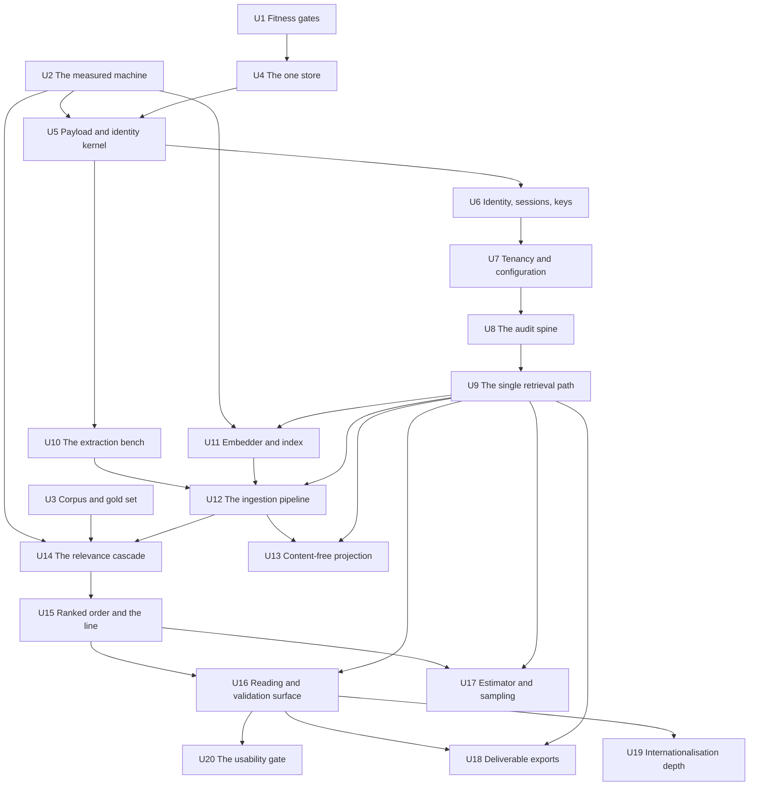

# Work Breakdown

Twenty units. Every FR-1…FR-60 appears in **exactly one** unit. Order is dependency order, with
**irreversibility first**: the payload and identity model (U5) and the single retrieval path (U9)
come before anything built on them, because both are cheap now and catastrophic later.

Two units are gates rather than features and sit at the top for that reason: **U1** (the checks
that stand in for the engineers this team does not have) and **U2** (the timed run without which
every wall-clock number in the PRD is speculation).

> **Revised 21 July 2026** against the spine's consolidated revision (34 → 49 ADs). What moved:
> **U4 is unblocked** — the encryption question is answered by AD-31 and the schema can be written.
> **U9's scope widened from retrieval to every read of *tenant* data** (AD-14), which makes it a
> dependency of U12, U13, U16, U17 and U18 rather than a peer. **The concurrency contract (AD-37)
> is new and binds nine units**, and each adds its entities to the spine's ownership table before
> its first write. **The egress check moved out of U13 into U1** (AD-45), so the cut this document
> predicts cannot take it. Unit-level changes are marked `NEW 21 JUL` in the cards below.

---

## Sequence at a glance

---

## The units

### U1 — The fitness gates and the structural checks

| | |
| --- | --- |
| **Delivers** | A build that fails when the product stops being installable inside a firm, and a static check behind every "no code path does X" in the spine. |
| **FRs** | FR-55, FR-56 |
| **Depends on** | Nothing. Starts in week one, before any feature is complete. |
| **Binds** | AD-2, AD-33, AD-4, AD-1, AD-3, **AD-45** |

Grows continuously — every later unit adds its own checks here rather than asserting a universal
negative in a runtime test. The network-isolated CI job runs from the first week, not before the
first installation: the gap between "we intend to keep it portable" and "it is portable" is
measured in weeks of discovery, and otherwise it is discovered in front of a client.

> **`NEW 21 JUL` — five additions, and one of them is a scope transfer.**
> **(a) The AD-45 egress check is owned here, not by U13.** Exactly three egress paths, outbound
> network from an enumerated adapter set, any fourth is a defect. It was a clause of AD-26 and
> would have been cut with the unit this document predicts gets cut.
> **(b) The AD-2 job now asserts against the live schema** what a source grep cannot see: no
> `ON DELETE CASCADE`/`SET NULL`/`SET DEFAULT`, the pinned collation, exactly one PostgreSQL
> endpoint not in recovery, and no `/api` cache directive in the shipped proxy configuration.
> **(c) The embedder is never stubbed.** The job runs the real embedder from weights inside the
> artefact, starts from a cold cache with the four offline variables set at image build time, and
> fails if any weight is fetched. Artefact size and job wall-clock become recorded figures. If the
> cost bites after U2, the answer is a second job tier, never a stub.
> **(d) The installer's cosign verification is exercised here**, with no route to any network —
> `--bundle` + `--trusted-root`, never `--offline` (AD-30).
> **(e) The AD-33 registry gains three required fields per action:** its read entry point (AD-14),
> whether it is state-changing and so needs an idempotency key (AD-6), and the state transitions it
> owns (AD-37). An action missing any of them fails the build. Plus the AD-3 package deny-list, and
> the check that no conditional under `core/` reads a *tenant* identifier (AD-24).

**Salvage:** `tests/unit/test_guardrails.py` from the previous build — 184 LOC, 13 tests,
**LIFT AS-IS** (retrospective rank 3). It is the non-negotiables written as executable assertions
— label reversibility, no bulk delete, out-of-taxonomy labels can never leak, recall-biased
quality gate, no network without a key — and it imports only base dependencies by design. Adopt it
as the acceptance floor on day one.

---

### U2 — The measured machine `RISK GATE`

| | |
| --- | --- |
| **Delivers** | The number nobody has: a **timed 5 000-document run with OCR, embedding and LLM judgement concurrent** on the target hardware, plus measured chunk yield, HNSW p95 under a *matter*-scoped filter, and full-text index size. |
| **FRs** | None. It precedes them. |
| **Depends on** | Nothing. A throwaway harness using spike-quality adapters, **not** a unit of the product. |
| **Binds** | Falsifies or confirms AD-5, AD-11, AD-18, AD-21, AD-27, AD-28 |

**This gate is the reason the order below is what it is.** Open Risk 3: sections 3, 4 and 5 of the
stack research each sized the same €2 000 box independently; during an ingestion all three run
concurrently and nobody added them up. Open Risk 1: the whole single-store argument rests on an
assumed 3–8 M chunk yield on a corpus nobody has seen, and the measurement **must happen before
any retrieval code is written**.

> **Gates:** U5's vector column choice, U9, U11, U14, and **every performance or retrieval
> commitment in the programme**. Until this run exists, no wall-clock number may be quoted to a
> firm and UJ-1's weekend ceiling is unverified.

---

### U3 — The corpus, the gold set and the degradation pipeline `MOST LIKELY TO BE DROPPED`

| | |
| --- | --- |
| **Delivers** | Acquired, licence-cleared evaluation corpora; a mechanical degradation pipeline whose outputs are asserted against the *failure register* classes they must produce; and the gold set's relevance judgments **mapped, in writing and versioned, onto this product's notion of relevance**. |
| **FRs** | FR-54 |
| **Depends on** | Nothing for acquisition, licence clearance, degradation design and the mapping. Its "enters through ingestion" clause depends on **U12**. |
| **Binds** | AD-16, AD-34 |

Enron/EDRM for real mess at volume; TREC Legal Track for measurable recall; real French public
legal text mechanically degraded for French realism; APX's own mail as a smoke test.
TREC's relevance is not *ordonnance 145 CPC* relevance — the mapping is the hard part and is not
trivial.

**Salvage — the single most valuable artefact in the previous build:** `data/mock/raw/` (140
files), `data/mock/raw/manifest.json`, `data/mock/processed/` — **LIFT AS-IS** (retrospective rank
1). A coherent, anonymised, deliberately noisy six-month employment-law dump **with ground-truth
routing and pertinence labels per item**. Copy the data; it is regenerable by
`scripts/generate_firm_corpus.py` and should not need to be.

> **This is the unit the adversarial review would stake itself on being quietly dropped.** It is
> a product-sized build with no user-visible output, and its absence is invisible because the
> product still runs. §6.3 names it as the one item that **may never be cut**, because dropping it
> **is** the v1 defect: v1 had a gold set and never once ran it.

---

### U4 — The one stateful store

| | |
| --- | --- |
| **Delivers** | PostgreSQL 18.4 with pgvector ≥ 0.8.5 and Procrastinate 3.9.x, the migration wrapper that fails closed, and a backup/restore that is exercised rather than assumed. |
| **FRs** | FR-52 |
| **Depends on** | U1 (checks exist before the first schema) |
| **Binds** | AD-5, AD-6, AD-30, AD-32, AD-31, **AD-35**, **AD-46**, **AD-7** (migrations), **AD-47** |

Includes the storage-footprint computation and the pre-flight capacity check that refuses an
*import job* that cannot fit — a firm buying one machine needs that number before it buys. The
pre-flight check also **states the expected wall-clock for the configured inference profile and
records the statement in the *audit record* with the *import job*** (AD-27) — the sentence that
used to be a sales act is now a screen and a test.

> **`UNBLOCKED 21 JUL` — Open Question 1 is answered and the schema can be written.** AD-31 now
> carries the rule: the `halfvec` vector column and the deterministic text index are **named
> exceptions** to application-layer encryption, protected at the volume or cluster layer on a
> machine the firm owns; everything else is encrypted by the application's storage adapters;
> **start-up fails closed on both layers**. Build both halves of the gate — a single-layer
> configuration must not start. FR-47 was amended in the PRD on the same day.

> **`NEW 21 JUL` — four additions to the store's contract.**
> **(a) Migrations declare no cascade.** No `ON DELETE CASCADE`, `SET NULL` or `SET DEFAULT`
> anywhere; every reference to an evidential ledger is `ON DELETE RESTRICT`; `DELETE FROM`,
> `TRUNCATE` and `DROP TABLE` appear in no runtime module and in migrations only under a dated
> allow-list. Retirement is a state transition, not a delete (AD-7).
> **(b) One endpoint, pinned collation.** Refuse to start where `pg_is_in_recovery()` is true; no
> replica, no routing pooler; `LC_COLLATE`, `LC_CTYPE`, provider and ICU version declared and
> asserted at start-up and before every restore (AD-5).
> **(c) The head journal (AD-35)** — outside the restorable database, on every backup target,
> written on every seal, reconciled on start-up and on restore; a live head behind the journal is a
> truncation and is named as one. A missing or unwritable journal fails start-up.
> **(d) The transient-credential table (AD-47)** — encrypted, single-use, TTL-bounded, **excluded
> from backups by name**, purged after consumption with an audit entry naming the register entry
> and never the value.

> Pin pgvector `== 0.8.5`, not `≥`: 0.8.3 and 0.8.4 fixed HNSW vacuum corruption, on an index
> nobody can inspect remotely. **Check before relying on the hosted dev tier:** PostgreSQL major
> version 18 availability there is asserted in two documents and verified in neither (spine Open
> Question 5).

---

### U5 — The payload and identity kernel `IRREVERSIBLE — BUILD FIRST`

| | |
| --- | --- |
| **Delivers** | The frozen payload record, the one chunk write boundary, the (content, *matter*) identity function, chunk provenance to source position, container expansion arithmetic, and the *denominator*'s unit. |
| **FRs** | FR-8, FR-4, FR-11, FR-57 |
| **Depends on** | U4; the vector column shape depends on **U2** |
| **Binds** | AD-8, AD-9, AD-10, AD-11, AD-17, AD-23, **AD-38**, **AD-40** |

**The only irreversible decision in the increment.** Adding a mandatory field later means
re-indexing everything at every installed site, blind, against a live 100 000-*pièce* index — and
that migration is §16's genuinely unsolved problem.

> **`NEW 21 JUL` — the schema shape changed, and this is the edit that cannot be made after the
> first installation.** Four corrections that are one edit:
> **(a) Scope is never a column.** The chunk writer still takes *RBAC scope* as a required
> argument, but it is a **write-time authorisation check**, not a stored value — a scope column
> would be a second representation of the wall that nothing may re-stamp (AD-9 vs AD-13).
> **(b) *Custodian* is never a column either.** It is a set on the *pièce* (`CUSTODIAN_LINK`),
> unioned by every *import job* admitting the same content, joined at read time. A stamped scalar
> never receives the second custodian, because the second import is a no-op under AD-17.
> **(c) `full_text_version` enters `chunk_id`**, so the extractor version is inside the identity of
> what it produced and a re-extraction yields **new *chunks*** rather than different words under an
> existing citation.
> **(d) The permitted `chunk` columns are enumerated** and anything else fails the build:
> `chunk_id`, `piece_id`, `tenant`, `matter`, `position`, `full_text_version`, chunking-configuration
> identity, schema version, `model_id`, `model_version`, the vector, the reserved external-authority
> reference.
>
> **One reserved extension point, not two.** The external-authority reference (Judilibre,
> Légifrance) is reserved and written by nothing. **`supersedes` is written in this increment** —
> AD-9 previously said otherwise while FR-4 requires it — with its semantics fixed in AD-8:
> newer→older, acyclic, a chain not a tree, both *pièces* stay in the *corpus*, the superseded one
> stays in the *denominator* and is excluded from the ranked order and from every *sampling run*,
> and it is **never derived from a provenance path**.
>
> **The *denominator* is a record, not an integer** (AD-38): six named disjoint fields, the
> identity over known *pièces* only, and `unknown_cardinality_entries` never summed into any total.
> Asserted by a type — the *denominator* has no `int` representation anywhere in the source.

**Salvage:** `domain/chunking/strategies.py` — **REFACTOR** (rank 9). The parent/child +
contextual-header architecture is right; the sentence splitter mangles French legal text
(`art. L. 1235-3`, `n° 21-12.345`, `M.`, `Cass. soc.` all split mid-citation) and there are **zero
tests — write them first**.

---

### U6 — Identity, sessions, grants and keys

| | |
| --- | --- |
| **Delivers** | Owned authentication, opaque server-side sessions, the administrative grant and scope administration, secret and key management, encryption at rest and in transit. |
| **FRs** | FR-47, FR-48, FR-49, FR-51 |
| **Depends on** | U4, U5 |
| **Binds** | AD-15, AD-12, AD-31, AD-22, **AD-47**, **AD-48**, **AD-49** |

**The highest-risk code in the product**, and it is defended by tests alone: the off-the-shelf
options are forbidden for portability reasons that are correct, so identity, sessions and
authorisation are hand-rolled application code, written by AI agents, reviewed by one non-hands-on
person, where a mistake is silent and criminal.

`Principal` resolution goes behind one interface here — the cheap insurance against Open Risk 2,
and the thing that turns a future SSO requirement into an adapter rather than a rewrite.

> **Correction, now applied upstream:** FR-49's "a re-scope re-stamps every *chunk*" is
> **superseded by AD-13** — scope is joined at query time and nothing propagates. The PRD was
> amended on 21 July 2026 with a dated note, together with its three dependent references. Build
> the stronger guarantee (immediate, no half-migrated window), and make FR-14's mutating
> adversarial suite assert the new mechanism.

> **`NEW 21 JUL` — four additions.**
> **(a) The encryption gate has two halves** and this unit owns both: no application key **and** no
> verifiable encrypted data volume each refuse start-up (AD-31). The volume half protects the
> vector column and the deterministic text index — every embedding and every word of every *pièce*
> — and was previously owned by nobody.
> **(b) The transient-credential channel (AD-47).** A document or archive password reaches a worker
> **only** through an encrypted, single-use, TTL-bounded row keyed by the *failure register* entry,
> purged after consumption. Never in a job payload, a log, a diagnostic, an export or a backup. Seed
> a document password among the seeded-token test's tokens — nobody would otherwise think to.
> **(c) The principal taxonomy (AD-48).** Exactly three kinds — user, matter-bound job,
> tenant-bound maintenance — and a fourth fails the build. Maintenance may read whole *tenant*
> partitions and **may not** produce a result set, render content, or emit through the projector
> registry. Every audit entry names its principal and kind.
> **(d) PyJWT is used with the algorithm list passed explicitly** — `algorithms=["HS256"]` at every
> `jwt.decode`, never inferred from the header, no `PyJWK`/`PyJWKClient`/JWKS anywhere — asserted
> statically. 2.13.0 is the fix release for five CVEs including a HIGH forged-HS256 issue of the
> same class that disqualified the rejected libraries; the version is not the control, this is.
> Session lifetimes compare **monotonic** values, not wall-clock (AD-49).

---

### U7 — Tenancy, configuration-as-data and provisioning

| | |
| --- | --- |
| **Delivers** | *Tenant* isolation at the write and read boundary; every per-*tenant* behaviour as data rows; and the one audited surface through which configuration changes and a *tenant* is provisioned on first run. |
| **FRs** | FR-29, FR-30, FR-50 |
| **Depends on** | U4, U6 |
| **Binds** | AD-12, AD-24, AD-25, AD-3, **AD-37**, **AD-43** |

> **`NEW 21 JUL`.** Configuration rows change **only** through the AD-25 surface and are conditional
> commits against the observed value (AD-37). Configuration changes, scope grants and revocations,
> and provisioning are **matterless acts** and append to the ***tenant* chain**, not to a sentinel
> *matter* (AD-43). The check behind "no *tenant*-specific behaviour" is now real and greppable:
> **no conditional under `core/` reads a *tenant* identifier** (AD-24) — a *tenant* identifier is a
> filter argument and a row key, never a branch. Every registered configuration key has a default,
> and no default disables its own guarantee.

Without FR-50, a correctly fail-closed installation is one where nobody can see anything and
nobody can grant access, at a site APX reaches only by telephone. Direct database editing is not
the mechanism — it is the fork configuration-as-data exists to prevent, arriving as data instead
of as code.

**Salvage:** `domain/classification/labels.py` — the nine flat, mutually exclusive French legal
categories with prompt-ready descriptions, **LIFT AS-IS** (rank 5) as the **default taxonomy row
set**, not as code. Whether it is the right taxonomy for *ordonnance 145 CPC* review is
unvalidated (OQ-16) — it is configuration, so being wrong is cheap, but shipping it unexamined
would be inheriting a v1 assumption unexamined.

---

### U8 — The audit spine

| | |
| --- | --- |
| **Delivers** | The append-only per-*matter* record, sequenced from one authority and chained; *overrides* with mandatory reasons; and the rule that an action whose record cannot be written **fails**. |
| **FRs** | FR-24, FR-25, FR-53 |
| **Depends on** | U4, U7 |
| **Binds** | AD-22, AD-7, AD-23, **AD-35**, **AD-37**, **AD-43**, **AD-44**, **AD-49** |

Every later unit writes here. Building it after them means retrofitting atomicity into actions
that already succeed without it, which is how an unaudited mode gets introduced by accident.

> **`NEW 21 JUL` — the concurrency contract this unit had none of.**
> **(a) The sequence is allocated inside the entry's own transaction**, from a chained head row
> under `SELECT … FOR UPDATE` — **never `nextval`**, which is non-transactional and burns a number
> on any crash. A worker crash would otherwise manufacture a permanent, unrepairable tamper alarm
> that AD-22 forbids repairing, on a machine reachable only by telephone. `nextval` and any
> `Sequence`-backed column on an evidential table fail the build (AD-43).
> **(b) The chain's scope is decided:** per (*tenant*, *matter*), **plus one matterless *tenant*
> chain** per *tenant* for provisioning, grants, revocations, configuration changes, backups and
> restores. FR-24's "every entry carries a *matter*" needs the dated PRD correction to "…or names
> the *tenant* chain explicitly" — a scope grant belongs to no *matter*.
> **(c) High-volume events are partitioned, not chained one by one** (AD-44): per-worker partition
> ledgers, sealed at a configured interval, one digest entry per seal. Otherwise read-path
> availability is bounded by write contention on the head, and AD-22's "read-only functions may
> continue" escape does not cover a lock timeout.
> **(d) The head journal (AD-35)** is written on every seal and reconciled on start-up and restore.
> **(e) Both timestamps (AD-49):** wall-clock for humans, monotonic for ordering; a backward
> wall-clock movement appends its own `clock-adjusted` entry.
> **(f) This unit seeds the AD-37 ownership table** and reviews every later unit's additions to it.

**Salvage:** `domain/audit/` (~230 LOC) plus the read/filter API — **REFACTOR** (rank 11). The
event vocabulary, factory functions and read API are clean and tested; the JSONL-on-local-disk
substrate is unusable and is replaced by the append-only table. **It is on an unmerged branch —
grab it before it is lost.**

> **Open Question 3 — `RESOLVED 21 JUL`.** The authority is the in-transaction chained head of
> AD-43, scoped per (*tenant*, *matter*) plus the *tenant* chain, with AD-44 keeping high-volume
> events off it. **It is no longer on the critical path** and no longer gates this unit on U2. The
> contention rate on the head row at the *design target* is still unmeasured and is still worth
> folding into U2's run — but the design no longer depends on the number.

---

### U9 — The single read path `IRREVERSIBLE — BUILD EARLY` `UNDERESTIMATED` `SCOPE WIDENED 21 JUL`

| | |
| --- | --- |
| **Delivers** | **One read entry point (`core/app/read/`) for every read of *tenant* data**, with required *tenant* and scope arguments and no identifier-only method; two engines with two truth statuses; deterministic exhaustive search over full text and names with declared normalisation; the qualifications every exhaustive claim carries; and the adversarial isolation suite. |
| **FRs** | FR-12, FR-13, FR-14, FR-15 |
| **Depends on** | U5, U6, U7, U8; **gated on U2** |
| **Binds** | AD-12, AD-13, AD-14, AD-20, AD-21, AD-10, **AD-42**, **AD-48** |
| **Depended on by** | U11, U12, U13, U16, U17, U18 — every unit that reads *tenant* data, which is all of them |

Once a second read path exists anywhere, the wall has two places to be wrong and no static check
can close it again. Everything that reads *tenant* data is built **on top of** this unit, never
beside it.

> **`SCOPE WIDENED 21 JUL` — from retrieval to every read, and this is a real increase.** *Retrieval*
> means the search of a *corpus* returning a ranked or complete match set; four legitimate, in-scope
> second paths were outside it — the *pièce* viewer (FR-44), per-*pièce* hydration inside the export
> (FR-46), corpus-wide aggregates (AD-18's stage-3 share, FR-3's OCR figure), and every non-search
> screen (FR-27, FR-28, FR-60, FR-7, FR-52). AD-12 made a hand-written scope check in each of them
> **obligatory** but not **centralised**. The entry point now covers reads by identifier, byte and
> image streams, stored full text, render requests, counts and aggregates, the *failure register*,
> and every enumeration performed while producing an export.
>
> **The deciding check, which replaces "the suite must be extended forever":** no SQL text and no
> ORM query naming a *tenant*-owned table appears outside `core/app/read/` — a grep over
> `adapters/`, `api/`, `worker/`, `eval/` and `web/` — and **every registered action names the read
> entry point it uses; an action with none fails the build**.
>
> **Also new here:** an **exhaustive** set is never truncated (a limit downgrades it to
> *suggestive* at the construction site, and the constructor accepts no limit parameter), is
> computed in one repeatable-read snapshot, and **refuses** over a *matter* with an open *import
> job* rather than silently claiming completeness over a population that grew while the claim was
> being made (AD-20). Its four qualifications are AD-42 and a surface rendering it without all four
> fails the build. Aggregates run under the **tenant-bound maintenance principal** (AD-48), which
> may read whole partitions and may not produce a result set.

> **Underestimated, and more so now.** Building the pre-filter is straightforward; building the
> **proof** is not. SM-6 demands zero out-of-scope results, counts, snippets or metadata across
> **every** retrieval, export and diagnostic surface — including scope mutation mid-corpus,
> revocation with a session open, and a grant mid-*sampling run*. PostgreSQL RLS, the one mechanism
> that would enforce this at the storage layer regardless of application bugs, is forbidden for
> portability.

**Salvage:** only the `SearchResult` schema shape from `retrieval/schemas.py` — the
`parent_text` / `excerpt` split is a good idea. The service itself is **REWRITE** (rank 16): no
filtering, so no tenancy; no reranking; no hybrid; no metadata filters.

---

### U10 — The extraction bench `UNDERESTIMATED — LARGEST SURFACE`

| | |
| --- | --- |
| **Delivers** | Text and structure out of the formats a litigation *matter* actually contains, each engine out-of-process and licence-isolated, with the extractor version recorded and the OCR quality signal computed per *matter* and per *tenant*. |
| **FRs** | FR-3 |
| **Depends on** | U5 |
| **Binds** | AD-28, AD-10, AD-17, AD-19, **AD-40** |

> **`NEW 21 JUL` — two rules that change how this unit is built, not just what it checks.**
> **(a) Subprocess streams are never propagated verbatim.** `pdfplumber`, `pypdf`, Docling and
> `extract-msg` all emit warnings containing document fragments, object streams and filenames on
> malformed input — the normal case at the *design target* — and the *failure register* is
> exportable and is a projector's potential input. Map `stdout`/`stderr` to an **enumerated error
> class** and discard the text; any free-text diagnostic is truncated and passed through the
> register's redaction function, whose output joins the seeded-token test — extended to seed tokens
> **inside malformed documents fed to each extractor**. No `subprocess` call outside
> `adapters/extraction`, no `stderr=None` within it.
> **(b) The extractor version is inside the identity of what it produced.** `full_text_version`
> enters `chunk_id`, so a re-extraction — a `pypdf` → Docling fallback, a Tesseract upgrade, a
> `password-protected` retry — produces **new *chunks*** and marks every citing *judgement*,
> *retained extract* and export stale, instead of changing the words under an existing citation.
> Assert it: re-extract under a changed extractor version, no `chunk_id` collides.
> The licence position is now complete and includes **psycopg (LGPL-3.0-only, in-process)**; it
> goes to counsel in the same email as `extract-msg`'s GPL question. pdfplumber is **0.11.10**.

> **The largest single engineering surface in the increment, and the most likely to be
> underestimated.** `.msg` alone is compound-file/MAPI parsing: RTF-compressed bodies, TNEF
> (`winmail.dat`), nested `.msg`, charset recovery and reply-chain reconstruction — and an email
> with N attachments yields N+1 *pièces*, so the attachment-identity problem, the nested-container
> problem and the deduplication interaction all land at once. Then OCR must run **inside the
> *tenant* boundary**, which forbids every hosted OCR service, on a firm's single machine, over
> 100 000 *pièces*. **Months, not weeks, and entirely unglamorous.**

**Salvage:** `domain/parsing/*` — **REWRITE** (rank 15). Eight thin wrappers, zero tests;
`parse_pdf` never falls back to OCR so scanned PDFs silently yield nothing; `.msg` untested
despite being the stated dominant format; `.eml` handles only `text/plain`, dropping HTML-only
mail, which is most mail.

---

### U11 — The embedder and the index that never deletes itself

| | |
| --- | --- |
| **Delivers** | A real semantic embedder that halts rather than degrades, and an index in which destructive operations are reachable from exactly one named administrative entry point. |
| **FRs** | FR-9, FR-10 |
| **Depends on** | U5, U9; **gated on U2** |
| **Binds** | AD-11, AD-19, AD-7, **AD-2** |

> **`NEW 21 JUL` — the embedder is never stubbed, and that is a packaging decision.** The port has
> exactly one implementation **in the artefact**, in every environment including CI and the hosted
> dev tier; no configuration key and no wiring variable selects a stub; test fakes substitute at the
> port boundary **inside the test process** only. Enforced by a check: exactly one class implements
> `Embedder` under `adapters/`. Consequences, stated because they collide with U1 in week one
> otherwise: **1.4 GB of weights ride inside the CI image and the shipped tarball**, the AD-2 job's
> wall-clock is bounded by real embedding throughput from day one, and the on-premise install has
> no model-download step. If the CI cost bites, the answer is a second job tier — never a stub,
> which would reintroduce v1's defect through the front door with a green build.

Negates the two v1 defects that silently converted a working system into a broken one that still
returned results: a 1024→256-dim hash fallback swallowed on any exception, and a collection wiped
on any vector-size mismatch. The failure chain was: transient provider 429 → 256-dim fallback →
next store construction sees 1024 ≠ 256 → **entire vector index deleted** → queries return nothing
→ frontend silently serves the demo bundle. No log, no alert, no error.

---

### U12 — The ingestion pipeline `UNDERESTIMATED (runner-up)`

| | |
| --- | --- |
| **Delivers** | The folder gesture as the whole onboarding; a non-blocking, resumable, idempotent, quarantining *import job*; the *failure register*; the inventory guarantee; the completion summary; and the rule that there is exactly one ingestion path. |
| **FRs** | FR-1, FR-2, FR-5, FR-6, FR-7, FR-33 |
| **Depends on** | U5, U7, U8, U9, U10, U11 |
| **Binds** | AD-6, AD-16, AD-17, AD-19, AD-7, AD-12, **AD-37**, **AD-38**, **AD-41**, **AD-47**, **AD-8** (supersedes) |

> **`NEW 21 JUL` — five, and three of them are concurrency.**
> **(a) The ledger is the only authority** (AD-17). The queue holds no state any read path
> consults, and no module outside `adapters/store_postgres/queue` may query a queue table.
> Otherwise FR-2's "processed against submitted" has two values that disagree during retries and
> after quarantine.
> **(b) The attempt counter is incremented in a separate transaction committed *before* the unit's
> work begins**, so an OS-level kill still advances it; **the quarantine transition and its register
> entry commit in a transaction independent of the failing unit's**. Writing quarantine inside the
> failing unit's exception handler rolls it back with the failure and the poison unit is retried
> forever — the exact failure AD-17 exists to prevent, reached through its own letter. Assert with
> an induced `SIGKILL` mid-unit, not only an induced exception.
> **(c) Register transitions are conditional commits with named owners** (AD-37): `open → resolved`
> is owned here and conditional on `open`; `open → overridden` is U16's; a retry that succeeds
> against an `overridden` entry produces a *worklist* line **offering to reverse the override**,
> never a silent resolution. Without this, a bulk retry racing a lawyer's *override* leaves a
> permanent audit entry in which she states a reason for deliberately excluding a document that was
> in fact ingested — the shape FR-5 calls a defect, made unerasable by AD-7.
> **(d) `superseded-by-reimport` is a first-class register transition** (AD-41), keyed by
> (submitted path, submitted content hash, *import job*) — because fixing a corrupt file produces
> different content and therefore a **different *pièce***, so without it the original entry's only
> exit is the *override* FR-5 itself calls a defect, accumulating forever in the "not indexed"
> count.
> **(e) `supersedes` is written here** with AD-8's semantics — and **never derived from a
> provenance path**: only an explicit user act, or a configured audited rule that produces a
> *worklist* line **offering** the relation. The *denominator* is AD-38's record, and a document
> password reaches this unit only through AD-47's credential row.

**Security does not begin downstream of this unit — it begins here.** One hundred thousand
confidential *pièces* entering in a single gesture, at 19:10, with no IT department in the room
and a non-technical user holding the drive. FR-1's scope ceiling in **both** directions, its loud
refusal of a null scope, and its traversal boundary are the guard on the widest attack surface the
product has — and they read as edge cases to whoever is cutting scope. A scope mislabelled here is
enforced correctly and permanently against the wrong wall; the pre-filter cannot detect data
mislabelled at the boundary.

> **Runner-up for underestimation:** resumable, idempotent, concurrency-safe ingestion asserted
> with induced kills at ≥3 points and induced write conflicts. Well-understood distributed-systems
> work — expensive but not dangerous.

**Salvage:** `domain/ingestion/service.py` — **REWRITE** (rank 17). The *sequence* of steps is
right; the implementation is one synchronous function inside the HTTP request accumulating all
points for all files in memory before a single upsert. `domain/scoring/quality.py` — **LIFT
AS-IS** (rank 6), cheap, explainable, recall-biased, returns a machine-readable rejection reason,
tested. `domain/documents/repository.py` and `infra/vectorstore/qdrant.py` — **DROP/REWRITE**
(ranks 18, 19); the latter silently deletes the whole collection on a vector-size mismatch, wearing
a comment that calls it a feature. The v1 fixture layer and `demo-data.json`/`demo.ts` mechanism —
**DROP** (rank 25), deleted rather than disabled.

---

### U13 — The content-free projection and the diagnostic export `MOST LIKELY TO BE DROPPED`

| | |
| --- | --- |
| **Delivers** | One registry of named projectors with content-freedom enforced by seeded-token test, an emission path outside the registry that fails the build, an attestation floor for text-derived projectors, and the user-initiated diagnostic export. |
| **FRs** | FR-31, FR-32 |
| **Depends on** | U7, U8, U9, U12 |
| **Binds** | AD-26 |

Built **open by construction** because the next increment's on-premises style extractor is its
second consumer and emits none of the value kinds the diagnostic export needs. A closed
enumeration here forces that increment to build a second content-free path, which is a defect the
seeded-token test would not cover.

> **`SCOPE REDUCED 21 JUL` — the egress check left this unit.** AD-26 was split: **AD-45** (exactly
> three egress paths, outbound network from an enumerated adapter set, any fourth is a defect) is
> now **owned by U1**, because it binds everyone and this unit is the one this document predicts
> will be cut. Dropping U13 must not drop the check that no fourth egress path exists.
> **What remains here, and is new:** projectors declare their attestation counts
> **machine-readably** in the registry, or fail the build — the floor is otherwise undecidable —
> and the seeded-token test runs against **the union of all registered projectors' output for one
> *tenant***, not projector by projector, because the floor is not composable and two projectors
> each above it can jointly identify.

> **Predicted drop #2.** No client exists, nothing is installed, nobody has ever asked for a
> diagnostic. It is pure future tax, technically fiddly, and the seeded-token test — the
> interesting part — is the easiest thing to skip. §6.3 also makes it **cut #2**, and records the
> discomfort honestly: it is simultaneously the cheapest cut and the most damaging, because at the
> first installation it is the only support channel that exists and its absence is undetectable
> until then.

---

### U14 — The relevance cascade `SEQUENCING GATE`

| | |
| --- | --- |
| **Delivers** | The optional *case theory* with versioning and re-rank offer; the three-stage cascade with its stage-3 share measured per run; near-duplicate families judged together; and derived — never self-reported — per-*pièce* confidence. |
| **FRs** | FR-37, FR-38, FR-42 |
| **Depends on** | U9, U11, U12; **gated on U2 and U3** |
| **Binds** | AD-18, AD-19, AD-23, AD-27, AD-34, **AD-36** |

> **`NEW 21 JUL` — three.**
> **(a) The cascade removes *pièces* from judgement, never from the population** (AD-36). Every
> *pièce* is at all times in the ranked order **or** the explicit unscored set — there is no third
> place. A stage-1 or stage-2 rejection goes **into the ranked order carrying its rejection reason
> as an enumerated class**. Otherwise a `date-undetermined` *pièce* failing a case-theory date
> filter — the normal case for scanned material — sits outside the population that the *confidence
> bound* quoted to a court claims to cover.
> **(b) The near-duplicate family identifier and the judged representative flag travel into the
> ranked order**, and the grouping is part of the *ranking version* (AD-23). The threshold's value
> stays deferred; its presence in the version identity does not. Without it U17 cannot draw by
> family even if it decides to, and a bound over 40 members of one family is wrong in the unsafe
> direction.
> **(c) Stage 3 has a floor** (AD-18): a configuration that would send more than a configured share
> of a *matter* to stage 3 needs an audited *override*, and the measured share generates a
> *worklist* line when it exceeds the floor. "Only the uncertain band" is otherwise satisfied by a
> configuration that widens the band to everything.

**The most expensive capability in the increment** — in build time, in inference cost and in data
egress — and the one whose quality nobody can verify without a real *matter*. Stage 3 sends the
substance of a *matter* to a hosted provider as **normal operation**, under a contract clause that
is not a technical property.

> **Two gates before a line of this is written.**
> **(a) U2** — the cascade is the mitigation for Open Risk 3 and should be built first among the
> ranking work, not last.
> **(b) §6.3's sequencing gate** — *no triage-layer work begins until one real anonymised* matter
> *is in hand, or its absence is explicitly re-accepted, in writing, with a date.* That sentence is
> the only structural defence in the PRD against the drift that produced v1.
> **(c) U3's merge gate** — no ranking code merges before recall executes against the gold set.

**Salvage:** the LLM provider abstraction `llm/base.py`, `factory.py`, `stub.py`,
`mistral_provider.py`, `anthropic_provider.py` — **REFACTOR** (rank 10). The shape is right: a
`Protocol`, deferred SDK imports, a stub that cannot be mistaken for a real answer. Three things
must change: `grounded_passage_ids` is passed in and echoed out untouched — it is bookkeeping, not
verification, and must not be presented as a grounding guarantee; the hard-coded model id is not a
valid one and must be verified against the current model list; and streaming, retries, timeouts and
token accounting do not exist. Also `domain/syllogisme/grounding.py` — **LIFT AS-IS** (rank 7):
`extract_json` survives code fences and prose wrappers, `truthy` handles `true`/`oui`/`yes`, 6
tests. And the tolerant parser + `{"off_corpus": true}` escape-hatch pattern from
`domain/syllogisme/builder.py` (rank 4) — weeks of prompt iteration, and a parser that survives
partial or malformed model output.

---

### U15 — The ranked order and **the line**

| | |
| --- | --- |
| **Delivers** | One ranked order per *matter* with a complete *ranking version* and a deterministic recorded tie-break; **the line** as an ordinal cut over a named version; per-*pièce* labelling; the *pin*; and the complete staleness trigger list. |
| **FRs** | FR-16, FR-17, FR-39, FR-40, FR-43, FR-58 |
| **Depends on** | U14, U8 |
| **Binds** | AD-7, AD-23, AD-19, **AD-37**, **AD-39** |

> **`NEW 21 JUL` — four.**
> **(a) The tie-break is computed over a byte-ordered, collation-independent key** — the *pièce*
> identity hash — never over collated text. A restore onto a machine with a different libc or ICU
> would otherwise silently reshuffle tied *pièces* across **the line**, changing set membership with
> no recorded event and breaking AD-32's restore assertion at the *design target* while passing at
> reduced scale. Assert the same order under two `LC_COLLATE` settings.
> **(b) A version identity is a conditional commit** (AD-23): an artefact carrying one commits only
> if **every input recorded in that identity is unchanged at commit time**, verified in the same
> transaction — otherwise it fails into `invalidated` with a *worklist* line naming the input that
> changed.
> **(c) This unit owns `LINE_POSITION` and `PIN`** in the AD-37 ownership table; both are
> conditional commits against the observed position and the *ranking version*. U17 offers the line
> move but does not own the row.
> **(d) The ranked order records, per *pièce*:** rank, score **or** enumerated rejection class
> (AD-36), family identifier and representative flag, and `supersedes` state. The *retained* and
> *discarded* sets are AD-39 — views computed after pins, never memberships, never a column.

The *retained set* and *discarded set* are views computed **after** pins are applied — never
stored memberships. A tie spanning **the line** would otherwise reshuffle set membership on
recomputation with no recorded event, silently invalidating any *sampling run* drawn from it.
Ingestion into a ranked *matter* is a staleness trigger, because *pièces* arriving after a ranking
are in neither set — a third state the model does not admit.

> **Demo-shaped, and named as such.** A ranked table with confidences, a committed line and
> one-line justifications is the single most demonstrable artefact in the product, and it is
> unfalsifiable without a *matter*-specific gold standard. That is the definition of demo-shaped,
> and it is why U3 and U14's gates sit in front of it.

**Salvage:** `domain/syllogisme/scorer.py` — **LIFT AS-IS** (rank 2). Pure, deterministic, zero
I/O, tested on both sides of the threshold, encodes a real product decision (0.40/0.40/0.20, gate
at 0.70, auto-generated follow-up questions), coupled to nothing. Port the file verbatim, keep the
tests.

---

### U16 — Reading, validation and the home screen

| | |
| --- | --- |
| **Delivers** | The *pièce* viewer; the editable cell-by-cell table with a live *change log*; per-*pièce* confidence and the justification derived from named extracts; the *audit drawer*; the *validation act*; the *worklist* and the permanent *denominator*; the *matters* zone; and the guarantee that nothing hard-deletes. |
| **FRs** | FR-18, FR-20, FR-21, FR-26, FR-27, FR-28, FR-41, FR-44, FR-45, FR-60 |
| **Depends on** | U9, U8, U15 |
| **Binds** | AD-29, AD-7, AD-10, AD-22, AD-12, **AD-14**, **AD-37**, **AD-38**, **AD-42**, **AD-6** |

> **`NEW 21 JUL` — this unit had the most surface outside the wall, and now has none.**
> **(a) Every read goes through U9's entry point** (AD-14) — the *pièce* viewer's primary-key fetch
> and byte streams, the *worklist*, the *denominator*, the *matters* zone, the completion summary,
> the backup status. No SQL or ORM query naming a *tenant*-owned table exists in this unit, and each
> registered action names the entry point it uses.
> **(b) Nothing carrying *tenant* data is cacheable** (AD-29): `Cache-Control: no-store`, no
> `ETag`, asserted over every registered route; SPA result caching lasts one rendered view and is
> discarded on any mutation, *matter* change or session change. The reverse-proxy configuration is
> part of the signed artefact.
> **(c) Every state-changing request carries a client-generated idempotency key** (AD-6) — a
> double-click on a bulk *validation act* over 1 400 *pièces* otherwise writes 2 800 permanent
> entries in two batches, and AD-7 forbids removing either.
> **(d) This unit owns `open → overridden`** on register entries in the AD-37 table, conditional on
> `open`. **(e)** The *denominator* is rendered as AD-38's record — six named counts, `unknown`
> never summed, "1 archive unopened, contents unknown" in words — and every **exhaustive** set is
> rendered with all four AD-42 qualifications or the build fails.

The largest unit by FR count and the whole of the client surface. Built **inside the workspace
shell** — one workspace, three verbs — not beside it: navigation, *matter* selection and the home
screen belong to the workspace, and a navigation that must be discarded when drafting arrives is
the default outcome of building this in isolation.

Two rules that are cheap to state and easy to lose: *reading is the job above **the line**;
supervising is the job below it* — any requirement asking for per-*pièce* verdicts below the line
spends the very thing the product is sold to save. And **the extracts are the control; the sentence
is not evidence** — stated in the interface, once, plainly.

**Salvage:** `web/src/app/**` and `components/ui.tsx` — **REFACTOR as design reference, not as
code** (rank 14): real screens real clients have seen, but `syllogisme/page.tsx` is 870 lines with
no tests and no lint, and `translations.ts` keys English strings by their French source text. The
increment's single most reusable asset is a mockup, and the shipped v1 application and its mockups
shared almost no visual DNA.

---

### U17 — The estimator and the sampling ritual `UNDERESTIMATED — CAN CONSUME UNBOUNDED TIME`

| | |
| --- | --- |
| **Delivers** | A random draw over a frozen *discarded set*; a hypergeometric prevalence bound stating its confidence level, its scope, its *ranking version* and its *case theory* version; and the priced statement shown before **the line** moves. |
| **FRs** | FR-19, FR-22, FR-23 |
| **Depends on** | U15, U8, U9 |
| **Binds** | AD-22, AD-23, AD-34, AD-2, **AD-36**, **AD-37**, **AD-38** |

> **`NEW 21 JUL` — three inputs to the five design decisions are now fixed, which narrows them.**
> **(a) The population is the *discarded set* plus the unscored set** (AD-36), or the run's record
> states the exclusion and the sentence carries it in words. Stage-1 and stage-2 rejects are **in**
> the ranked order with their rejection class, so they are drawable — assert that a
> `date-undetermined` *pièce* outside the case-theory period can be drawn.
> **(b) The near-duplicate family identifier is present in the ranked order** (AD-23), so the
> "unit of the draw" decision is now a real choice rather than one the data forecloses.
> **(c) A run's completion is a conditional commit** against every recorded population input —
> *ranking version*, line position, scope, the identifier list (AD-23, AD-37). A line move during a
> run fails the completion into `invalidated-in-flight` with a *worklist* line, instead of
> committing a *confidence bound* over a population whose defining cut moved. **U15 owns the line
> row; this unit offers the move and does not write it.**
> **(d) A bound whose population record has `unknown_cardinality_entries > 0` says so in the
> sentence** (AD-38), and *reading burden* is the same function FR-39 calls, in **estimated pages**.

The north star, and **not an implementation task**. Five design decisions must each be answered
explicitly and recorded, then the estimator validated by simulation against populations of known
truth: the unit of the draw (*pièce* or near-duplicate family); the census-versus-sample crossover
and what the sentence says near it; whether repeated runs pool; the exact population-freezing
contract and what invalidates a run mid-flight; and whether TREC calibration is admissible for the
projection at an unsampled position.

> **This is the item that can consume unbounded time, because it cannot be brute-forced by an
> agent.** Answer OQ-26 before building: nothing establishes that 200 individual verdicts is a
> thing a senior lawyer actually does, and if the honest answer is sixty, the estimator has to be
> designed for sixty — which changes what the simulation must validate. Batching is free and
> required; stratified draws change the estimator; sequential or curtailed sampling is the largest
> saving and is **unsound unless the stopping rule is part of the validated estimator**.
>
> **Two things this unit must never do:** state the probability that nothing relevant was missed
> (not estimable from a sample of this size), and depend on a network call — the sentence is
> templated and rendered locally from the *audit record*, asserted by the U1 offline job.
>
> **Cut #4 fallback, already named:** ship the sampling ritual and report counts only.

---

### U18 — The deliverable

| | |
| --- | --- |
| **Delivers** | Export of the *retained set* — the working set the associate actually needs, not only a record of what happened. |
| **FRs** | FR-46 |
| **Depends on** | U16, U8, U9, U17 |
| **Binds** | AD-26, AD-22, AD-10, **AD-14**, **AD-42**, **AD-6** |

> **`NEW 21 JUL`.** The export's per-*pièce* hydration — title, date, *custodian*, label, rank,
> confidence, justification — is the single largest set of reads by identifier in the product, and
> it was entirely outside the one query path: the artefact that leaves the building was being
> assembled without it. **Every enumeration and every hydration goes through U9's read entry point**
> (AD-14). An export carrying an **exhaustive** claim carries all four AD-42 qualifications on its
> face. Export generation is state-changing and **carries an idempotency key** (AD-6) — a retried
> export job otherwise writes the third egress path's audit entry twice and a reader concludes two
> exports left the building. Superseded *pièces* are marked and their current version named
> (AD-8).

Small, and the thing whose absence gets a tool routed around: v1 exported an *audit record* and
never the working set, so the associate would re-key 180 references by hand to build her
*bordereau*. Superseded *pièces* are marked as such so two versions of one document do not appear
as two.

**Salvage:** `web/src/lib/export.ts` and `word-export.ts` — **REFACTOR** (rank 13). The
citation-renumbering logic genuinely works and Word/Google Docs open the output natively; move
generation server-side, because client-side generation leaves no server-side record of what was
exported, which conflicts with auditability. "PDF" was `window.print()` — not a document and not
reproducible.

> **Honourable mention on the drop list:** FR-26's self-containment — *a reader with the export
> and no access to the system can reconstruct every number in it, asserted by test*. Genuinely
> hard, and trivially fakeable with an export that merely **looks** complete.

---

### U19 — Internationalisation depth `MOST LIKELY TO BE DROPPED`

| | |
| --- | --- |
| **Delivers** | Namespaced keys with no silent fallback; locale-aware dates, numbers and collation; and the user's language reaching the language model with the source language declared. |
| **FRs** | FR-34, FR-35, FR-36 |
| **Depends on** | U16 for the surfaces, U14 for the model path |
| **Binds** | AD-24, AD-29, AD-33 |

**Sequencing warning:** the key-set **mechanism** is not deferrable to here. It binds the frontend
from its first line and belongs in U16's first story; retrofitting it means touching every string
twice. What is listed as this unit is the **depth**.

> **Predicted drop #3, and precisely delimited.** FR-34's key-set parity is cheap and survives
> because it fails the build. Locale collation, distinguishable *pièce*-date versus ingestion-date
> rendering, the source-language statement, and "language reaches the model" asserted with the
> locale switched are per-string diligence with no failing test behind most of it — and they decay
> exactly the way v1's did, protected by the same mechanism (care) that failed the first time.
> §6.3's cut #5 is this list, minus key-set parity.

---

### U20 — The usability gate

| | |
| --- | --- |
| **Delivers** | A versioned phrasing checklist with recorded, dated verdicts per surface; keyboard reachability for every *worklist* action and every triage-table edit; one token set enforced structurally. |
| **FRs** | FR-59 |
| **Depends on** | U16, U18, U19 |
| **Binds** | AD-29, AD-33 |

The only unit whose primary verb is *asserted by review*, never counted as a passing test. Its
value is that the review happened, is dated and is arguable. A failed item blocks the release
candidate or is recorded as an accepted exception with a reason; an **unrecorded verdict counts as
a failure**. A *worklist* line whose only resolution is a telephone call to APX is a defect of this
unit as much as of U12's.

> **`NEW 21 JUL`.** The spine now labels the clauses no check can decide as `[NOT ENFORCEABLE]`,
> naming why and what stands in their place (AD-33). **Those clauses are this unit's checklist
> items** — AD-19's "never a plausible-looking wrong answer" above all — because *asserted by
> review* is the only verb left for them. Add one item: a clause added to the spine with neither a
> check nor a label is a failure of the spine's own self-check.

---

## The three risk gates, and exactly what they hold up

| Gate | Holds up | Released by |
| --- | --- | --- |
| **Open Risk 3 — nobody summed the machine** | U5's vector column, U9, U11, U14, U15, and **every wall-clock or throughput commitment made to a firm**. UJ-1's weekend ceiling is unverified until this exists. | **U2**: a timed 5 000-document run on target hardware with OCR, embedding and LLM judgement **concurrent**. If it extrapolates past one weekend for 100 000 *pièces*, or Tesseract overtakes the LLM as the bottleneck, the hardware recommendation and the €2 000 sales story are both wrong. |
| **Open Risk 1 — pgvector as the sole store** | The same measurement, same run: chunk yield, HNSW p95 under a *matter*-scoped filter, index build within `maintenance_work_mem`, and full-text index size. **Must precede any retrieval code.** | **U2**. Falsified above ~8 M chunks or ~2 s p95. Keep the vector column type behind a migration you can change. |
| **Open Risk 2 — no identity provider** | Nothing today. It is a watch item, not a blocker, and the insurance is already in U6. | The first customer security questionnaire demanding SAML/OIDC. If it comes, an OIDC adapter lands behind U6's `Principal` interface — with CVE-heavy Authlib on the critical path of an unpatchable machine. |

Two non-risk gates of equal force: **U3's merge gate** (no ranking or triage code merges before
recall runs against the gold set) and **§6.3's sequencing gate** (no triage-layer work — U14
onward — until one real anonymised *matter* is in hand, or its absence is re-accepted in writing,
with a date).

**Two gates released on 21 July 2026, and one small one added.**
**Released:** U4's block on the encryption question — AD-31 now carries the decision, both halves
of the fail-closed gate have an owner (U6), and the schema can be written. And U8's dependency on
Open Question 3 — AD-43 and AD-44 decide the sequence authority and the chain's scope, so the
contention figure is a measurement worth having rather than a blocker.
**Added, and it is thirty seconds of work:** confirm that the managed dev tier actually offers
**PostgreSQL major version 18** before anything depends on it (spine Open Question 5). It is
asserted in two documents, verified in neither, and it is the very criterion AD-3 uses to reject
pgvectorscale and ParadeDB. If the tier is on PG 17, either the dev environment diverges from the
one artefact — which AD-3 forbids — or U4 absorbs a self-hosted dev database.

---

## Where the estimates will be wrong

| Unit | Why it is underestimated |
| --- | --- |
| **U10 — extraction** | Five bullets of PRD prose concealing the largest engineering surface in the increment. `.msg` compound-file parsing, TNEF, nested messages, charset recovery, reply-chain reconstruction, N+1 *pièce* identity, **and** local OCR at 100 000 *pièces* with an undefined quality signal that gates every absence claim. Months, not weeks. |
| **U17 — the estimator** | Not an implementation task. Five design decisions, a simulation harness, and an open question (OQ-26) about what size of run a real lawyer completes — which changes the estimator itself. Cannot be brute-forced by an agent. |
| **U9 — the isolation proof, now over every read** | The pre-filter is easy; the proof is not. Since 21 July the unit owns **every read of *tenant* data**, not only search: viewer fetches, byte streams, aggregates, counts, the register, every export enumeration. That is more surface, but it is now closed by a static check (no SQL outside `core/app/read/`; every registered action names its entry point) rather than by a suite somebody must remember to extend. Revise the estimate upward and the risk downward. RLS — the one storage-layer enforcement — is forbidden for portability. |
| **U8 / U12 / U15 / U16 / U17 — the concurrency contract** | AD-37 is new and binds all five: an ownership table entry per entity before the first write, conditional commits naming the observed state, declared isolation levels, induced-conflict tests. Well-understood work that nobody had scheduled, because the spine did not previously ask for it. |
| **U12 — resumable idempotent ingestion** | Runner-up. Induced kills at ≥3 points, induced concurrent write conflicts, poison-unit quarantine, memory bounded per unit as well as per job. Expensive but well-understood. |
| **U16 — the client surface** | Ten FRs, and it must be built inside the workspace shell rather than as a triage tool, with the i18n key mechanism in place from its first story. |

## What will quietly disappear if nobody watches

| Rank | Item | Why it goes, and what it costs |
| --- | --- | --- |
| 1 | **U3 — the corpus and gold set** | Invisible, no user-visible output, and the product still runs without it. **This is the prediction the adversarial review would stake itself on.** §6.3 names it as the one thing that may never be cut, because dropping it **is** the v1 defect. |
| 2 | **U13 — the content-free projection** | Pure future tax with no client and nothing installed; the seeded-token test is the interesting part and the easiest to skip. Also §6.3's cut #2 — simultaneously the cheapest and the most damaging cut, because it is the only support channel a first installation has. **Partly defused 21 July:** the egress enumeration and the outbound-adapter check moved to U1 as AD-45, so cutting this unit no longer cuts the check that no fourth egress path exists. |
| 3 | **U19 — i18n depth** | Per-string diligence with no failing test behind most of it. Decays exactly as v1's did, protected by the same mechanism that failed the first time. |
| — | **FR-26's self-containment** (in U16/U18) | Genuinely hard, trivially fakeable with an export that merely looks complete. |

---

## Salvage summary

Paths are relative to `../apx-platform/` — **reference only, never an edit target**.

| Verdict | Item | Lands in |
| --- | --- | --- |
| **LIFT AS-IS** | `data/mock/raw/` + `manifest.json` + `data/mock/processed/` — the gold-labelled corpus, the most valuable artefact in the repo and the hardest to recreate | **U3** |
| **LIFT AS-IS** | `tests/unit/test_guardrails.py` — the non-negotiables as executable assertions | **U1** |
| **LIFT AS-IS** | `domain/syllogisme/scorer.py` — pure, deterministic, tested, encodes a real product decision | **U15** |
| **LIFT AS-IS** | `domain/scoring/quality.py` — cheap, explainable, recall-biased pre-ingestion filter | **U12** |
| **LIFT AS-IS** | `domain/syllogisme/grounding.py` — `extract_json`, `truthy` | **U14** |
| **LIFT AS-IS** | `domain/classification/labels.py` — nine French legal categories, **as taxonomy rows, not code** | **U7** |
| **LIFT AS-IS** | `domain/syllogisme/builder.py` prompt patterns + tolerant parser + `off_corpus` escape hatch | **U14** |
| **REFACTOR** | `domain/audit/` — keep events, models, service interface; swap JSONL for the append-only table. **On an unmerged branch** | **U8** |
| **REFACTOR** | `llm/` provider abstraction — keep the Protocol and deferred imports; fix the fake grounding guarantee, the invalid model id, and the absent retries/timeouts/accounting | **U14** |
| **REFACTOR** | `domain/chunking/strategies.py` — keep parent/child + contextual headers, replace the sentence splitter with something citation-aware, **write the tests first** | **U5** |
| **REFACTOR** | `web/src/lib/export.ts`, `word-export.ts` — keep citation renumbering, move generation server-side | **U18** |
| **REFACTOR** | `web/src/app/**` — as **design reference**, not code | **U16** |
| **REWRITE** | `domain/parsing/*`, `domain/retrieval/service.py`, `domain/ingestion/service.py`, `domain/documents/repository.py`, `infra/vectorstore/qdrant.py`, `rbac/` (from zero) | U10, U9, U12, U4, U11, U6 |
| **DROP** | `workers/**` (8 files, 0 bytes), `Dev/legal-rag-core/`, `.env.example`, `generate_mock_corpus.py`, the `demo-data.json`/`demo.ts` **mechanism** | — |

The largest gap between the previous spec and the previous build was `rbac/` — a docstring only,
while `client_key` and `dossier_key` were persisted and never used as a filter. In this increment
it is not a filter bolted on later: it is AD-9, AD-12, AD-13 and AD-14, and it is built in U5, U6,
U7 and U9 **before** anything reads *tenant* data.
