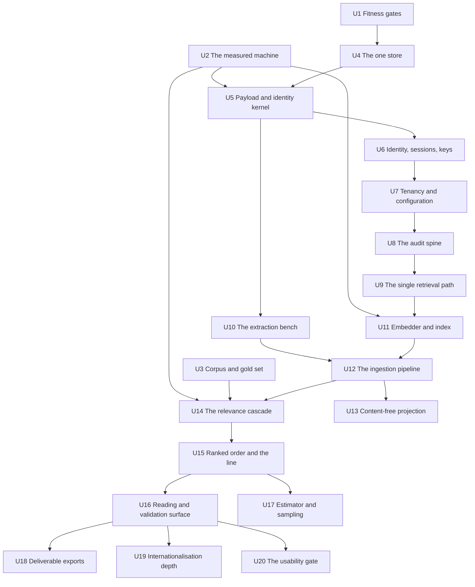

# Work Breakdown

Twenty units. Every FR-1…FR-60 appears in **exactly one** unit. Order is dependency order, with
**irreversibility first**: the payload and identity model (U5) and the single retrieval path (U9)
come before anything built on them, because both are cheap now and catastrophic later.

Two units are gates rather than features and sit at the top for that reason: **U1** (the checks
that stand in for the engineers this team does not have) and **U2** (the timed run without which
every wall-clock number in the PRD is speculation).

---

## Sequence at a glance

---

## The units

### U1 — The fitness gates and the structural checks

| | |
| --- | --- |
| **Delivers** | A build that fails when the product stops being installable inside a firm, and a static check behind every "no code path does X" in the spine. |
| **FRs** | FR-55, FR-56 |
| **Depends on** | Nothing. Starts in week one, before any feature is complete. |
| **Binds** | AD-2, AD-33, AD-4, AD-1 |

Grows continuously — every later unit adds its own checks here rather than asserting a universal
negative in a runtime test. The network-isolated CI job runs from the first week, not before the
first installation: the gap between "we intend to keep it portable" and "it is portable" is
measured in weeks of discovery, and otherwise it is discovered in front of a client.

**Salvage:** `tests/unit/test_guardrails.py` from the previous build — 184 LOC, 13 tests,
**LIFT AS-IS** (retrospective rank 3). It is the non-negotiables written as executable assertions
— label reversibility, no bulk delete, out-of-taxonomy labels can never leak, recall-biased
quality gate, no network without a key — and it imports only base dependencies by design. Adopt it
as the acceptance floor on day one.

---

### U2 — The measured machine `RISK GATE`

| | |
| --- | --- |
| **Delivers** | The number nobody has: a **timed 5 000-document run with OCR, embedding and LLM judgement concurrent** on the target hardware, plus measured chunk yield, HNSW p95 under a *matter*-scoped filter, and full-text index size. |
| **FRs** | None. It precedes them. |
| **Depends on** | Nothing. A throwaway harness using spike-quality adapters, **not** a unit of the product. |
| **Binds** | Falsifies or confirms AD-5, AD-11, AD-18, AD-21, AD-27, AD-28 |

**This gate is the reason the order below is what it is.** Open Risk 3: sections 3, 4 and 5 of the
stack research each sized the same €2 000 box independently; during an ingestion all three run
concurrently and nobody added them up. Open Risk 1: the whole single-store argument rests on an
assumed 3–8 M chunk yield on a corpus nobody has seen, and the measurement **must happen before
any retrieval code is written**.

> **Gates:** U5's vector column choice, U9, U11, U14, and **every performance or retrieval
> commitment in the programme**. Until this run exists, no wall-clock number may be quoted to a
> firm and UJ-1's weekend ceiling is unverified.

---

### U3 — The corpus, the gold set and the degradation pipeline `MOST LIKELY TO BE DROPPED`

| | |
| --- | --- |
| **Delivers** | Acquired, licence-cleared evaluation corpora; a mechanical degradation pipeline whose outputs are asserted against the *failure register* classes they must produce; and the gold set's relevance judgments **mapped, in writing and versioned, onto this product's notion of relevance**. |
| **FRs** | FR-54 |
| **Depends on** | Nothing for acquisition, licence clearance, degradation design and the mapping. Its "enters through ingestion" clause depends on **U12**. |
| **Binds** | AD-16, AD-34 |

Enron/EDRM for real mess at volume; TREC Legal Track for measurable recall; real French public
legal text mechanically degraded for French realism; APX's own mail as a smoke test.
TREC's relevance is not *ordonnance 145 CPC* relevance — the mapping is the hard part and is not
trivial.

**Salvage — the single most valuable artefact in the previous build:** `data/mock/raw/` (140
files), `data/mock/raw/manifest.json`, `data/mock/processed/` — **LIFT AS-IS** (retrospective rank
1). A coherent, anonymised, deliberately noisy six-month employment-law dump **with ground-truth
routing and pertinence labels per item**. Copy the data; it is regenerable by
`scripts/generate_firm_corpus.py` and should not need to be.

> **This is the unit the adversarial review would stake itself on being quietly dropped.** It is
> a product-sized build with no user-visible output, and its absence is invisible because the
> product still runs. §6.3 names it as the one item that **may never be cut**, because dropping it
> **is** the v1 defect: v1 had a gold set and never once ran it.

---

### U4 — The one stateful store

| | |
| --- | --- |
| **Delivers** | PostgreSQL 18.4 with pgvector ≥ 0.8.5 and Procrastinate 3.9.x, the migration wrapper that fails closed, and a backup/restore that is exercised rather than assumed. |
| **FRs** | FR-52 |
| **Depends on** | U1 (checks exist before the first schema) |
| **Binds** | AD-5, AD-6, AD-30, AD-32, AD-31 |

Includes the storage-footprint computation and the pre-flight capacity check that refuses an
*import job* that cannot fit — a firm buying one machine needs that number before it buys.

> **Blocked on Open Question 1** before the schema is written: how the vector column and the
> deterministic text index are encrypted at rest, given that neither can be indexed as ciphertext.

---

### U5 — The payload and identity kernel `IRREVERSIBLE — BUILD FIRST`

| | |
| --- | --- |
| **Delivers** | The frozen payload record, the one chunk write boundary, the (content, *matter*) identity function, chunk provenance to source position, container expansion arithmetic, and the *denominator*'s unit. |
| **FRs** | FR-8, FR-4, FR-11, FR-57 |
| **Depends on** | U4; the vector column shape depends on **U2** |
| **Binds** | AD-8, AD-9, AD-10, AD-11, AD-17, AD-23 |

**The only irreversible decision in the increment.** Adding a mandatory field later means
re-indexing everything at every installed site, blind, against a live 100 000-*pièce* index — and
that migration is §16's genuinely unsolved problem. The two reserved extension points cost nothing
now and cannot be added cheaply later: the external-authority reference on a *chunk* (Judilibre,
Légifrance) and the `supersedes` relation between *pièces*.

**Salvage:** `domain/chunking/strategies.py` — **REFACTOR** (rank 9). The parent/child +
contextual-header architecture is right; the sentence splitter mangles French legal text
(`art. L. 1235-3`, `n° 21-12.345`, `M.`, `Cass. soc.` all split mid-citation) and there are **zero
tests — write them first**.

---

### U6 — Identity, sessions, grants and keys

| | |
| --- | --- |
| **Delivers** | Owned authentication, opaque server-side sessions, the administrative grant and scope administration, secret and key management, encryption at rest and in transit. |
| **FRs** | FR-47, FR-48, FR-49, FR-51 |
| **Depends on** | U4, U5 |
| **Binds** | AD-15, AD-12, AD-31, AD-22 |

**The highest-risk code in the product**, and it is defended by tests alone: the off-the-shelf
options are forbidden for portability reasons that are correct, so identity, sessions and
authorisation are hand-rolled application code, written by AI agents, reviewed by one non-hands-on
person, where a mistake is silent and criminal.

`Principal` resolution goes behind one interface here — the cheap insurance against Open Risk 2,
and the thing that turns a future SSO requirement into an adapter rather than a rewrite.

> **Correction to carry into the stories:** FR-49's "a re-scope re-stamps every *chunk*" is
> **superseded by AD-13** — scope is joined at query time and nothing propagates. Build the
> stronger guarantee (immediate, no half-migrated window), and make FR-14's mutating adversarial
> suite assert the new mechanism.

---

### U7 — Tenancy, configuration-as-data and provisioning

| | |
| --- | --- |
| **Delivers** | *Tenant* isolation at the write and read boundary; every per-*tenant* behaviour as data rows; and the one audited surface through which configuration changes and a *tenant* is provisioned on first run. |
| **FRs** | FR-29, FR-30, FR-50 |
| **Depends on** | U4, U6 |
| **Binds** | AD-12, AD-24, AD-25, AD-3 |

Without FR-50, a correctly fail-closed installation is one where nobody can see anything and
nobody can grant access, at a site APX reaches only by telephone. Direct database editing is not
the mechanism — it is the fork configuration-as-data exists to prevent, arriving as data instead
of as code.

**Salvage:** `domain/classification/labels.py` — the nine flat, mutually exclusive French legal
categories with prompt-ready descriptions, **LIFT AS-IS** (rank 5) as the **default taxonomy row
set**, not as code. Whether it is the right taxonomy for *ordonnance 145 CPC* review is
unvalidated (OQ-16) — it is configuration, so being wrong is cheap, but shipping it unexamined
would be inheriting a v1 assumption unexamined.

---

### U8 — The audit spine

| | |
| --- | --- |
| **Delivers** | The append-only per-*matter* record, sequenced from one authority and chained; *overrides* with mandatory reasons; and the rule that an action whose record cannot be written **fails**. |
| **FRs** | FR-24, FR-25, FR-53 |
| **Depends on** | U4, U7 |
| **Binds** | AD-22, AD-7, AD-23 |

Every later unit writes here. Building it after them means retrofitting atomicity into actions
that already succeed without it, which is how an unaudited mode gets introduced by accident.

**Salvage:** `domain/audit/` (~230 LOC) plus the read/filter API — **REFACTOR** (rank 11). The
event vocabulary, factory functions and read API are clean and tested; the JSONL-on-local-disk
substrate is unusable and is replaced by the append-only table. **It is on an unmerged branch —
grab it before it is lost.**

> **Open Question 3:** where the single sequence authority lives under many concurrent workers,
> and its contention rate during a 100 000-*pièce* ingestion. Fold the measurement into U2.

---

### U9 — The single retrieval path `IRREVERSIBLE — BUILD EARLY` `UNDERESTIMATED`

| | |
| --- | --- |
| **Delivers** | One query constructor with a required scope argument; two engines with two truth statuses; deterministic exhaustive search over full text and names with declared normalisation; and the adversarial isolation suite. |
| **FRs** | FR-12, FR-13, FR-14, FR-15 |
| **Depends on** | U5, U6, U7, U8; **gated on U2** |
| **Binds** | AD-12, AD-13, AD-14, AD-20, AD-21, AD-10 |

Once a second query path exists anywhere, the wall has two places to be wrong and no static check
can close it again. Everything that reads *tenant* data is built **on top of** this unit, never
beside it.

> **Underestimated.** Building the pre-filter is straightforward; building the **proof** is not.
> SM-6 demands zero out-of-scope results, counts, snippets or metadata across **every** retrieval,
> export and diagnostic surface — an adversarial suite that must be extended every time any
> surface is added, forever, including scope mutation mid-corpus, revocation with a session open,
> and a grant mid-*sampling run*. PostgreSQL RLS, the one mechanism that would enforce this at the
> storage layer regardless of application bugs, is forbidden for portability.

**Salvage:** only the `SearchResult` schema shape from `retrieval/schemas.py` — the
`parent_text` / `excerpt` split is a good idea. The service itself is **REWRITE** (rank 16): no
filtering, so no tenancy; no reranking; no hybrid; no metadata filters.

---

### U10 — The extraction bench `UNDERESTIMATED — LARGEST SURFACE`

| | |
| --- | --- |
| **Delivers** | Text and structure out of the formats a litigation *matter* actually contains, each engine out-of-process and licence-isolated, with the extractor version recorded and the OCR quality signal computed per *matter* and per *tenant*. |
| **FRs** | FR-3 |
| **Depends on** | U5 |
| **Binds** | AD-28, AD-10, AD-17, AD-19 |

> **The largest single engineering surface in the increment, and the most likely to be
> underestimated.** `.msg` alone is compound-file/MAPI parsing: RTF-compressed bodies, TNEF
> (`winmail.dat`), nested `.msg`, charset recovery and reply-chain reconstruction — and an email
> with N attachments yields N+1 *pièces*, so the attachment-identity problem, the nested-container
> problem and the deduplication interaction all land at once. Then OCR must run **inside the
> *tenant* boundary**, which forbids every hosted OCR service, on a firm's single machine, over
> 100 000 *pièces*. **Months, not weeks, and entirely unglamorous.**

**Salvage:** `domain/parsing/*` — **REWRITE** (rank 15). Eight thin wrappers, zero tests;
`parse_pdf` never falls back to OCR so scanned PDFs silently yield nothing; `.msg` untested
despite being the stated dominant format; `.eml` handles only `text/plain`, dropping HTML-only
mail, which is most mail.

---

### U11 — The embedder and the index that never deletes itself

| | |
| --- | --- |
| **Delivers** | A real semantic embedder that halts rather than degrades, and an index in which destructive operations are reachable from exactly one named administrative entry point. |
| **FRs** | FR-9, FR-10 |
| **Depends on** | U5, U9; **gated on U2** |
| **Binds** | AD-11, AD-19, AD-7 |

Negates the two v1 defects that silently converted a working system into a broken one that still
returned results: a 1024→256-dim hash fallback swallowed on any exception, and a collection wiped
on any vector-size mismatch. The failure chain was: transient provider 429 → 256-dim fallback →
next store construction sees 1024 ≠ 256 → **entire vector index deleted** → queries return nothing
→ frontend silently serves the demo bundle. No log, no alert, no error.

---

### U12 — The ingestion pipeline `UNDERESTIMATED (runner-up)`

| | |
| --- | --- |
| **Delivers** | The folder gesture as the whole onboarding; a non-blocking, resumable, idempotent, quarantining *import job*; the *failure register*; the inventory guarantee; the completion summary; and the rule that there is exactly one ingestion path. |
| **FRs** | FR-1, FR-2, FR-5, FR-6, FR-7, FR-33 |
| **Depends on** | U5, U7, U8, U10, U11 |
| **Binds** | AD-6, AD-16, AD-17, AD-19, AD-7, AD-12 |

**Security does not begin downstream of this unit — it begins here.** One hundred thousand
confidential *pièces* entering in a single gesture, at 19:10, with no IT department in the room
and a non-technical user holding the drive. FR-1's scope ceiling in **both** directions, its loud
refusal of a null scope, and its traversal boundary are the guard on the widest attack surface the
product has — and they read as edge cases to whoever is cutting scope. A scope mislabelled here is
enforced correctly and permanently against the wrong wall; the pre-filter cannot detect data
mislabelled at the boundary.

> **Runner-up for underestimation:** resumable, idempotent, concurrency-safe ingestion asserted
> with induced kills at ≥3 points and induced write conflicts. Well-understood distributed-systems
> work — expensive but not dangerous.

**Salvage:** `domain/ingestion/service.py` — **REWRITE** (rank 17). The *sequence* of steps is
right; the implementation is one synchronous function inside the HTTP request accumulating all
points for all files in memory before a single upsert. `domain/scoring/quality.py` — **LIFT
AS-IS** (rank 6), cheap, explainable, recall-biased, returns a machine-readable rejection reason,
tested. `domain/documents/repository.py` and `infra/vectorstore/qdrant.py` — **DROP/REWRITE**
(ranks 18, 19); the latter silently deletes the whole collection on a vector-size mismatch, wearing
a comment that calls it a feature. The v1 fixture layer and `demo-data.json`/`demo.ts` mechanism —
**DROP** (rank 25), deleted rather than disabled.

---

### U13 — The content-free projection and the diagnostic export `MOST LIKELY TO BE DROPPED`

| | |
| --- | --- |
| **Delivers** | One registry of named projectors with content-freedom enforced by seeded-token test, an emission path outside the registry that fails the build, an attestation floor for text-derived projectors, and the user-initiated diagnostic export. |
| **FRs** | FR-31, FR-32 |
| **Depends on** | U7, U8, U12 |
| **Binds** | AD-26 |

Built **open by construction** because the next increment's on-premises style extractor is its
second consumer and emits none of the value kinds the diagnostic export needs. A closed
enumeration here forces that increment to build a second content-free path, which is a defect the
seeded-token test would not cover.

> **Predicted drop #2.** No client exists, nothing is installed, nobody has ever asked for a
> diagnostic. It is pure future tax, technically fiddly, and the seeded-token test — the
> interesting part — is the easiest thing to skip. §6.3 also makes it **cut #2**, and records the
> discomfort honestly: it is simultaneously the cheapest cut and the most damaging, because at the
> first installation it is the only support channel that exists and its absence is undetectable
> until then.

---

### U14 — The relevance cascade `SEQUENCING GATE`

| | |
| --- | --- |
| **Delivers** | The optional *case theory* with versioning and re-rank offer; the three-stage cascade with its stage-3 share measured per run; near-duplicate families judged together; and derived — never self-reported — per-*pièce* confidence. |
| **FRs** | FR-37, FR-38, FR-42 |
| **Depends on** | U9, U11, U12; **gated on U2 and U3** |
| **Binds** | AD-18, AD-19, AD-23, AD-27, AD-34 |

**The most expensive capability in the increment** — in build time, in inference cost and in data
egress — and the one whose quality nobody can verify without a real *matter*. Stage 3 sends the
substance of a *matter* to a hosted provider as **normal operation**, under a contract clause that
is not a technical property.

> **Two gates before a line of this is written.**
> **(a) U2** — the cascade is the mitigation for Open Risk 3 and should be built first among the
> ranking work, not last.
> **(b) §6.3's sequencing gate** — *no triage-layer work begins until one real anonymised* matter
> *is in hand, or its absence is explicitly re-accepted, in writing, with a date.* That sentence is
> the only structural defence in the PRD against the drift that produced v1.
> **(c) U3's merge gate** — no ranking code merges before recall executes against the gold set.

**Salvage:** the LLM provider abstraction `llm/base.py`, `factory.py`, `stub.py`,
`mistral_provider.py`, `anthropic_provider.py` — **REFACTOR** (rank 10). The shape is right: a
`Protocol`, deferred SDK imports, a stub that cannot be mistaken for a real answer. Three things
must change: `grounded_passage_ids` is passed in and echoed out untouched — it is bookkeeping, not
verification, and must not be presented as a grounding guarantee; the hard-coded model id is not a
valid one and must be verified against the current model list; and streaming, retries, timeouts and
token accounting do not exist. Also `domain/syllogisme/grounding.py` — **LIFT AS-IS** (rank 7):
`extract_json` survives code fences and prose wrappers, `truthy` handles `true`/`oui`/`yes`, 6
tests. And the tolerant parser + `{"off_corpus": true}` escape-hatch pattern from
`domain/syllogisme/builder.py` (rank 4) — weeks of prompt iteration, and a parser that survives
partial or malformed model output.

---

### U15 — The ranked order and **the line**

| | |
| --- | --- |
| **Delivers** | One ranked order per *matter* with a complete *ranking version* and a deterministic recorded tie-break; **the line** as an ordinal cut over a named version; per-*pièce* labelling; the *pin*; and the complete staleness trigger list. |
| **FRs** | FR-16, FR-17, FR-39, FR-40, FR-43, FR-58 |
| **Depends on** | U14, U8 |
| **Binds** | AD-7, AD-23, AD-19 |

The *retained set* and *discarded set* are views computed **after** pins are applied — never
stored memberships. A tie spanning **the line** would otherwise reshuffle set membership on
recomputation with no recorded event, silently invalidating any *sampling run* drawn from it.
Ingestion into a ranked *matter* is a staleness trigger, because *pièces* arriving after a ranking
are in neither set — a third state the model does not admit.

> **Demo-shaped, and named as such.** A ranked table with confidences, a committed line and
> one-line justifications is the single most demonstrable artefact in the product, and it is
> unfalsifiable without a *matter*-specific gold standard. That is the definition of demo-shaped,
> and it is why U3 and U14's gates sit in front of it.

**Salvage:** `domain/syllogisme/scorer.py` — **LIFT AS-IS** (rank 2). Pure, deterministic, zero
I/O, tested on both sides of the threshold, encodes a real product decision (0.40/0.40/0.20, gate
at 0.70, auto-generated follow-up questions), coupled to nothing. Port the file verbatim, keep the
tests.

---

### U16 — Reading, validation and the home screen

| | |
| --- | --- |
| **Delivers** | The *pièce* viewer; the editable cell-by-cell table with a live *change log*; per-*pièce* confidence and the justification derived from named extracts; the *audit drawer*; the *validation act*; the *worklist* and the permanent *denominator*; the *matters* zone; and the guarantee that nothing hard-deletes. |
| **FRs** | FR-18, FR-20, FR-21, FR-26, FR-27, FR-28, FR-41, FR-44, FR-45, FR-60 |
| **Depends on** | U9, U8, U15 |
| **Binds** | AD-29, AD-7, AD-10, AD-22, AD-12 |

The largest unit by FR count and the whole of the client surface. Built **inside the workspace
shell** — one workspace, three verbs — not beside it: navigation, *matter* selection and the home
screen belong to the workspace, and a navigation that must be discarded when drafting arrives is
the default outcome of building this in isolation.

Two rules that are cheap to state and easy to lose: *reading is the job above **the line**;
supervising is the job below it* — any requirement asking for per-*pièce* verdicts below the line
spends the very thing the product is sold to save. And **the extracts are the control; the sentence
is not evidence** — stated in the interface, once, plainly.

**Salvage:** `web/src/app/**` and `components/ui.tsx` — **REFACTOR as design reference, not as
code** (rank 14): real screens real clients have seen, but `syllogisme/page.tsx` is 870 lines with
no tests and no lint, and `translations.ts` keys English strings by their French source text. The
increment's single most reusable asset is a mockup, and the shipped v1 application and its mockups
shared almost no visual DNA.

---

### U17 — The estimator and the sampling ritual `UNDERESTIMATED — CAN CONSUME UNBOUNDED TIME`

| | |
| --- | --- |
| **Delivers** | A random draw over a frozen *discarded set*; a hypergeometric prevalence bound stating its confidence level, its scope, its *ranking version* and its *case theory* version; and the priced statement shown before **the line** moves. |
| **FRs** | FR-19, FR-22, FR-23 |
| **Depends on** | U15, U8 |
| **Binds** | AD-22, AD-23, AD-34, AD-2 |

The north star, and **not an implementation task**. Five design decisions must each be answered
explicitly and recorded, then the estimator validated by simulation against populations of known
truth: the unit of the draw (*pièce* or near-duplicate family); the census-versus-sample crossover
and what the sentence says near it; whether repeated runs pool; the exact population-freezing
contract and what invalidates a run mid-flight; and whether TREC calibration is admissible for the
projection at an unsampled position.

> **This is the item that can consume unbounded time, because it cannot be brute-forced by an
> agent.** Answer OQ-26 before building: nothing establishes that 200 individual verdicts is a
> thing a senior lawyer actually does, and if the honest answer is sixty, the estimator has to be
> designed for sixty — which changes what the simulation must validate. Batching is free and
> required; stratified draws change the estimator; sequential or curtailed sampling is the largest
> saving and is **unsound unless the stopping rule is part of the validated estimator**.
>
> **Two things this unit must never do:** state the probability that nothing relevant was missed
> (not estimable from a sample of this size), and depend on a network call — the sentence is
> templated and rendered locally from the *audit record*, asserted by the U1 offline job.
>
> **Cut #4 fallback, already named:** ship the sampling ritual and report counts only.

---

### U18 — The deliverable

| | |
| --- | --- |
| **Delivers** | Export of the *retained set* — the working set the associate actually needs, not only a record of what happened. |
| **FRs** | FR-46 |
| **Depends on** | U16, U8, U17 |
| **Binds** | AD-26, AD-22, AD-10 |

Small, and the thing whose absence gets a tool routed around: v1 exported an *audit record* and
never the working set, so the associate would re-key 180 references by hand to build her
*bordereau*. Superseded *pièces* are marked as such so two versions of one document do not appear
as two.

**Salvage:** `web/src/lib/export.ts` and `word-export.ts` — **REFACTOR** (rank 13). The
citation-renumbering logic genuinely works and Word/Google Docs open the output natively; move
generation server-side, because client-side generation leaves no server-side record of what was
exported, which conflicts with auditability. "PDF" was `window.print()` — not a document and not
reproducible.

> **Honourable mention on the drop list:** FR-26's self-containment — *a reader with the export
> and no access to the system can reconstruct every number in it, asserted by test*. Genuinely
> hard, and trivially fakeable with an export that merely **looks** complete.

---

### U19 — Internationalisation depth `MOST LIKELY TO BE DROPPED`

| | |
| --- | --- |
| **Delivers** | Namespaced keys with no silent fallback; locale-aware dates, numbers and collation; and the user's language reaching the language model with the source language declared. |
| **FRs** | FR-34, FR-35, FR-36 |
| **Depends on** | U16 for the surfaces, U14 for the model path |
| **Binds** | AD-24, AD-29, AD-33 |

**Sequencing warning:** the key-set **mechanism** is not deferrable to here. It binds the frontend
from its first line and belongs in U16's first story; retrofitting it means touching every string
twice. What is listed as this unit is the **depth**.

> **Predicted drop #3, and precisely delimited.** FR-34's key-set parity is cheap and survives
> because it fails the build. Locale collation, distinguishable *pièce*-date versus ingestion-date
> rendering, the source-language statement, and "language reaches the model" asserted with the
> locale switched are per-string diligence with no failing test behind most of it — and they decay
> exactly the way v1's did, protected by the same mechanism (care) that failed the first time.
> §6.3's cut #5 is this list, minus key-set parity.

---

### U20 — The usability gate

| | |
| --- | --- |
| **Delivers** | A versioned phrasing checklist with recorded, dated verdicts per surface; keyboard reachability for every *worklist* action and every triage-table edit; one token set enforced structurally. |
| **FRs** | FR-59 |
| **Depends on** | U16, U18, U19 |
| **Binds** | AD-29, AD-33 |

The only unit whose primary verb is *asserted by review*, never counted as a passing test. Its
value is that the review happened, is dated and is arguable. A failed item blocks the release
candidate or is recorded as an accepted exception with a reason; an **unrecorded verdict counts as
a failure**. A *worklist* line whose only resolution is a telephone call to APX is a defect of this
unit as much as of U12's.

---

## The three risk gates, and exactly what they hold up

| Gate | Holds up | Released by |
| --- | --- | --- |
| **Open Risk 3 — nobody summed the machine** | U5's vector column, U9, U11, U14, U15, and **every wall-clock or throughput commitment made to a firm**. UJ-1's weekend ceiling is unverified until this exists. | **U2**: a timed 5 000-document run on target hardware with OCR, embedding and LLM judgement **concurrent**. If it extrapolates past one weekend for 100 000 *pièces*, or Tesseract overtakes the LLM as the bottleneck, the hardware recommendation and the €2 000 sales story are both wrong. |
| **Open Risk 1 — pgvector as the sole store** | The same measurement, same run: chunk yield, HNSW p95 under a *matter*-scoped filter, index build within `maintenance_work_mem`, and full-text index size. **Must precede any retrieval code.** | **U2**. Falsified above ~8 M chunks or ~2 s p95. Keep the vector column type behind a migration you can change. |
| **Open Risk 2 — no identity provider** | Nothing today. It is a watch item, not a blocker, and the insurance is already in U6. | The first customer security questionnaire demanding SAML/OIDC. If it comes, an OIDC adapter lands behind U6's `Principal` interface — with CVE-heavy Authlib on the critical path of an unpatchable machine. |

Two non-risk gates of equal force: **U3's merge gate** (no ranking or triage code merges before
recall runs against the gold set) and **§6.3's sequencing gate** (no triage-layer work — U14
onward — until one real anonymised *matter* is in hand, or its absence is re-accepted in writing,
with a date).

---

## Where the estimates will be wrong

| Unit | Why it is underestimated |
| --- | --- |
| **U10 — extraction** | Five bullets of PRD prose concealing the largest engineering surface in the increment. `.msg` compound-file parsing, TNEF, nested messages, charset recovery, reply-chain reconstruction, N+1 *pièce* identity, **and** local OCR at 100 000 *pièces* with an undefined quality signal that gates every absence claim. Months, not weeks. |
| **U17 — the estimator** | Not an implementation task. Five design decisions, a simulation harness, and an open question (OQ-26) about what size of run a real lawyer completes — which changes the estimator itself. Cannot be brute-forced by an agent. |
| **U9 — the isolation proof** | The pre-filter is easy; the proof is not. An adversarial suite covering every retrieval, export and diagnostic surface, extended forever, including scope mutation, revocation mid-session and grants mid-*sampling run*. RLS — the one storage-layer enforcement — is forbidden for portability. |
| **U12 — resumable idempotent ingestion** | Runner-up. Induced kills at ≥3 points, induced concurrent write conflicts, poison-unit quarantine, memory bounded per unit as well as per job. Expensive but well-understood. |
| **U16 — the client surface** | Ten FRs, and it must be built inside the workspace shell rather than as a triage tool, with the i18n key mechanism in place from its first story. |

## What will quietly disappear if nobody watches

| Rank | Item | Why it goes, and what it costs |
| --- | --- | --- |
| 1 | **U3 — the corpus and gold set** | Invisible, no user-visible output, and the product still runs without it. **This is the prediction the adversarial review would stake itself on.** §6.3 names it as the one thing that may never be cut, because dropping it **is** the v1 defect. |
| 2 | **U13 — the content-free projection** | Pure future tax with no client and nothing installed; the seeded-token test is the interesting part and the easiest to skip. Also §6.3's cut #2 — simultaneously the cheapest and the most damaging cut, because it is the only support channel a first installation has. |
| 3 | **U19 — i18n depth** | Per-string diligence with no failing test behind most of it. Decays exactly as v1's did, protected by the same mechanism that failed the first time. |
| — | **FR-26's self-containment** (in U16/U18) | Genuinely hard, trivially fakeable with an export that merely looks complete. |

---

## Salvage summary

Paths are relative to `../apx-platform/` — **reference only, never an edit target**.

| Verdict | Item | Lands in |
| --- | --- | --- |
| **LIFT AS-IS** | `data/mock/raw/` + `manifest.json` + `data/mock/processed/` — the gold-labelled corpus, the most valuable artefact in the repo and the hardest to recreate | **U3** |
| **LIFT AS-IS** | `tests/unit/test_guardrails.py` — the non-negotiables as executable assertions | **U1** |
| **LIFT AS-IS** | `domain/syllogisme/scorer.py` — pure, deterministic, tested, encodes a real product decision | **U15** |
| **LIFT AS-IS** | `domain/scoring/quality.py` — cheap, explainable, recall-biased pre-ingestion filter | **U12** |
| **LIFT AS-IS** | `domain/syllogisme/grounding.py` — `extract_json`, `truthy` | **U14** |
| **LIFT AS-IS** | `domain/classification/labels.py` — nine French legal categories, **as taxonomy rows, not code** | **U7** |
| **LIFT AS-IS** | `domain/syllogisme/builder.py` prompt patterns + tolerant parser + `off_corpus` escape hatch | **U14** |
| **REFACTOR** | `domain/audit/` — keep events, models, service interface; swap JSONL for the append-only table. **On an unmerged branch** | **U8** |
| **REFACTOR** | `llm/` provider abstraction — keep the Protocol and deferred imports; fix the fake grounding guarantee, the invalid model id, and the absent retries/timeouts/accounting | **U14** |
| **REFACTOR** | `domain/chunking/strategies.py` — keep parent/child + contextual headers, replace the sentence splitter with something citation-aware, **write the tests first** | **U5** |
| **REFACTOR** | `web/src/lib/export.ts`, `word-export.ts` — keep citation renumbering, move generation server-side | **U18** |
| **REFACTOR** | `web/src/app/**` — as **design reference**, not code | **U16** |
| **REWRITE** | `domain/parsing/*`, `domain/retrieval/service.py`, `domain/ingestion/service.py`, `domain/documents/repository.py`, `infra/vectorstore/qdrant.py`, `rbac/` (from zero) | U10, U9, U12, U4, U11, U6 |
| **DROP** | `workers/**` (8 files, 0 bytes), `Dev/legal-rag-core/`, `.env.example`, `generate_mock_corpus.py`, the `demo-data.json`/`demo.ts` **mechanism** | — |

The largest gap between the previous spec and the previous build was `rbac/` — a docstring only,
while `client_key` and `dossier_key` were persisted and never used as a filter. In this increment
it is not a filter bolted on later: it is AD-9, AD-12, AD-13 and AD-14, and it is built in U5, U6,
U7 and U9 **before** anything reads *tenant* data.
