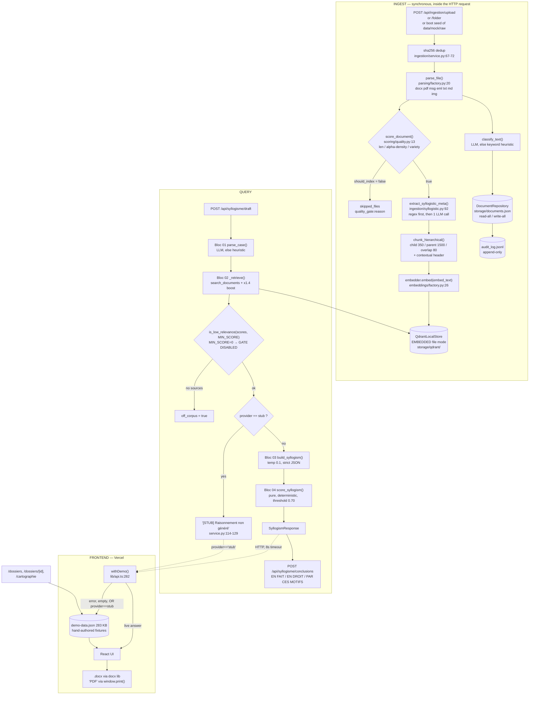

# Existing Build — Technical Retrospective

**Subject:** `Dev/apx-platform/` (the previous APX MVP) and `Dev/legal-rag-core/` (an older, superseded copy of the core library).
**Purpose:** tell the rebuild exactly what to lift, what to rewrite, and what will silently bite.
**Method:** every claim below is traced to a file (and line where useful). Where the README / `CLAUDE.md` / `docs/syllogisme-pipeline.md` assert something the code does not support, it is flagged **[DOC ≠ CODE]**. Anything not confirmed by reading code or running it is marked **unverified**.

Paths are relative to `Dev/apx-platform/` unless prefixed otherwise.

---

## 0. Headline numbers

| Metric | Value | Evidence |
|---|---|---|
| Python LOC (whole repo) | **6 993** | `find . -name '*.py' \| xargs wc -l` |
| — of which corpus generators | **2 920** (42 %) | `scripts/generate_firm_corpus.py` (2 177), `scripts/generate_mock_corpus.py` (743) |
| — of which the actual library | **≈ 3 200** | `packages/legal-rag-core/legal_rag_core/**` |
| — of which the FastAPI app | **310** | `apps/apx-demo/backend/app/**` |
| — of which tests | **556** | `tests/unit/*.py` |
| TypeScript/TSX LOC (frontend) | **5 603** | `apps/apx-demo/web/src/**` |
| Bundled demo JSON | **283 KB** | `apps/apx-demo/web/src/lib/demo-data.json` |
| Commits on the project | **53** | `git log --oneline \| wc -l` |
| Active development window | **2026-05-31 → 2026-06-22** (~3 weeks) | first commit `5ae01fe`, last `fb05ec3` |
| Tests, all passing | **44** | `pytest -q` → `44 passed` (run in a clean 3.11 venv) |
| **Empty (0-byte) `.py` files in the library** | **29** | `find … -size -1` |
| **Empty (0-byte) `.py` files in `workers/`** | **8 of 8** | `wc -l workers/**/*.py` → `0 total` |

The single most important structural fact: **42 % of the Python in this repo generates fake data, and 100 % of the async worker layer is empty files.** The real engine is about 3 200 lines.

⚠️ **The repo is not on `main`.** `HEAD` sits on branch `apx/auto/20260622-audit-trail`, three commits ahead of both `main` and `origin/main` (`git log --oneline main..HEAD` → `fb05ec3`, `96c546e`, `bc10742`). The audit-trail feature — the one thing PLAN.md §5 calls "the trust mechanism" — **is not on the deployed branch**.

---

## 1. What exists today — module-by-module inventory

### 1.1 `packages/legal-rag-core/` — the library

Installed as an editable path dependency; `pyproject.toml` declares only `pydantic`, `httpx`, `python-dotenv` as hard deps, with everything else behind extras (`ingest`, `embeddings`, `vectorstore`, `generation`, `llm`, `dev`).

| Module | Purpose | Key files | LOC | Maturity |
|---|---|---|---|---|
| `domain/syllogisme/` | The 5-block reasoning pipeline (see §3) | `service.py` (154), `builder.py` (162), `schemas.py` (109), `scorer.py` (85), `parser.py` (62), `grounding.py` (41) | ~620 | **working** — best code in the repo |
| `domain/ingestion/` | Parse → quality-gate → chunk → embed → upsert → classify → audit, synchronously | `service.py` (223), `syllogistic.py` (104), `schemas.py` (23) | ~350 | **working** (synchronous only) |
| `domain/documents/` | JSON-file document index, delete, reclassify, graph, preprocessing stats | `service.py` (172), `repository.py` (56), `schemas.py` (53), `models.py` (17) | ~300 | **working** (not production storage) |
| `llm/` | Provider abstraction: stub / Mistral / Anthropic, key auto-detect | `factory.py` (52), `mistral_provider.py` (54), `anthropic_provider.py` (53), `stub.py` (42), `base.py` (35) | ~250 | **production-ish** |
| `domain/parsing/` | `.docx .pdf .msg .eml .txt .md .png/.jpg/.jpeg/.webp` | `factory.py` (35), `msg_parser.py` (55), `eml_parser.py` (39), `text_parser.py` (31), `pdf_parser.py` (24), `docx_parser.py` (19), `image_parser.py` (17), `base.py` (10) | ~230 | **prototype** — thin wrappers, zero tests |
| `domain/veille/` | RSS/Atom fetch of 4 public EU feeds + LLM executive brief | `service.py` (144), `feeds.py` (73), `schemas.py` (21) | ~240 | **working**, zero tests |
| `domain/audit/` | Append-only JSONL audit trail | `service.py` (110), `events.py` (63), `models.py` (27), `__init__.py` (29) | ~230 | **working**, well tested — but **not on `main`** |
| `domain/conclusions/` | "Couche 2": render a validated syllogism as French procedural conclusions | `service.py` (105), `styles.py` (38), `schemas.py` (33) | ~180 | **working** |
| `domain/classification/` | 9-label legal taxonomy, LLM-first with keyword-heuristic fallback | `service.py` (108), `labels.py` (32), `schemas.py` (10) | ~150 | **working**, well tested |
| `domain/chunking/` | Hierarchical parent/child chunking with contextual embed headers | `strategies.py` (99), `service.py` (23) | ~130 | **working**, **zero tests** |
| `domain/retrieval/` | Vector search + grounded ask | `service.py` (89), `schemas.py` (41) | 130 | **prototype** |
| `domain/embeddings/` | Embedder selection: local-hash / Mistral / BGE-M3 | `factory.py` (44), `mistral_embed.py` (36), `bge_m3.py` (23), `local_hash.py` (17) | ~130 | **working**, tested |
| `infra/vectorstore/qdrant.py` | Qdrant **embedded/local-file** store; recreates collection on vector-size change | 62 | **prototype** |
| `infra/storage/filesystem.py` | Upload → `STORAGE_ROOT/uploads/{client_key}/` | 32 | **prototype** |
| `infra/ocr/tesseract.py` | pytesseract wrapper, swallows all errors, returns `""` | 20 | **prototype** |
| `domain/scoring/quality.py` | Pre-ingestion noise gate (length / alpha-density / lexical variety) | 46 | **working**, tested |
| `domain/review/` | Update a document label | `service.py` (14), `schemas.py` (14) | 28 | **prototype** |

**Empty shells that exist only as import targets** — these are real files with real names and **no code**:

| Path | Bytes | Consequence |
|---|---|---|
| `legal_rag_core/domain/retrieval/reranking.py` | **0** | There is **no reranker at all**, anywhere. |
| `legal_rag_core/domain/retrieval/citations.py` | **0** | Citation linking is done ad-hoc inline (`service.py:54` builds `f"{document_id}-c{chunk_index}"`); no citation module. |
| `legal_rag_core/domain/ingestion/pipeline.py`, `validators.py`, `models.py` | **0** each | Ingestion is one 223-line function; no validators. |
| `legal_rag_core/domain/classification/rules.py`, `models.py` | **0** each | Rules live inline in `service.py:24-33`. |
| `legal_rag_core/infra/db/session.py`, `base.py` | **0** each | **No database. At all.** |
| `legal_rag_core/infra/queue/broker.py` | **0** | **No queue. At all.** |
| `legal_rag_core/domain/review/audit.py`, `models.py` | **0** each | — |
| `legal_rag_core/citation/__init__.py` | docstring only | PLAN.md §2 module — never implemented. |
| `legal_rag_core/generation/__init__.py` | docstring only | python-docx/WeasyPrint export lives **in the browser** instead. |
| `legal_rag_core/rbac/__init__.py` | docstring only | **PLAN.md §5 calls RBAC-by-matter "a hard requirement". Zero lines exist.** |

### 1.2 `workers/` — 8 files, 0 bytes

`worker.py`, `tasks/{ingest_batch,parse_document,run_ocr,chunk_document,embed_chunks,index_document,classify_document}.py` — all empty. `wc -l workers/**/*.py` → `0 total`.

**[DOC ≠ CODE]** `README.md` describes `workers/ ← async ingestion / OCR / veille crawls`. Nothing is async; nothing exists. Ingestion runs synchronously inside the HTTP request (`domain/ingestion/service.py:46`). `docker-compose.yml` starts Redis; nothing connects to it.

### 1.3 `apps/apx-demo/backend/` — FastAPI, 310 LOC

| File | LOC | Notes |
|---|---|---|
| `app/main.py` | 52 | `load_dotenv()` before imports; CORS; 9 routers under `/api`; lifespan calls `seed_mock_corpus_if_empty()` |
| `app/seed.py` | 51 | Walks parents for `data/mock/raw`, ingests it on boot if the index is empty. Whole body wrapped in `except Exception` (`seed.py:50`) |
| `app/api/documents.py` | 49 | list / graph / preprocessing / detail / delete / classify |
| `app/api/ingestion.py` | 42 | `/jobs`, `/folder`, `/upload` (multipart) |
| `app/api/syllogisme.py` | 19 | `/draft`, `/conclusions` |
| `app/api/audit.py` | 19 | read-only `/api/audit` |
| `app/api/search.py` | 16 | `/api/search`, `/api/search/ask` |
| `app/api/veille.py`, `review.py`, `jobs.py`, `health.py` | 46 total | thin |
| `app/config.py` | 30 | **mostly dead** — see §7 |
| `app/dependencies.py` | 5 | **dead code**: nothing imports it (`grep -rn dependencies apps/…` → only its own definition) |

Every endpoint is a 1–3 line pass-through to the library. **No auth. No tenancy. No rate limiting. No request validation beyond Pydantic. No tests touch any endpoint.**

### 1.4 `apps/apx-demo/web/` — Next.js 14 App Router, 5 603 LOC

| File | LOC | Notes |
|---|---|---|
| `src/app/syllogisme/page.tsx` | **870** | The flagship screen. Largest single file in the repo. |
| `src/components/CorpusGraph.tsx` | 477 | Hand-rolled SVG graph — no graph library |
| `src/lib/api.ts` | 424 | Types + the demo-fallback wrapper (§5) |
| `src/lib/export.ts` | 373 | `.docx` via the `docx` npm lib; "PDF" via `window.print()` in a hidden iframe (`export.ts:313-336`) |
| `src/app/assistant/page.tsx` | 361 | Regex intent router (`ask` / `syllogisme` / `veille`) |
| `src/lib/demo.ts` | 346 | The demo fallback layer |
| `src/app/dossiers/[id]/page.tsx` | 298 | 100 % fed from `demo-data.json` |
| `src/lib/translations.ts` | 295 | FR→EN dictionary keyed by French source text |
| `src/app/veille/page.tsx` | 275 | |
| `src/app/documents/page.tsx` | 266 | |

Dependencies are minimal and current: `next ^14.2.35`, `react ^18`, `docx ^9.7.1`, `tailwindcss ^3.3`. **No ESLint config, no test runner, no component tests.**

### 1.5 `data/mock/` — synthetic corpora

| Directory | Files | Size | Role |
|---|---|---|---|
| `raw/` (`emails/`, `documents/`, `notes/`, `manifest.json`) | 140 | 580 KB | Canonical: a noisy 6-month dump for *Cabinet Marchand & Lefèvre*, droit du travail, 8 dossiers. `manifest.json` is a **gold-standard routing/pertinence ground truth**. |
| `processed/` | 48 | 288 KB | Triage output, per-dossier chronology / bordereau / context pack, 5 syllogismes, veille |
| `documentation/`, `syllogisme/`, `veille/` | 62 | 236 KB | Legacy single-domain fixtures from `generate_mock_corpus.py`; superseded (`data/mock/README.md`) |

### 1.6 `Dev/legal-rag-core/` — the older, separate copy

967 Python LOC, **231 empty `.py` files**, one commit (`7be85f5 feat(poc): initial visual POC`). Its `backend/app/` is a strict *subset* of `packages/legal-rag-core/legal_rag_core/` — it **lacks** `syllogisme/`, `veille/`, `conclusions/`, `scoring/`, `llm/`, `mistral_embed.py`, `text_parser.py`, `ingestion/syllogistic.py` (verified with `diff -rq`). It additionally carries a dead React+Vite frontend (`frontend/src/main.tsx`) that the monorepo replaced with Next.js.

**Verdict: it is pure dead weight.** It contains nothing the monorepo copy does not have, and it ships a committed `backend/.env` (values are all localhost defaults, no secrets — but the habit is the problem).

---

## 2. Actual runtime architecture

### 2.1 The real data flow



### 2.2 Where it degrades — and what the degraded mode actually does

There are **six independent fallbacks**, each silent. Composed, the default deployment is a demo, not a product.

| # | Trigger | Code | Degraded behaviour | Real consequence |
|---|---|---|---|---|
| 1 | `EMBEDDER` unset | `embeddings/factory.py:27` | `LocalHashEmbedder` — 256-dim SHA-256 token bucketing | **Retrieval is lexical bag-of-words with hash collisions, not semantic.** A query with no literal token overlap retrieves nothing relevant. |
| 2 | Embedder import/key fails | `factory.py:40-42` — bare `except Exception` | Silently returns `LocalHashEmbedder` | You set `EMBEDDER=mistral`, a typo'd key makes it fail, and **nothing tells you** you are back on hashes. Vector dim silently drops 1024→256, so `_ensure_collection` (`qdrant.py:37`) **deletes and recreates the collection** — the whole index is wiped, silently. |
| 3 | No `MISTRAL_API_KEY` / `ANTHROPIC_API_KEY` | `llm/factory.py:9-19` | `StubProvider` — echoes the query, prefixed `[STUB]` | Syllogisme returns `"[STUB] Raisonnement non généré par un modèle"` (`syllogisme/service.py:114`); classification falls to keywords; veille brief is `""`; ingest-time M/m/C extraction returns empty. |
| 4 | LLM returns non-JSON | `builder.py:156-162` | Dumps raw text into `conclusion.pretention_principale[:1500]` | A malformed response produces a **structurally valid but semantically wrong syllogism** with a low confidence score. No error surfaces. |
| 5 | RSS feeds unreachable | `veille/service.py:120-123` | 4 hard-coded `SAMPLE_ITEMS` from May 2026 (`feeds.py:32`) | The digest shows stale sample news. `degraded: true` **is** set on the response — the only honest degradation flag in the codebase. |
| 6 | Backend error, timeout, empty, **or `provider == "stub"`** | `web/src/lib/api.ts:282-294` | Serves `demo-data.json` | **This is the big one.** A perfectly healthy backend with no LLM key is treated identically to a dead backend. See §5.2. |

---

## 3. The Syllogisme 5-block pipeline

Source: `docs/syllogisme-pipeline.md` (spec v1.0), implemented in `packages/legal-rag-core/legal_rag_core/domain/syllogisme/`. Orchestrator: `service.py:97 draft_syllogism()`.

**Stated principle** (verbatim from the doc): *"Le LLM n'a pas d'opinion juridique propre : il organise/structure/formule ce que le corpus lui donne. Toute assertion est ancrée dans un document réel indexé. Zéro inférence non sourcée."*

| Bloc | Doc status | Verified in code | Reality |
|---|---|---|---|
| **01 Case Parser** — NL → `CaseModel` JSON | ✅ `parser.py` | ✅ `parser.py:44` | LLM extracts `{type_acte, domaine, sous_domaine, parties, faits_bruts, montant, urgence, droit_applicable, question_juridique_centrale}` at `temperature=0.0`. **Any** exception → `_heuristic()` (`parser.py:35`), which just truncates the question to 400 chars and splits facts on newlines. |
| **02 Majeure Retriever** — 2 collections + rerank + cabinet boost + threshold | ⚙️ "logique implémentée (`retriever.py`), infra partielle" | ⚠️ `service.py:78 _retrieve()` | **[DOC ≠ CODE] `retriever.py` does not exist.** The block is a 17-line private function. Of its four advertised features: the second collection is **absent**; the reranker is **absent** (`domain/retrieval/reranking.py` is 0 bytes); the ×1.4 cabinet boost **is applied to every result uniformly** (`service.py:91-93`) and is therefore a mathematical no-op on ordering; the threshold defaults to `0` which **disables the gate** (`grounding.py:25`). Effective behaviour: one plain vector search over one collection. |
| **03 Syllogisme Builder** — structured M/m/C | ✅ `builder.py` | ✅ `builder.py:149` | Genuinely good. Hard system prompt at `builder.py:24-35` ("RÈGLE ABSOLUE — NON NÉGOCIABLE"), explicit `{"off_corpus": true}` escape hatch, `temperature=0.1`, tight JSON schema, and a **partial-tolerant** parser (`parse_build`, `builder.py:59`) that drops malformed list entries rather than throwing. `flatten()` and `draft_note()` render the structure back to the flat strings the old API contract expects. |
| **04 Confidence Scorer** — weighted score, review gate at 0.70 | ✅ `scorer.py` (déterministe) | ✅ `scorer.py:49` | Pure function, no LLM, no I/O — the most testable thing in the repo. `0.40·majeure + 0.40·mineure + 0.20·conclusion`. Majeure scores presence of `fondements_textuels` / `jurisprudence_appui` / `position_cabinet`; mineure scores the ratio of satisfied facts and penalises `faits_ecarts`; conclusion scores presence of `fondement_procedural` and `formulation_dispositif`. Below `REVIEW_THRESHOLD = 0.70` it sets `requires_human_review` and emits up to 5 targeted questions (`_questions`, `scorer.py:18`). **It scores structural completeness, not legal correctness** — a confidently wrong, well-formed syllogism scores 1.0. |
| **05 Draft Generator** — `.docx` cabinet style | ✅ "existant (`domain/conclusions`)" | ⚠️ split | `domain/conclusions/service.py:72` produces *prose* (EN FAIT / EN DROIT / PAR CES MOTIFS). The **`.docx` file itself is generated client-side in the browser** (`web/src/lib/export.ts`), not by `domain/conclusions`, and `legal_rag_core/generation/` is a docstring-only package. "PDF" is `window.print()` on a hidden iframe (`export.ts:313`). |

**Sequencing rule** (doc): a block runs only if the previous produced valid output; if `requires_human_review`, the pipeline stops before Bloc 05 **côté UI**. Confirmed: the backend does *not* enforce this — `POST /api/syllogisme/conclusions` (`api/syllogisme.py:16`) accepts any payload with no confidence check. The gate is frontend-only, therefore **not a guardrail**.

**Doc §"Reste à faire"** lists 4 infra items — public-jurisprudence ingestion (PISTE/Légifrance/Judilibre), ingest-time syllogism extraction for the whole corpus, the Cohere reranker, and per-cabinet isolation `corpus_{firm_id}`. Of these, only #2 exists (`ingestion/syllogistic.py`), and only on the pattern-matching path when there is no key.

**Doc §"Critères de succès du POC"** — 75–80 % usable draft, zero fabricated citations, < 45 s generation, mean confidence > 0.80. **No harness measures any of these.** `data/mock/documentation/gold_standard.json` exists but nothing reads it (`grep -rn gold_standard` → no code hits). Unverified, and unverifiable as built.

---

## 4. What genuinely works (verified from code / tests / execution)

Verified by running `pytest -q` in a clean CPython 3.11 venv: **44 tests, 44 passed.**

| Capability | Evidence | Confidence |
|---|---|---|
| **Confidence scorer** — weighting, 0.70 gate, auto-questions | `scorer.py:49` + `tests/unit/test_syllogisme_pipeline.py:37,44` | High — pure function, directly tested both sides of the threshold |
| **Builder JSON parse / flatten / draft_note**, incl. `off_corpus` | `builder.py:59,124,139` + `test_syllogisme_pipeline.py:59,64` | High |
| **Grounding helpers** — fenced-JSON extraction, relevance floor, `truthy()` | `grounding.py` + `test_syllogisme_grounding.py` (6 tests) | High |
| **Taxonomy safety** — an LLM inventing a label can never leak into the graph; confidence clamped to [0,1]; malformed output degrades to heuristic; never raises on degenerate input | `classification/service.py:95-107` + `test_guardrails.py:88,97,105,76` | High — this is the best-tested invariant in the repo |
| **Reversible labelling** — relabel is non-destructive, no duplication; delete targets exactly one id | `documents/repository.py:46` + `test_guardrails.py:116,137` | High — PLAN §5 "never hard-delete" is genuinely locked |
| **Quality gate is recall-biased** — short-but-real legal text passes; only empty / garbled / boilerplate rejected, each with a stated reason | `scoring/quality.py:13` + `test_guardrails.py:150,161,173` | High |
| **No accidental network without a key** — `LLM_PROVIDER=anthropic` with no key returns the stub, never instantiates a client | `llm/factory.py:42-44` + `test_guardrails.py:181`, `test_llm_stub.py:26` | High |
| **Embedder fallback never crashes** — missing key, missing dep, unknown value all → `LocalHashEmbedder`; vectors are L2-normalised | `embeddings/factory.py:31-43` + `test_embedder_factory.py` (5 tests) | High |
| **Append-only audit log** — JSONL, prior content is a byte-prefix after a new write, document filtering, chronological order, stable action vocabulary | `audit/service.py:31` + `test_audit.py` (5 tests) | High — **but not on `main`** |
| **Conclusions scaffold** works without a key and is procedurally correct | `conclusions/service.py:59` + `test_conclusions.py:41` | High |
| **Ingest-time M/m/C pattern extraction** on documents with explicit headers | `ingestion/syllogistic.py:57` + `test_syllogistic_extraction.py` (3 tests) | Medium — only the regex path is tested; the LLM path is not |
| **Hierarchical chunking** with contextual headers | `chunking/strategies.py:46` | Medium — **zero tests**; read-verified, plausibly correct |
| **Veille RSS/Atom parsing** of 4 public EU feeds | `veille/service.py:40` | Medium — **zero tests**; network-dependent, unverified live |
| **Client-side `.docx` export** with `[id]` → numbered superscript citation conversion | `web/src/lib/export.ts`, `word-export.ts` | Medium — read-verified, no browser test |

### README / CLAUDE.md claims **not** evidenced in code

| Claim | Source | Reality |
|---|---|---|
| `workers/ ← async ingestion / OCR / veille crawls` | `README.md` layout | All 8 files are 0 bytes. Nothing is async. |
| `PISTE_API_KEY` gates Légifrance + Judilibre jurisprudence | `CLAUDE.md` secrets table | **The string `PISTE` appears nowhere in any `.py`/`.ts` file.** Setting it does nothing. |
| `COHERE_API_KEY` gates the Bloc-02 reranker | `CLAUDE.md`; `docs/syllogisme-pipeline.md` | **`COHERE` appears in no code.** `domain/retrieval/reranking.py` is 0 bytes. Setting it does nothing. |
| Bloc 02 lives in `retriever.py` | `docs/syllogisme-pipeline.md` | No such file. It is `service.py:78 _retrieve()`. |
| "Collection jurisprudence publique (Bloc 02 passe B) — créer la collection Qdrant" | `docs/syllogisme-pipeline.md` | No code reads a second collection. Creating it changes nothing. |
| Boost cabinet ×1.4 prioritises internal sources | `docs/syllogisme-pipeline.md`; `service.py:83` | Applied to *all* results (`service.py:91-93`) → **no-op on ordering**. Code comment at `:90` admits it: *"no-op until a public collection is mixed in"*. |
| `EMBEDDING_PROVIDER=bge-m3` (default), `EMBEDDING_MODEL`, `OCR_PROVIDER`, `AUDIT_LOG_PATH`, `QDRANT_URL` | `.env.example` | **None of these are read by any code** except `QDRANT_URL`, which is loaded into `config.py:21` and then never referenced. The real variables are `EMBEDDER` and `EMBEDDER_MODEL`. `.env.example` will actively mislead a new developer. |
| Stack uses "BGE-M3 embeddings, Qdrant" | `PLAN.md` §0 | Default embedder is the hash stub; Qdrant runs **embedded/file-mode**, not as the server in `docker-compose.yml`. |
| "RBAC by matter/team is a hard requirement" | `PLAN.md` §5 | `legal_rag_core/rbac/` is a docstring. `client_key`/`dossier_key` are stored on `DocumentRecord` but **never used as a retrieval filter** (`retrieval/service.py:17` passes no filter). |
| "Flag stale precedents … cross-check Veille" | `PLAN.md` §5 | No code. |
| "before/after metrics panel for sales" | `PLAN.md` §7 DoD | `preprocessing_summary()` exists; a dedicated metrics panel — unverified. |

---

## 5. What is stubbed, fake, or degraded

### 5.1 The default embedder is not an embedder

`domain/embeddings/local_hash.py` (17 lines, the whole file):

```python
counts = Counter(token.lower() for token in text.split() if token.strip())
vector = [0.0] * self.size                      # size = 256
for token, weight in counts.items():
    idx = int(hashlib.sha256(token.encode("utf-8")).hexdigest(), 16) % self.size
    vector[idx] += float(weight)
```

This is a 256-bucket hashed bag-of-words. **It has no notion of meaning.** "licenciement sans cause réelle et sérieuse" and "rupture abusive du contrat de travail" land in disjoint buckets and score ~0 similarity. Worse, 256 buckets across a French legal vocabulary guarantees heavy collisions, so unrelated documents score spuriously high.

`CLAUDE.md` is honest about this ("hash non sémantique → pertinence limitée en live"), but it is the **default** (`factory.py:27`), and `tests/unit/test_embedder_factory.py:10` *locks it in* as the expected default. **Every retrieval number, every score, every "relevance" the previous build ever demonstrated live was produced by this.** Any performance claim from the old build is void.

### 5.2 The frontend prefers fixtures over a working backend

`web/src/lib/api.ts:369-374`:

```ts
export const draftSyllogism = (question, facts) =>
  withDemo(
    () => post("/api/syllogisme/draft", { question, facts: facts || null }),
    () => demoSyllogism(question),
    (s) => s.provider === "stub" || s.draft.startsWith("[STUB]"),   // ← prefersDemo
  );
```

The third argument means: *even when the backend answers 200 OK*, if it has no LLM key the frontend **throws the real answer away** and serves a fixture. Same pattern for `askDocuments` (`:353`), `redactConclusions` (`:401`), and `getVeille` (`:423`, which falls back whenever `!v.brief` — i.e. **always**, on a keyless backend, even if the live RSS fetch succeeded).

And `/dossiers`, `/dossiers/[id]`, `/cartographie` never call the backend at all:

```ts
// api.ts:408-412
export const getCartography = (): Cartography => demoCartography();
export const listDossiers  = (): DossierDetail[] => demoDossiers();
export const getDossier    = (id) => demoDossier(id);
```

**Consequence:** three of the app's most impressive screens are static JSON. There is no backend code path behind them to salvage — it was never written.

### 5.3 The "golden fixtures" were never generated by a model

`web/src/lib/demo.ts:5-8` says LLM outputs are *"shipped as recorded 'golden' fixtures"*. They were not recorded from anything. The 5 syllogismes and the veille brief are **hand-authored Python string literals** at `scripts/generate_firm_corpus.py:1222` — the source comment reads `# ── SYLLOGISMES (grounded legal reasoning — authored, cite firm notes) ──`. Verified: `demo-data.json` → `syllogismes[0].provider == "fixture"`, `model == "pré-calculé (sans clé API)"`.

They *are* labelled `provider: "fixture"` in the payload, and `demoState.active` drives a "mode démonstration" badge — so the UI is not lying to the user. But the artefacts demonstrate **a human's writing quality, not the system's**. Any stakeholder impression formed from the demo is an impression of `generate_firm_corpus.py`.

`demo.ts:187 synthesizeBuild()` then regex-scrapes article references (`/[LRD]\.?\s?\d{3,4}-\d+/`) and case citations (`/Cass\.|CJUE|CEDH/`) out of that hand-written prose to fabricate a structured Bloc-03 output, and `demo.ts:159 scoreBuild()` **re-implements the backend scorer in TypeScript** to produce a matching confidence number. Two implementations of the same formula, no shared test.

### 5.4 The strict-RAG guardrail is off by default

`syllogisme/service.py:26`: `_MIN_SCORE = float(os.getenv("SYLLOGISME_MIN_SCORE", "0") or 0)`, and `grounding.py:25`: `if floor <= 0: return False`. The pre-LLM relevance gate is **disabled out of the box**, with a fair justification (the score scale depends on the embedder). The only remaining defence is the LLM's own `{"off_corpus": true}` judgment — which does not exist on the stub path. So on the default deployment, "refuse rather than answer off-topic" is enforced **only by the frontend fixture matcher** (`demo.ts:124 matchSyllogisme()`), which is a token-overlap heuristic with hand-tuned constants (`0.4`, `0.35`, `0.7`, `themeAbs >= 3`) and a stop-word list.

### 5.5 Storage is three files on an ephemeral disk

- Document index: `storage/documents.json`, read-all/write-all on **every** operation (`documents/repository.py:16-24`). O(n) per write, no locking, no transactions. Two concurrent ingests lose data.
- Vectors: Qdrant **embedded** file mode (`QdrantClient(path=...)`, `qdrant.py:21`) — single-process, no server. `QDRANT_URL` is dead config.
- Audit: `storage/audit_log.jsonl`.

`STORAGE_ROOT` defaults to `"./storage"` (`config.py:20`), resolved against the CWD. `Procfile` and `nixpacks.toml` both `cd apps/apx-demo/backend` first, so on Railway everything lands in `apps/apx-demo/backend/storage/` — **a container-local path on an ephemeral filesystem.** Every redeploy wipes the corpus and the audit log, and boot re-seeds `data/mock/raw` from scratch (`app/seed.py:26`). An "immutable audit trail" that vanishes on deploy is not an audit trail.

### 5.6 Other stubs

- **OCR** (`infra/ocr/tesseract.py:19`): the entire body is wrapped in `except Exception: return ""`. A missing Tesseract binary is indistinguishable from a blank scan; the document is silently filed as `needs_ocr` and never indexed. `.pdf` parsing is text-layer only (`pypdf`) — **scanned PDFs produce no text and are never OCR'd**, because `parse_pdf` never calls `ocr_image`.
- **`get_job()`** (`ingestion/service.py:215`): returns a hard-coded `status="completed"` with zero counts for *any* job id. Job tracking is fiction; `job_id` is always the literal `"job-sync-001"`.
- **Cabinet styles** (`conclusions/styles.py:28`): one `"default"` entry with `"examples": []`. "Firm style" — the actual differentiator P&P is buying — is an empty list.
- **`domain/review/`**: 28 lines that set a label. Not a review workflow.
- **`.msg` parsing**: `extract-msg` is an optional extra. The PLAN's headline corpus is *"1700+ docs, mostly .msg"*, and `.msg` support is unverified — no test, no fixture in `data/mock/raw` (all emails are `.eml`).

---

## 6. Salvage list (ranked — the section that matters)

Ranked by value-per-line-carried-over. Paths relative to `Dev/apx-platform/`.

| # | Component | Path | Verdict | Why |
|---|---|---|---|---|
| 1 | **Mock corpus + gold-standard manifest** | `data/mock/raw/` (140 files), `data/mock/raw/manifest.json`, `data/mock/processed/` | **LIFT AS-IS** | The most valuable artefact in the repo and the hardest to recreate. A coherent, anonymised, deliberately noisy 6-month employment-law dump with **ground-truth routing and pertinence labels per item** — that is an evaluation set. Copy the data; you can regenerate it with `scripts/generate_firm_corpus.py` but you should not need to. |
| 2 | **Confidence Scorer** | `domain/syllogisme/scorer.py` (85 LOC) | **LIFT AS-IS** | Pure, deterministic, zero I/O, tested on both sides of the threshold, and it encodes a real product decision (0.40/0.40/0.20, gate at 0.70, auto-generated follow-up questions). Nothing about it is coupled to the old stack. Port the file verbatim, keep the tests. |
| 3 | **Guardrail test suite** | `tests/unit/test_guardrails.py` (184 LOC, 13 tests) | **LIFT AS-IS** | These are PLAN §5's non-negotiables written as executable assertions: label reversibility, no bulk delete, out-of-taxonomy labels can never leak, recall-biased quality gate, no network without a key. They import only base deps by design (`test_guardrails.py:16`). Adopt them as the rebuild's acceptance floor on day one. |
| 4 | **Syllogisme prompt + JSON schema + tolerant parser** | `domain/syllogisme/builder.py:24-48` (prompts), `:59-112` (`parse_build`) | **LIFT AS-IS** | Weeks of prompt iteration compressed into 25 lines. The `RÈGLE ABSOLUE` framing, the explicit `{"off_corpus": true}` escape hatch, the flat schema, `temperature=0.1`, and a parser that survives partial/malformed model output. Domain knowledge, not infrastructure. |
| 5 | **Legal taxonomy + classification prompt** | `domain/classification/labels.py`, `service.py:64-108` | **LIFT AS-IS** | 9 flat, mutually exclusive French legal categories with prompt-ready descriptions, plus the LLM→heuristic degradation and the out-of-taxonomy clamp. Well-tested, correct, and independently useful. |
| 6 | **Quality gate** | `domain/scoring/quality.py` (46 LOC) | **LIFT AS-IS** | Cheap, explainable, recall-biased, returns a machine-readable rejection reason. Exactly right for pre-ingestion noise removal at scale. Tested. |
| 7 | **Grounding helpers** | `domain/syllogisme/grounding.py` (41 LOC) | **LIFT AS-IS** | `extract_json` (survives code fences and prose wrappers) and `truthy` (handles `true`/`oui`/`yes`) are the boring utilities every LLM pipeline needs and everyone rewrites badly. 6 tests. |
| 8 | **Conclusions prompt + procedural structure** | `domain/conclusions/service.py:25-56`, `styles.py:10-26` | **LIFT AS-IS** (the prompts), **REWRITE** (the service) | The EN FAIT / EN DROIT / PAR CES MOTIFS structure and the style rules ("les textes sont visés avant d'être appliqués", "jamais de mention d'outil ou d'IA") are correct French procedural drafting. The 105-line service around them is trivial. Keep the strings, rebuild the plumbing with real per-cabinet style storage — `CABINET_STYLES` as a hard-coded dict with one empty entry is not a feature. |
| 9 | **Hierarchical chunking** | `domain/chunking/strategies.py:46-99` | **REFACTOR** | The parent/child + contextual-header idea is right and the docstring explains *why* better than most production code. But `sentence_chunking` splits on `.`/`?`/`!` after collapsing whitespace, which mangles French legal text: `art. L. 1235-3`, `n° 21-12.345`, `M.`, `Cass. soc.` all split mid-citation. Keep the architecture, replace the sentence splitter with something citation-aware. **Zero tests — write them first.** |
| 10 | **LLM provider abstraction** | `llm/base.py`, `factory.py`, `stub.py`, `mistral_provider.py`, `anthropic_provider.py` | **REFACTOR** | The shape is right: a `Protocol`, deferred SDK imports so the lib installs without them, key auto-detection, and a stub that can never be mistaken for a real answer. Three things must change: (a) `grounded_passage_ids` is passed *in* and echoed *out* untouched (`stub.py:41`, `mistral_provider.py:52`) — it is bookkeeping, not verification, so it must not be presented as a grounding guarantee; (b) `model = "claude-sonnet-4-6"` (`factory.py:49`) is not a valid model id — verify against the current Anthropic model list before shipping; (c) add streaming, retries, timeouts, and token accounting, none of which exist. |
| 11 | **Audit trail** | `domain/audit/` (~230 LOC), `apps/.../api/audit.py` | **REFACTOR** | The event vocabulary, factory functions, and read/filter API are clean and tested. The JSONL-on-local-disk substrate is unusable in production (ephemeral, unordered reads, no tamper evidence). Keep `events.py` + `models.py` + the service interface; swap the backing store for an append-only DB table. **Note it is currently on an unmerged branch — grab it before it is lost.** |
| 12 | **Ingest-time M/m/C extraction** | `domain/ingestion/syllogistic.py` (104 LOC) | **REFACTOR** | The concept — extract the syllogism at index time so retrieval can match on *legal logic* rather than surface tokens — is the single most interesting idea in the build and is listed as unfinished in `docs/syllogisme-pipeline.md`. The implementation only works on documents that already carry `RÈGLE DE DROIT` / `APPLICATION AU CAS D'ESPÈCE` headers, which in practice means only the synthetic corpus. Rebuild the LLM path properly (batched, cached, cost-bounded). |
| 13 | **Frontend `.docx` export with citation renumbering** | `web/src/lib/export.ts`, `word-export.ts` (465 LOC) | **REFACTOR** | Genuinely working: `[node_id]` tokens become numbered superscripts consistent with the source list, and Word/Google Docs open the output natively. Two problems: "PDF" is `window.print()` (not a document, and it is not reproducible), and doing this client-side means no server-side record of what was exported — which conflicts with auditability. Move generation server-side (`legal_rag_core/generation/` was always meant to hold it), keep the citation-renumbering logic. |
| 14 | **UI screens & visual design** | `web/src/app/**`, `web/src/components/ui.tsx` | **REFACTOR** (see `03-design-and-ux-inventory.md`) | Real screens that real clients have seen. Salvage as *design reference*, not as code: `syllogisme/page.tsx` is 870 lines with no tests and no ESLint, `CorpusGraph.tsx` is 477 lines of hand-rolled SVG, and `translations.ts` keys English strings by their French source text — a scheme that breaks the moment any French copy is edited. |
| 15 | **Document parsers** | `domain/parsing/*` (~230 LOC) | **REWRITE** | Eight thin wrappers with zero tests. `parse_pdf` never falls back to OCR, so scanned PDFs silently yield nothing. `.msg` is untested and unexercised despite being the stated dominant format of the RMT corpus. `.eml` handles only `text/plain` parts (`eml_parser.py:18`), dropping HTML-only mail — which is most mail. This layer meets the raw client data first; it deserves a real implementation with real fixtures. |
| 16 | **Retrieval** | `domain/retrieval/service.py` (89 LOC) | **REWRITE** | Embed the query, top-k, done. No filtering (so no tenancy — see #20), no reranking (`reranking.py` is empty), no hybrid/BM25, no MMR, no score normalisation, no metadata filters. `ask_documents` is a hard-coded French prompt inline in the service. Nothing here is worth carrying. Keep only the `SearchResult` schema shape (`retrieval/schemas.py:9`) — the `parent_text` / `excerpt` split is a good idea. |
| 17 | **Ingestion orchestration** | `domain/ingestion/service.py` (223 LOC) | **REWRITE** | One synchronous function inside the HTTP request doing dedup + parse + score + extract + chunk + embed + upsert + classify + audit, accumulating **all points for all files in memory** before a single `upsert` (`:168`). This cannot ingest 1 700 documents, let alone 1 TB. The *sequence* of steps is right — reimplement it as a queued, resumable, per-document pipeline. |
| 18 | **Document repository** | `domain/documents/repository.py` (56 LOC) | **REWRITE** | Full-file JSON read + full-file write on every mutation. No concurrency control, no indexing, no query capability. It exists because `infra/db/` is empty. Replace with a real database (Postgres — `docker-compose.yml` already declares one that nothing uses). |
| 19 | **Vector store adapter** | `infra/vectorstore/qdrant.py` (62 LOC) | **REWRITE** | Embedded file mode only, single-process, and `_ensure_collection` (`:37`) **silently deletes the entire collection** on a vector-size mismatch. That is a data-loss bug wearing a comment that calls it a feature. Rebuild against a Qdrant *server* with explicit, operator-driven migrations. |
| 20 | **RBAC / multi-tenancy** | `legal_rag_core/rbac/__init__.py` | **REWRITE** (from zero) | Docstring only. `client_key` and `dossier_key` are persisted on `DocumentRecord` but never used as a retrieval filter. PLAN §5 calls matter/team isolation a legal obligation (conflicts, Chinese walls). **This is the largest single gap between the spec and the build, and it must be a schema-level primitive in the rebuild, not a filter bolted on later.** |
| 21 | **`workers/`** | `workers/**` (8 files) | **DROP** | 0 bytes. Nothing to salvage. |
| 22 | **`Dev/legal-rag-core/`** | the whole directory | **DROP** | A strict subset of the monorepo copy (verified by `diff -rq`), 231 empty files, one commit, plus a dead React+Vite frontend and a committed `backend/.env`. Delete it. Keeping it guarantees someone eventually edits the wrong copy. |
| 23 | **`.env.example`** | `.env.example` | **DROP** | Actively wrong (§7). Regenerate from `grep -rn getenv`. |
| 24 | **`scripts/generate_mock_corpus.py`** | 743 LOC | **DROP** | Superseded by `generate_firm_corpus.py` per `data/mock/README.md`. Its output (`data/mock/documentation|syllogisme|veille`) is legacy single-domain fixtures. |
| 25 | **`demo-data.json` + `demo.ts`** | `web/src/lib/` (629 LOC + 283 KB) | **DROP** (as a mechanism) | The *content* is worth keeping as a sales asset. The *mechanism* — a silent fallback that discards live backend answers — must not survive. If the rebuild needs a demo mode, make it an explicit, user-visible mode toggle, never an automatic fallback triggered by `provider === "stub"`. |
| 26 | **`docs/syllogisme-pipeline.md`** | | **REFACTOR** | Excellent product thinking, partly inaccurate as documentation (references a non-existent `retriever.py`, describes a reranker and a jurisprudence collection that do not exist). Keep it as **the spec of intent**; strip every "✅ implémenté" claim and re-derive status from code. |

---

## 7. Traps and debt

### 7.1 The three-way config split

Three `Settings` objects with **different defaults for the same variables**, and the one the app configures is largely not the one the engine reads:

| Setting | `packages/.../config.py` (what ingestion & retrieval actually use) | `apps/.../app/config.py` (what the app declares) | `.env.example` (what a developer copies) |
|---|---|---|---|
| `QDRANT_COLLECTION` | `apx_demo` (`:22`) | `apx_phase1_documents` (`:15`) | `apx_demo` |
| `DEFAULT_CLIENT_KEY` | `demo` (`:23`) | `philippe-partners` (`:13`) | — |
| `STORAGE_ROOT` | `./storage` (or `/tmp/apx-storage` under Vercel, `:13`) | `./storage` (`:14`) | `./storage` |
| Embedder var | `EMBEDDER` / `EMBEDDER_MODEL` | — | **`EMBEDDING_PROVIDER` / `EMBEDDING_MODEL`** ← wrong names |
| Audit path | `storage_root/audit_log.jsonl` (`:39`) | — | **`AUDIT_LOG_PATH`** ← never read |

`apps/.../app/config.py` supplies only `app_name` and `cors_origins` to anything real (`main.py:30,32`); its `storage_root`, `qdrant_collection`, and `default_client_key` are **dead**. `app/dependencies.py` is imported by nothing. Copying `.env.example` verbatim configures the wrong embedder variable, an unused Qdrant URL, an unused OCR provider, and an unused audit path — and silently leaves you on the hash embedder.

### 7.2 The silent index wipe

`infra/vectorstore/qdrant.py:32-39`: on every `QdrantLocalStore()` construction, if the stored collection's vector size differs from the current embedder's, the collection is **deleted and recreated**. Combined with `embeddings/factory.py:40` swallowing *every* exception back to the 256-dim `LocalHashEmbedder`, the failure chain is:

> transient Mistral 429 during a request → embedder falls back to 256-dim → next store construction sees 1024 ≠ 256 → **entire vector index deleted** → subsequent queries return nothing → frontend silently serves the demo bundle.

No log, no alert, no error. This is the single most dangerous behaviour in the codebase.

### 7.3 Deploy coupling

- **Railway backend.** `nixpacks.toml` requires the service **Root Directory = repo root** (not the backend dir) so the `packages/legal-rag-core` path dep resolves. It installs `legal-rag-core[ingest,vectorstore]` + the backend — note **`llm` and `embeddings` extras are not installed**, so `sentence-transformers` is absent (`EMBEDDER=bge_m3` will silently fall back) and `anthropic` is absent (`ANTHROPIC_API_KEY` alone yields the stub via `factory.py:47`). `mistralai` arrives only because the *backend's* `pyproject.toml:17` lists it directly — an undocumented load-bearing coupling.
- **Ephemeral disk.** Everything persistent (`documents.json`, `qdrant/`, `audit_log.jsonl`) lands under the container filesystem. Redeploy = total data loss + automatic re-seed of the mock corpus.
- **Cold starts.** `web/src/lib/api.ts:257` sets an 8 s timeout precisely because *"a cold Railway backend can hang for a long time"*. On a cold start the UI silently shows fixtures.
- **Vercel frontend.** Root `apps/apx-demo/web`; `vercel.json` force-declares `"framework": "nextjs"` (added by `747a139` to fix misdetection). `.env.production` **hard-codes the backend URL in the repo**: `NEXT_PUBLIC_API_URL=https://apx-platform-production.up.railway.app`. `config.py:13` contains a `VERCEL` env check redirecting storage to `/tmp/apx-storage` — a fossil from an abandoned attempt to run the *backend* on Vercel (commit `24e8701`, `3546e1d`). Dead code that will confuse anyone reading the config.
- **CORS defaults to `*`** (`app/config.py:12`) with credentials disabled to compensate (`main.py:39`). Fine for a public demo, unacceptable with real client documents.

### 7.4 Test gaps

CI (`.github/workflows/ci.yml`) installs **only** `pip install -e packages/legal-rag-core` — no extras, no backend. So `qdrant-client`, `fastapi`, `pypdf`, `python-docx`, `extract-msg` are absent, and every test is structurally confined to base-dependency code paths. **No test can touch:**

| Untested | LOC |
|---|---|
| Every API endpoint (all 9 routers) | 310 |
| `domain/retrieval/service.py` (search + ask) | 89 |
| `domain/ingestion/service.py` (the whole ingest path) | 223 |
| `domain/chunking/` | 130 |
| `domain/veille/` | 240 |
| `domain/documents/service.py` (graph, preprocessing, delete) | 172 |
| `domain/parsing/` (all 8 parsers) | 230 |
| `infra/vectorstore/qdrant.py` (incl. the wipe path) | 62 |
| `domain/syllogisme/service.py` (the orchestrator itself) | 154 |
| The entire frontend | 5 603 |

Roughly **80 % of executable lines have no test**. The 44 that exist are excellent — they just cover pure functions only.

**`make test` is broken.** `Makefile:22` runs `pytest tests packages/legal-rag-core/tests -q`; that second path **does not exist** (`ls: No such file or directory`). Verified: `ERROR: file or directory not found: packages/legal-rag-core/tests`. `pyproject.toml:[tool.pytest.ini_options].testpaths` lists the same phantom path, but pytest tolerates it when passed via config, which is why CI (`pytest -q`) is green while the documented local command fails. A new developer's first command fails.

`tests/integration/` contains only `.gitkeep`.

### 7.5 Branch and history hygiene

- `HEAD` = `apx/auto/20260622-audit-trail`, **3 commits ahead of `main` and `origin/main`**. `origin/main` is at `fce192e`, one merge behind local `main`. The audit trail is stranded.
- 11 remote branches, 6 unmerged. Branch names are agent-generated (`claude/brave-brahmagupta-9NpDP`, `apx/auto/20260604-guardrail-tests`) — no semantic history.
- Commit messages alternate French and English.
- `apx-platform/` is a **git repository nested inside** the `Dev/` repository (it shows as untracked `??` in `Dev/`'s status). Neither is a submodule. Deleting the parent's `.git`, or a careless `git add -A` at `Dev/` level, will do something surprising.
- `.pytest_cache/` and `.ruff_cache/` are committed on disk despite being in `.gitignore` — stale artefacts.

### 7.6 Duplication

- `Dev/legal-rag-core/backend/app/` vs `Dev/apx-platform/packages/legal-rag-core/legal_rag_core/` — same module tree, ~20 files differing, the old copy strictly poorer. **Every shared file differs**, so there is no clean merge; the old copy is simply stale. Delete it (salvage #22).
- The Bloc-04 scoring formula exists **twice**: `domain/syllogisme/scorer.py:49` (Python) and `web/src/lib/demo.ts:159 scoreBuild()` (TypeScript). Change the weights in one and the demo silently disagrees with the product.
- JSON-from-LLM extraction exists **twice**: `syllogisme/grounding.py:13` and `classification/service.py:55` — byte-identical regex logic, two implementations.
- `.gitignore` lists `data/mock/documentation/raw/` etc., paths that do not exist in the current layout.

### 7.7 Things that will silently bite

1. **`model="claude-sonnet-4-6"`** (`llm/factory.py:49`) is not a valid Anthropic model identifier. Setting `ANTHROPIC_API_KEY` without also setting `LLM_MODEL` will fail at request time — and `classify_text`, `parse_case`, `extract_syllogistic_meta`, and `_ai_brief` all catch the exception and degrade silently. You would see *degraded output*, never an error. **Verify current model ids before reusing this file.**
2. **Bare `except Exception`** appears at `embeddings/factory.py:40`, `llm/factory.py:35,47`, `classification/service.py:106`, `parser.py:61`, `builder.py:158`, `syllogistic.py:87`, `documents/service.py:68`, `ocr/tesseract.py:19`, `veille/service.py:85,114`, `app/seed.py:50`, `audit/service.py:61`. The system is engineered to never fail loudly. For a demo that is a feature; for a product handling legal documents it means **you cannot tell working from broken**.
3. **`grounded_ids` proves nothing.** It is the list of passages *sent* to the model (`retrieval/service.py:54`), echoed back verbatim (`stub.py:41`, `mistral_provider.py:52`). No code verifies the answer actually used them. Presenting it as citation provenance would be a misrepresentation.
4. `pypdf` extracts text layers only — scanned PDFs yield `""`, get status `needs_ocr` (`ingestion/service.py:41`), and are never revisited. There is no OCR retry path.
5. `sentence_chunking` (`chunking/strategies.py:11-15`) splits on `.` after normalising whitespace — it will cut `art. L. 1235-3` and `n° 21-12.345` mid-citation, corrupting exactly the strings the product must cite accurately.
6. `hierarchical_chunking` uses `zip(parent_chunks, child_groups, strict=False)` (`:85`) — a length mismatch silently truncates, losing content with no error.
7. `PointStruct(id=point_id)` uses a counter reset to `1` on every ingest call (`ingestion/service.py:59`). **A second ingest overwrites the first ingest's vectors by id.** Only the boot-seed path (which ingests everything in one call) avoids this. Upload two batches and the second destroys the first.
8. `domain/review/service.py:5` instantiates `DocumentRepository()` at **module import time**, binding the storage path before `load_dotenv()` can influence it in some import orders.

---

## 8. Environment / secrets surface

Complete enumeration from `grep -rn "getenv" --include="*.py"` and `grep -rn "process.env" web/src`. No `.env` file exists anywhere in `apx-platform/` (only `.env.example`), so **locally every variable is unset and every default applies**.

### 8.1 Variables actually read by code

| Variable | Read at | Gates | Default | Set? | Cost |
|---|---|---|---|---|---|
| `MISTRAL_API_KEY` | `llm/factory.py:15,30`; `embeddings/mistral_embed.py:20`; `embeddings/factory.py:29` | LLM generation **and** (via `EMBEDDER=mistral\|auto`) semantic embeddings | — | Not local. Railway status **unverified** (`CLAUDE.md`: "normalement déjà configuré") | Pay-per-token, low. `mistral-small-latest` + `mistral-embed`. Embedding cost scales with corpus size × re-index count |
| `ANTHROPIC_API_KEY` | `llm/factory.py:17,42` | LLM generation (fallback if no Mistral key) | — | Not local; **unverified** in prod | Pay-per-token. ⚠️ Also requires `LLM_MODEL` — the hard-coded default id is invalid (§7.7) |
| `LLM_PROVIDER` | `llm/factory.py:24` | Forces `stub` \| `mistral` \| `anthropic`, overriding auto-detect | unset → auto-detect | No | — |
| `LLM_MODEL` | `llm/factory.py:38,49` | Model id | `mistral-small-latest` / `claude-sonnet-4-6` | No | Drives per-token cost |
| **`EMBEDDER`** | `embeddings/factory.py:27` | **`local` (hash) \| `mistral` \| `bge_m3` \| `auto`** | **`local`** | **No → hash embedder is live** | `mistral` cheap; `bge_m3` free but ~2 GB download + RAM |
| `EMBEDDER_MODEL` | `mistral_embed.py:23`; `bge_m3.py:19` | Embedding model id | `mistral-embed` / `BAAI/bge-m3` | No | — |
| `SYLLOGISME_MIN_SCORE` | `syllogisme/service.py:26` | Bloc-02 relevance floor. **`<= 0` disables the off-corpus gate** | `0` → **disabled** | No | Free. Scale is embedder-dependent — must be re-tuned after any embedder change |
| `QDRANT_COLLECTION` | `config.py:22` | Collection name | `apx_demo` | No | Free |
| `STORAGE_ROOT` | `config.py:20` | Root for `documents.json`, `qdrant/`, `uploads/`, `audit_log.jsonl` | `./storage`, or `/tmp/apx-storage` if `VERCEL` is set | No | Free — but ephemeral on Railway (§7.3) |
| `VERCEL` | `config.py:13` | Redirects storage to `/tmp` | set by Vercel | Auto | Dead code — the backend does not run on Vercel |
| `DEFAULT_CLIENT_KEY` | `config.py:23`; `app/config.py:13` | Default tenant tag on `DocumentRecord` | `demo` / `philippe-partners` (**conflicting**) | No | Free. **Not enforced as an isolation boundary** |
| `APP_NAME`, `APP_ENV` | `config.py:18-19`; `app/config.py:8-9` | Cosmetic | — | No | Free |
| `API_HOST`, `API_PORT` | `app/config.py:10-11` | Declared; **uvicorn is launched with explicit flags in `Procfile`/`nixpacks.toml`, so these are inert** | `0.0.0.0` / `8000` | No | Free |
| `CORS_ORIGINS` | `app/config.py:12` → `main.py:32` | Allowed origins; `*` disables credentials | **`*`** | No | Free — **security-relevant** |
| `VEILLE_FEEDS` | `veille/feeds.py:20` | Override the 4 default RSS/Atom sources, format `"Label\|url,Label\|url"` | 4 EU public feeds | No | Free, keyless |
| `SEED_MOCK_ON_START` | `app/seed.py:27` | `"0"` disables boot seeding of `data/mock/raw` | `"1"` → **seeding ON** | No | Free — but **seeds fake data into any empty deployment**, including a would-be production one |
| `MOCK_DATA_DIR` | `app/seed.py:15` | Override the seed corpus path | auto-discovered | No | Free |
| `PORT` | `Procfile`, `nixpacks.toml` | Railway-injected listen port | `8000` | Auto | Free |
| `NEXT_PUBLIC_API_URL` | `web/src/lib/api.ts:17` | **Empty ⇒ `HAS_BACKEND = false` ⇒ the entire app runs on `demo-data.json`** | `""` | **Yes — hard-coded in `web/.env.production`** to the Railway URL | Free |

### 8.2 Documented but **not read by any code**

Setting these has **zero effect**. They exist only in `.env.example` and `CLAUDE.md`.

| Variable | Documented in | Claimed to gate | Reality |
|---|---|---|---|
| `PISTE_API_KEY` | `CLAUDE.md` secrets table (twice), `docs/syllogisme-pipeline.md` | Légifrance + Judilibre jurisprudence, Bloc-02 "passe B" | **No occurrence of `PISTE` in any source file.** Free to register at piste.gouv.fr, but there is nothing to plug it into. |
| `COHERE_API_KEY` | `CLAUDE.md`, `docs/syllogisme-pipeline.md` | Bloc-02 reranker | **No occurrence of `COHERE` in any source file.** `domain/retrieval/reranking.py` is 0 bytes. |
| `QDRANT_URL` | `.env.example`, `config.py:21` | Qdrant server address | Loaded into `Settings` and **never referenced**. The store is embedded file-mode (`qdrant.py:21`). The `docker-compose.yml` Qdrant service is unused. |
| `EMBEDDING_PROVIDER`, `EMBEDDING_MODEL` | `.env.example` | Embedder choice | **Wrong names.** The code reads `EMBEDDER` / `EMBEDDER_MODEL`. |
| `OCR_PROVIDER` | `.env.example` | OCR engine | Never read; Tesseract is hard-wired (`ocr/tesseract.py`). |
| `AUDIT_LOG_PATH` | `.env.example` | Audit log location | Never read; path is `storage_root/audit_log.jsonl` (`config.py:39`). |
| `DATABASE_URL`, `REDIS_URL`, `OCR_ENABLED` | `Dev/legal-rag-core/backend/.env` (committed) | Postgres / Redis / OCR toggle | `infra/db/` and `infra/queue/` are 0-byte files. Nothing connects. |

### 8.3 Cost implications for the rebuild

- **Everything runs at €0 today** because everything is degraded: hash embedder, stub LLM, embedded Qdrant, no queue, no database. The observed cost of the previous build is not a signal about the cost of a working one.
- **Embedding is the sleeper cost.** With a real embedder, every re-index re-embeds the whole corpus — and §7.2's silent collection wipe forces re-indexing at unpredictable times. Budget for embedding caching keyed on content hash (`_file_sha256` already exists at `ingestion/service.py:30`, currently used only for intra-batch dedup) **before** switching off the hash embedder.
- **`EMBEDDER=bge_m3` is free but not cheap**: ~2 GB model download and resident RAM on every backend instance. It will not fit a small Railway container.
- **Ingest-time M/m/C extraction** (`syllogistic.py:92`) issues **one LLM call per unstructured document**. On the RMT scale (1 700+ docs) that is 1 700 calls per full ingest, unbatched and uncached. Cost-bound it before enabling.

---

## 9. Five things to carry into planning

1. **The engine is ~3 200 lines, and its best parts are pure functions.** Blocs 03/04, the quality gate, the taxonomy, and the guardrail tests are portable in an afternoon. Everything infrastructural — storage, queue, tenancy, retrieval — was never built, and the empty files (`infra/db/`, `infra/queue/`, `rbac/`, `reranking.py`, `citations.py`, all of `workers/`) are an accurate map of what the rebuild actually has to do.
2. **Nothing about the previous build's retrieval quality is known.** The default embedder is non-semantic, no reranker exists, the off-corpus gate is disabled, and no evaluation harness ever ran against `manifest.json` or `gold_standard.json`. Treat retrieval as unmeasured, not as working. Build the eval harness first — the gold data is already there.
3. **The demo fallback must not survive.** `withDemo(..., prefersDemo)` discards a healthy backend's answer whenever `provider === "stub"`, and three whole screens never call the backend at all. It made a keyless demo possible; it also makes "is this real?" unanswerable from the UI. If a demo mode is needed, make it explicit and user-selected.
4. **Auditability and RBAC — the two things PLAN §5 calls non-negotiable — are the two weakest areas.** The audit trail is good code on an ephemeral disk, stranded on an unmerged branch. RBAC is a docstring. Both must be schema-level primitives from the first migration, not features added in a later sprint.
5. **The system never fails loudly.** A dozen bare `except Exception` handlers, a vector store that deletes itself, and an ingest path that overwrites its own point ids mean a broken deployment and a working one look identical. Whatever else changes, the rebuild needs errors that surface.
